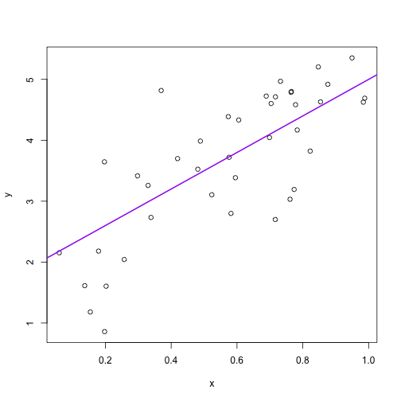

- [lecture outline](http://stat545-ubc.github.io/cm002_r-rstudio-intro.html)

### Notes
> *write code for humans, write data for computers* -- Vince Buffalo

- http://swirlstats.com -- swirl teaches you R programming and data science interactively

### R Tips
- "Alt/option" + "-" will produce produce " <- "
- Brackets -- e.g. `(y <- 1:10)` -- make assignment and print at same time
- Change "Preference" to not save `.RData`

### R Example script

```r
## Jenny's code
a <- 2
b <- 3
sig_sq <- 0.5
x <- runif(40)
y <- a + b * x + rnorm(40, sd = sqrt(sig_sq))
(avg_x <- mean(x))
```

```
## [1] 0.5692118
```

```r
plot(x, y)
abline(a, b, col = "purple", lwd = 2)
```

 

```r
#dev.print("my_purple_line.pdf")
```

