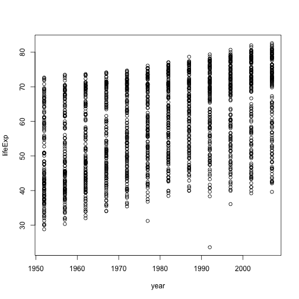
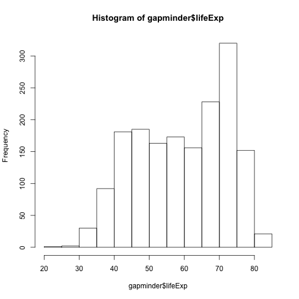
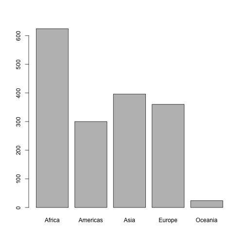
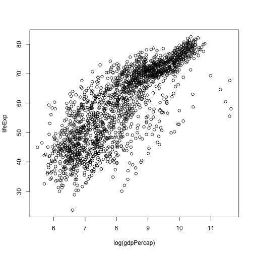
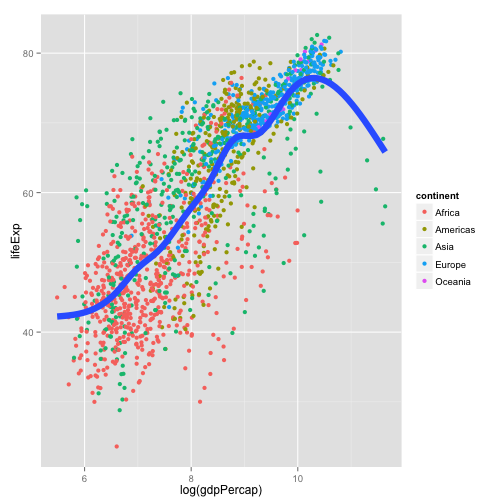

- [lecture outline](http://stat545-ubc.github.io/cm004_care-feeding-data.html)
- [Homework 1](http://stat545-ubc.github.io/hw01_edit-README.html) is assigned

### Notes
- cool R package: http://rich-iannone.github.io/DiagrammeR/
- UBC R Study Group: http://minisciencegirl.github.io/studyGroup/
- `dplyr` to work with data.frames
- Session -> Restart R to restart search path/packages

### R: Gapminder dataset

```r
# install.packages("gapminder")
library(gapminder)

## A look at the data:
str(gapminder)
```

```
## 'data.frame':	1704 obs. of  6 variables:
##  $ country  : Factor w/ 142 levels "Afghanistan",..: 1 1 1 1 1 1 1 1 1 1 ...
##  $ continent: Factor w/ 5 levels "Africa","Americas",..: 3 3 3 3 3 3 3 3 3 3 ...
##  $ year     : num  1952 1957 1962 1967 1972 ...
##  $ lifeExp  : num  28.8 30.3 32 34 36.1 ...
##  $ pop      : num  8425333 9240934 10267083 11537966 13079460 ...
##  $ gdpPercap: num  779 821 853 836 740 ...
```

```r
## 10 Random rows in the data.frame
gapminder[sample(nrow(gapminder), 10),]
```

```
##              country continent year lifeExp      pop  gdpPercap
## 911            Libya    Africa 2002  72.737  5368585  9534.6775
## 1540            Togo    Africa 1967  46.769  1735550  1477.5968
## 1230          Poland    Europe 1977  70.670 34621254  9508.1415
## 385             Cuba  Americas 1952  59.421  6007797  5586.5388
## 1607  United Kingdom    Europe 2002  78.471 59912431 29478.9992
## 99        Bangladesh      Asia 1962  41.216 56839289   686.3416
## 1672     Yemen, Rep.      Asia 1967  36.984  6740785   862.4421
## 909            Libya    Africa 1992  68.755  4364501  9640.1385
## 1373 Slovak Republic    Europe 1972  70.350  4593433  9674.1676
## 465            Egypt    Africa 1992  63.674 59402198  3794.7552
```

```r
## Plotting
plot(lifeExp ~ year, gapminder)
```

 

```r
hist(gapminder$lifeExp)
```

 

```r
table(gapminder$continent)
```

```
## 
##   Africa Americas     Asia   Europe  Oceania 
##      624      300      396      360       24
```

```r
barplot(table(gapminder$continent))
```

 

```r
plot(lifeExp ~ log(gdpPercap), gapminder)
```

 


```r
## Being awesome and doing the sample plot in ggplot
library(ggplot2)
```

```
## Loading required package: methods
```

```r
ggplot(gapminder, aes(x=log(gdpPercap), y=lifeExp)) +
    geom_point(aes(color=continent)) + 
    geom_smooth(lwd = 3, se = FALSE)
```

```
## geom_smooth: method="auto" and size of largest group is >=1000, so using gam with formula: y ~ s(x, bs = "cs"). Use 'method = x' to change the smoothing method.
```

 

