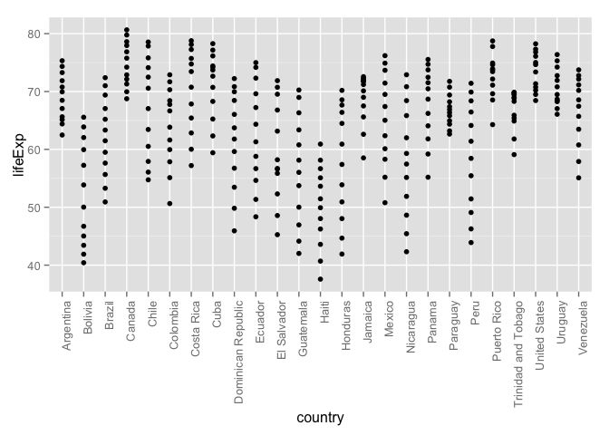

# dplyr
csiu  
2015-09-29  

- [lecture outline](http://stat545-ubc.github.io/cm007_dplyr-intro.html)
- theme of the week: `dplyr`
- split-apply-combine workflow

## dplyr
- [Intro to dplyr](http://stat545-ubc.github.io/block009_dplyr-intro.html): data.frame in, data.frame out
    - good for subsetting
- older package = `plyr`


```r
suppressPackageStartupMessages(library(dplyr)) ## dplyr is chatty
library(gapminder)
library(ggplot2)

## what packages is attached
search()
```

```
##  [1] ".GlobalEnv"        "package:ggplot2"   "package:gapminder"
##  [4] "package:dplyr"     "package:stats"     "package:graphics" 
##  [7] "package:grDevices" "package:utils"     "package:datasets" 
## [10] "package:methods"   "Autoloads"         "package:base"
```


```r
## transform to "tbl_df"" object
(gtbl <- tbl_df(gapminder))
```

```
## Source: local data frame [1,704 x 6]
## 
##        country continent  year lifeExp      pop gdpPercap
##         (fctr)    (fctr) (dbl)   (dbl)    (dbl)     (dbl)
## 1  Afghanistan      Asia  1952  28.801  8425333  779.4453
## 2  Afghanistan      Asia  1957  30.332  9240934  820.8530
## 3  Afghanistan      Asia  1962  31.997 10267083  853.1007
## 4  Afghanistan      Asia  1967  34.020 11537966  836.1971
## 5  Afghanistan      Asia  1972  36.088 13079460  739.9811
## 6  Afghanistan      Asia  1977  38.438 14880372  786.1134
## 7  Afghanistan      Asia  1982  39.854 12881816  978.0114
## 8  Afghanistan      Asia  1987  40.822 13867957  852.3959
## 9  Afghanistan      Asia  1992  41.674 16317921  649.3414
## 10 Afghanistan      Asia  1997  41.763 22227415  635.3414
## ..         ...       ...   ...     ...      ...       ...
```

```r
## get a glimpse of data
glimpse(gtbl)
```

```
## Observations: 1,704
## Variables: 6
## $ country   (fctr) Afghanistan, Afghanistan, Afghanistan, Afghanistan,...
## $ continent (fctr) Asia, Asia, Asia, Asia, Asia, Asia, Asia, Asia, Asi...
## $ year      (dbl) 1952, 1957, 1962, 1967, 1972, 1977, 1982, 1987, 1992...
## $ lifeExp   (dbl) 28.801, 30.332, 31.997, 34.020, 36.088, 38.438, 39.8...
## $ pop       (dbl) 8425333, 9240934, 10267083, 11537966, 13079460, 1488...
## $ gdpPercap (dbl) 779.4453, 820.8530, 853.1007, 836.1971, 739.9811, 78...
```

```r
## special: 
class(gtbl)
```

```
## [1] "tbl_df"     "tbl"        "data.frame"
```
- `tbl_df` -special class of-> `tbl` -special class of-> `data.frame`

### `filter()`: row-wise filtering (and `select()`: column-wise filtering)

```r
## [WHAT YOU WOULD HAVE DONE BEFORE]
snippet <- subset(gapminder, country == "Canada")
#     country continent year lifeExp      pop gdpPercap
# 241  Canada  Americas 1952  68.750 14785584  11367.16
# 242  Canada  Americas 1957  69.960 17010154  12489.95
# 243  Canada  Americas 1962  71.300 18985849  13462.49
# ...

## [WHAT YOU WOULD DO AFTER]
filter(gtbl, country %in% c("Canada"), lifeExp < 70)
```

```
## Source: local data frame [2 x 6]
## 
##   country continent  year lifeExp      pop gdpPercap
##    (fctr)    (fctr) (dbl)   (dbl)    (dbl)     (dbl)
## 1  Canada  Americas  1952   68.75 14785584  11367.16
## 2  Canada  Americas  1957   69.96 17010154  12489.95
```
- with `dplyr::filter` (and other functions), don't need "dataframe`$`variable"
    - i.e. assumes look within data.frame
- multiple expression in function get logical-and

### pipe operator: `%>%`
- new, mildly controversial, from package `magrittr`
- Shortcut: `command-shift-m`


```r
## Example
gapminder %>% 
  filter(continent == "Americas") %>% 
  select(country, lifeExp) %>%
  
  #head(50) %>% tail(10) %>% 
  
  ggplot(aes(x=country, y=lifeExp)) + ## can pipe into ggplot
  geom_point() +
  theme(axis.text.x = element_text(angle = 90, hjust = 1))
```

 

### List of functions from `dplyr`
- `filter()`: Return **rows** with matching conditions
- `select()`: Select/rename **variables** by name

- `mutate()`: Add new variables
- `arrange()`: Arrange rows by variables
- `rename()`: Select/rename variables by name

- `group_by()`: Group a tbl by one or more variables
