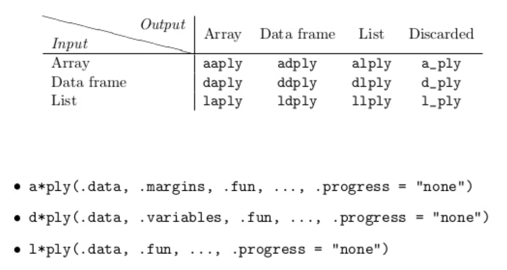

- [lecture outline](http://stat545-ubc.github.io/cm011_split-apply-combine.html)

- helpful packages: `import`, `modules`
- be proactive about NAs
- when defining function
    - be nice and add _defaults_
    - uses of `...` in defining functions
- unit testing to test expectation of function
    - package: `testthat` ( or `RUnit`)
    
## Data Aggregation
- Suggested reading

    > Split-Apply-Combine Strategy for Data Analysis -- Hadley Wickham

- data aggregation functions
    - before: `apply`
    - recommendation: `dplyr::` (data frame focused) & `plyr::`
    - new package(?): `purrr::` (10 days new)

- how to split your data into pieces?
    - compute something for every row or every column
    - make sub data frames
    - list of data frames

- group of observations induced by levels of >= 1 factors
    - `aggregate()`, `tapply()`, `by()`, `split() + [sl]apply()`

- functions in the `plyr` package



- new workflow: `group_by() %>% do()`

### Examples 1: [Linear regression of life expectancy on year](http://stat545-ubc.github.io/block012_function-regress-lifeexp-on-year.html)

```{r}
library(gapminder)
library(ggplot2)
suppressPackageStartupMessages(library(dplyr))

le_lin_fit <- function(dat, offset = 1952) {
  the_fit <- lm(lifeExp ~ I(year - offset), dat)
  setNames(coef(the_fit), c("intercept", "slope"))
}

# j_country <- "Zimbabwe"
# j_dat <- gapminder %>% filter(country == j_country)
# p <- ggplot(j_dat, aes(x = year, y = lifeExp))
# p + geom_point() + geom_smooth(method = "lm", se = FALSE)

```

### Example 2: [Computing by groups within data.frames with dplyr](http://stat545-ubc.github.io/block023_dplyr-do.html)
> Use `dplyr::do()` to apply this function to each country in Gapminder; use `broom` to do same in a slick way to linear models in general

```{r}
## Meet the "do" function
## "." is place holder; need to be used in "do" function
## "dplyr::do" in its finest

gapminder %>%
  filter(year == 2007) %>% 
  group_by(continent) %>%
  do(head(., 2))
```

#### CHALLENGE: 10th most populated country in each continent in 2002
```{r}
pop10th <- function(dat){
  dat %>% 
    arrange(desc(pop)) %>%
    slice(10)
}

gapminder %>%
  filter(year == 2002) %>% 
  group_by(continent) %>%
  do(pop10th(.))
```

- Other methods (from Jenny)
```{r}
## Alternative 1
gapminder %>% 
  filter(year == 2002) %>% 
  group_by(continent) %>% 
  arrange(desc(pop)) %>% 
  do(slice(., 10))

## Alternative 2
gapminder %>% 
  filter(year == 2002) %>% 
  group_by(continent) %>% 
  filter(min_rank(desc(pop)) == 10)
```

- other symbols: 
    - `%T>%`
    - `%$%`

#### Fit linear model to each country and return slope & intercept
```{r}
le_lin_fit <- function(dat, offset = 1952) {
  the_fit <- lm(lifeExp ~ I(year - offset), dat)
  setNames(data.frame(t(coef(the_fit))), c("intercept", "slope")) ## RETURN DATA.FRAME OBJECT
}

#le_lin_fit(gapminder %>% filter(country == "Canada"))

gapminder %>%
  group_by(country) %>% 
  do(le_lin_fit(.))
```
