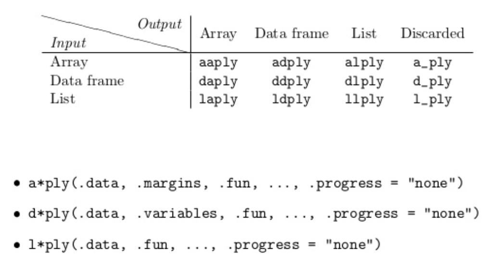

# split-apply-combine
csiu  
October 13, 2015  

- [lecture outline](http://stat545-ubc.github.io/cm011_split-apply-combine.html)

- helpful packages: `import`, `modules`
- be proactive about NAs
- when defining function
    - be nice and add _defaults_
    - uses of `...` in defining functions
- unit testing to test expectation of function
    - package: `testthat` ( or `RUnit`)
    
## Data Aggregation
- Suggested reading

    > Split-Apply-Combine Strategy for Data Analysis -- Hadley Wickham

- data aggregation functions
    - before: `apply`
    - recommendation: `dplyr::` (data frame focused) & `plyr::`
    - new package(?): `purrr::` (10 days new)

- how to split your data into pieces?
    - compute something for every row or every column
    - make sub data frames
    - list of data frames

- group of observations induced by levels of >= 1 factors
    - `aggregate()`, `tapply()`, `by()`, `split() + [sl]apply()`

- functions in the `plyr` package



- new workflow: `group_by() %>% do()`

### Examples 1: [Linear regression of life expectancy on year](http://stat545-ubc.github.io/block012_function-regress-lifeexp-on-year.html)


```r
library(gapminder)
library(ggplot2)
suppressPackageStartupMessages(library(dplyr))

le_lin_fit <- function(dat, offset = 1952) {
  the_fit <- lm(lifeExp ~ I(year - offset), dat)
  setNames(coef(the_fit), c("intercept", "slope"))
}

# j_country <- "Zimbabwe"
# j_dat <- gapminder %>% filter(country == j_country)
# p <- ggplot(j_dat, aes(x = year, y = lifeExp))
# p + geom_point() + geom_smooth(method = "lm", se = FALSE)
```

### Example 2: [Computing by groups within data.frames with dplyr](http://stat545-ubc.github.io/block023_dplyr-do.html)
> Use `dplyr::do()` to apply this function to each country in Gapminder; use `broom` to do same in a slick way to linear models in general


```r
## Meet the "do" function
## "." is place holder; need to be used in "do" function
## "dplyr::do" in its finest

gapminder %>%
  filter(year == 2007) %>% 
  group_by(continent) %>%
  do(head(., 2))
```

```
## Source: local data frame [10 x 6]
## Groups: continent [5]
## 
##        country continent  year lifeExp      pop  gdpPercap
##         (fctr)    (fctr) (dbl)   (dbl)    (dbl)      (dbl)
## 1      Algeria    Africa  2007  72.301 33333216  6223.3675
## 2       Angola    Africa  2007  42.731 12420476  4797.2313
## 3    Argentina  Americas  2007  75.320 40301927 12779.3796
## 4      Bolivia  Americas  2007  65.554  9119152  3822.1371
## 5  Afghanistan      Asia  2007  43.828 31889923   974.5803
## 6      Bahrain      Asia  2007  75.635   708573 29796.0483
## 7      Albania    Europe  2007  76.423  3600523  5937.0295
## 8      Austria    Europe  2007  79.829  8199783 36126.4927
## 9    Australia   Oceania  2007  81.235 20434176 34435.3674
## 10 New Zealand   Oceania  2007  80.204  4115771 25185.0091
```

#### CHALLENGE: 10th most populated country in each continent in 2002

```r
pop10th <- function(dat){
  dat %>% 
    arrange(desc(pop)) %>%
    slice(10)
}

gapminder %>%
  filter(year == 2002) %>% 
  group_by(continent) %>%
  do(pop10th(.))
```

```
## Source: local data frame [4 x 6]
## Groups: continent [4]
## 
##    country continent  year lifeExp      pop gdpPercap
##     (fctr)    (fctr) (dbl)   (dbl)    (dbl)     (dbl)
## 1  Morocco    Africa  2002  69.615 31167783  3258.496
## 2  Ecuador  Americas  2002  74.173 12921234  5773.045
## 3 Thailand      Asia  2002  68.564 62806748  5913.188
## 4   Greece    Europe  2002  78.256 10603863 22514.255
```

- Other methods (from Jenny)

```r
## Alternative 1
gapminder %>% 
  filter(year == 2002) %>% 
  group_by(continent) %>% 
  arrange(desc(pop)) %>% 
  do(slice(., 10))
```

```
## Source: local data frame [4 x 6]
## Groups: continent [4]
## 
##    country continent  year lifeExp      pop gdpPercap
##     (fctr)    (fctr) (dbl)   (dbl)    (dbl)     (dbl)
## 1  Morocco    Africa  2002  69.615 31167783  3258.496
## 2  Ecuador  Americas  2002  74.173 12921234  5773.045
## 3 Thailand      Asia  2002  68.564 62806748  5913.188
## 4   Greece    Europe  2002  78.256 10603863 22514.255
```

```r
## Alternative 2
gapminder %>% 
  filter(year == 2002) %>% 
  group_by(continent) %>% 
  filter(min_rank(desc(pop)) == 10)
```

```
## Source: local data frame [4 x 6]
## Groups: continent [4]
## 
##    country continent  year lifeExp      pop gdpPercap
##     (fctr)    (fctr) (dbl)   (dbl)    (dbl)     (dbl)
## 1  Ecuador  Americas  2002  74.173 12921234  5773.045
## 2   Greece    Europe  2002  78.256 10603863 22514.255
## 3  Morocco    Africa  2002  69.615 31167783  3258.496
## 4 Thailand      Asia  2002  68.564 62806748  5913.188
```

- other symbols: 
    - `%T>%`
    - `%$%`

#### Fit linear model to each country and return slope & intercept

```r
le_lin_fit <- function(dat, offset = 1952) {
  the_fit <- lm(lifeExp ~ I(year - offset), dat)
  setNames(data.frame(t(coef(the_fit))), c("intercept", "slope")) ## RETURN DATA.FRAME OBJECT
}

#le_lin_fit(gapminder %>% filter(country == "Canada"))

gapminder %>%
  group_by(country) %>% 
  do(le_lin_fit(.))
```

```
## Source: local data frame [142 x 3]
## Groups: country [142]
## 
##        country intercept     slope
##         (fctr)     (dbl)     (dbl)
## 1  Afghanistan  29.90729 0.2753287
## 2      Albania  59.22913 0.3346832
## 3      Algeria  43.37497 0.5692797
## 4       Angola  32.12665 0.2093399
## 5    Argentina  62.68844 0.2317084
## 6    Australia  68.40051 0.2277238
## 7      Austria  66.44846 0.2419923
## 8      Bahrain  52.74921 0.4675077
## 9   Bangladesh  36.13549 0.4981308
## 10     Belgium  67.89192 0.2090846
## ..         ...       ...       ...
```
