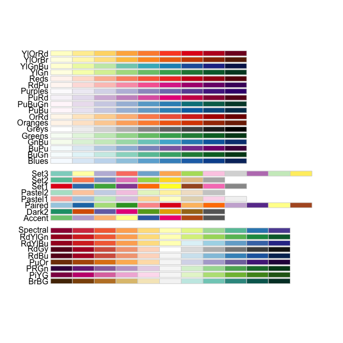
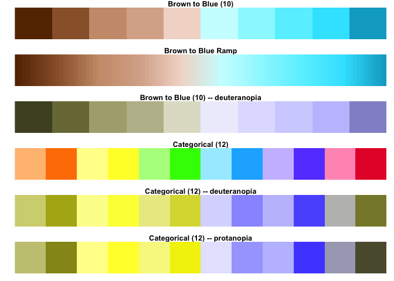
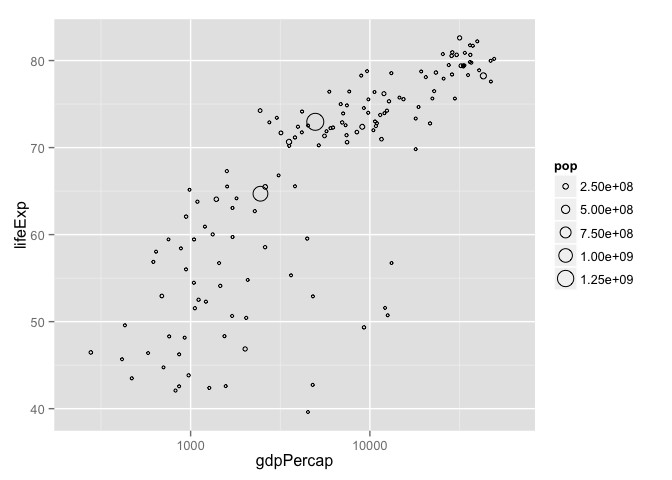
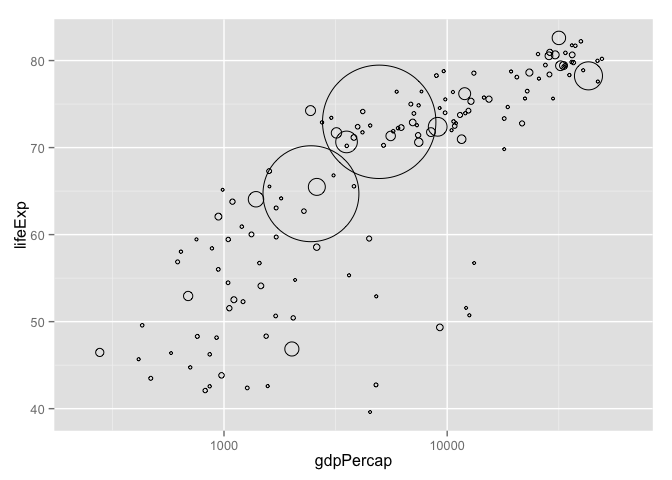
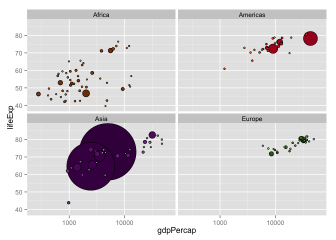
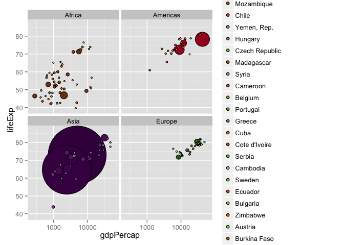

# graphing tips
csiu  
October 20, 2015  

```r
knitr::opts_chunk$set(fig.path='figure/cm013-')
```

- [lecture outline](http://stat545-ubc.github.io/cm013_practical-figure-making.html)

- [Do’s and Don’ts for Effective Graphs](http://stat545-ubc.github.io/block015_graph-dos-donts.html)
    - charts that are bad of conveying information: pie charts, stacked bar charts
    - better plots: dot plots, line plots, spegetti plots
    
- [R Graph Catalog, a visual, clickable index of 100+ figures + ggplot2 code to make them](http://shiny.stat.ubc.ca/r-graph-catalog/)

## [Using colors in R](http://stat545-ubc.github.io/block018_colors.html)
- `par()` and `options()` to change settings that affect graphics 

> when change `par()` and `option()`, polite to save old parm

- base R: apply color with character string; recycling happens
- can specify color by integers (which indexes the default palette)

```r
palette()
```

```
## [1] "black"   "red"     "green3"  "blue"    "cyan"    "magenta" "yellow" 
## [8] "gray"
```
- R recognizes 657 `colors()`

- **Cynthia Brewer**: a geographer and color specialist (library: `RColorBrewer`)

```r
library(RColorBrewer)

## look at all palettes
display.brewer.all()
```

 

- sequential palette: 
    - p-value
- qualitative palette:
- divergent palette:
    - signed correlation
    - residuals
    - up/down regulated proteins
    - t statistics or z-score

- `viridis::` new color palette

> These color maps are designed in such a way that they will analytically be perfectly perceptually-uniform, both in regular form and also when converted to black-and-white. They are also designed to be perceived by readers with the most common form of color blindness.
    
- HCL
   - Hue -- “what color is that?”
   - Chroma -- colorfullness, i.e. how pure or vivid a color is/muddyness
   - Luminance -- brightness, lightness, intensity, and value

- [Why Should Engineers and Scientists Be Worried About Color?](http://www.research.ibm.com/people/l/lloydt/color/color.HTM) -- rainbow palette is awful


```r
library(dichromat)

pal <- function(col, ...)
  image(seq_along(col), 1, matrix(seq_along(col), ncol = 1),
  col = col, axes = FALSE, ...)

opar <- par(mar = c(1, 2, 1, 1))
layout(matrix(1:6, ncol = 1))
pal(colorschemes$BrowntoBlue.10, main = "Brown to Blue (10)")
pal(colorRampPalette(colorschemes$BrowntoBlue.10, space = "Lab")(100),
  main = "Brown to Blue Ramp")
pal(dichromat(colorschemes$BrowntoBlue.10),
  main = "Brown to Blue (10) -- deuteranopia")
pal(colorschemes$Categorical.12, main = "Categorical (12)")
pal(dichromat(colorschemes$Categorical.12),
  main = "Categorical (12) -- deuteranopia")
pal(dichromat(colorschemes$Categorical.12, "protan"),
  main = "Categorical (12) -- protanopia")
```

 

```r
par(opar)
```

## Some r code
[Taking control of qualitative colors in ggplot2](http://stat545-ubc.github.io/block019_enforce-color-scheme.html)

```r
library(ggplot2)
library(gapminder)
suppressPackageStartupMessages(library(dplyr))
jdat <- gapminder %>% 
  filter(continent != "Oceania") %>% 
  droplevels() %>% 
  mutate(country = reorder(country, -1 * pop)) %>% 
  arrange(year, country)

j_year <- 2007
q <-
  jdat %>% 
  filter(year == j_year) %>% 
  ggplot(aes(x = gdpPercap, y = lifeExp)) +
  scale_x_log10(limits = c(230, 63000))
# q + geom_point()

## ggplot2 ALERT: size now means size, not radius!
q + geom_point(aes(size = pop), pch = 21)
```

 

```r
(r <- q +
   geom_point(aes(size = pop), pch = 21, show.legend = FALSE) +
   scale_size_continuous(range=c(1,40)) +
   theme(legend.position="none"))
```

 

```r
r + facet_wrap(~ continent) + ylim(c(39, 87)) + 
  aes(fill = country) + scale_fill_manual(values = country_colors)
```

 

Putting things together

```r
j_year <- 2007
jdat %>% 
  filter(year == j_year) %>% 
  ggplot(aes(x = gdpPercap, y = lifeExp, fill = country)) +
  scale_fill_manual(values = country_colors) +
  facet_wrap(~ continent) +
  geom_point(aes(size = pop), pch = 21, show.legend = FALSE) +
  scale_x_log10(limits = c(230, 63000)) +
  scale_size_continuous(range = c(1,40)) + ylim(c(39, 87))
```

 

## [Writing figures to file](http://stat545-ubc.github.io/block017_write-figure-to-file.html)
- Graphics devices: **vector** vs **raster**
- Write figures to file with `ggsave()`
    - `ggsave("fig-io-practice.png", p)`
    - `ggsave("img/fig-io-practice-scale-2.png", p2, scale = 2)`
- Chunk name determines figure file name

## [Multiple plots on a page](http://stat545-ubc.github.io/block020_multiple-plots-on-a-page.html)
- `arrangeGrob()`
- `multiplot()`
- Use the `cowplot` package

## Summary
- color palettes
    - `RColorBrewer::`
    - `viridis::`
    - `dichromat::`
- ggplot extras
    - `scale_size_continuous(range=c(1,40)) +`
    - `scale_fill_manual(values = country_colors)`
- multiple plots on a page: 
    - `cowplot::`    
