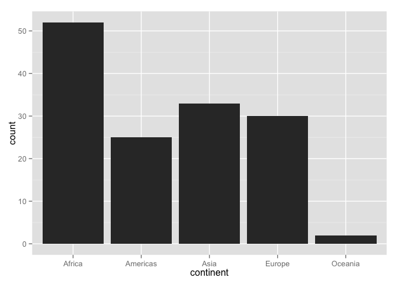
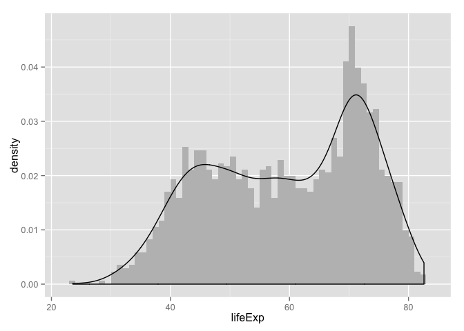
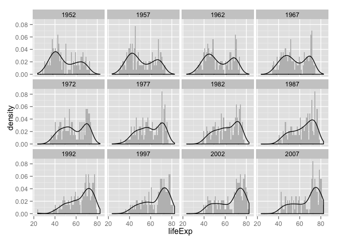
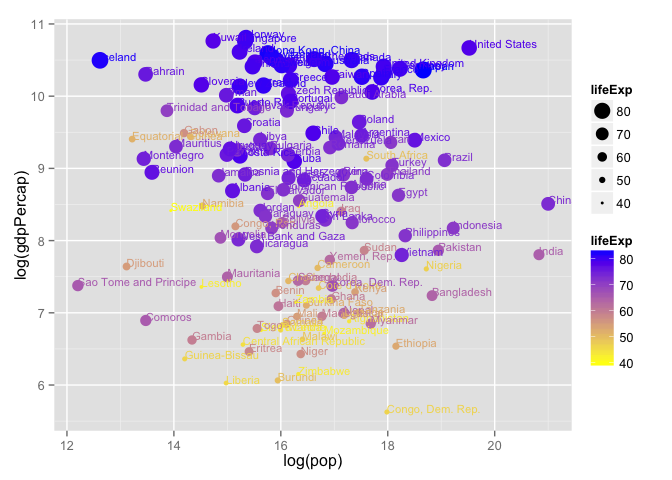

# Homework 02: Explore Gapminder and use R markdown
csiu  
2015-09-24  

- [Homework 02](http://stat545-ubc.github.io/hw02_explore-gapminder-use-rmarkdown.html)


```r
library(ggplot2)
```


## Bring rectangular data in
> - Load the Gapminder data with both functions without specifying args other than file. Do you get the same resulting object in your workspace? Use all the ways we’ve learned to inspect an object to back up your claims with hard facts.


```r
datafile <- "../data/gapminder.txt"

data      <- read.delim(datafile)
datatable <- read.table(datafile)
```

```
## Error in scan(file, what, nmax, sep, dec, quote, skip, nlines, na.strings, : line 146 did not have 6 elements
```

Unlike `read.delim`, running `read.table` without any arguments will result to an error. One of the reason is because "`line 146 did not have 6 elements`".


```r
data[146,]
```

```
##                    country year     pop continent lifeExp gdpPercap
## 146 Bosnia and Herzegovina 1957 3076000    Europe   58.45  1353.989
```

> - If you’re not getting the same object, why not?

They are not the same object because `read.delim` results to a R object, whereas `read.table` does not (i.e. an error appears instead).

> - Develop the call to read.table() that is equivalent to read.delim(), i.e. how do you need to set various arguments and describe this in prose as well.

To do this, we need to specify `header=TRUE, sep="\t", quote="\""`:

```r
datatable <- read.table(datafile, header=TRUE, sep="\t", quote="\"")
str(datatable)
```

```
## 'data.frame':	1704 obs. of  6 variables:
##  $ country  : Factor w/ 142 levels "Afghanistan",..: 1 1 1 1 1 1 1 1 1 1 ...
##  $ year     : int  1952 1957 1962 1967 1972 1977 1982 1987 1992 1997 ...
##  $ pop      : num  8425333 9240934 10267083 11537966 13079460 ...
##  $ continent: Factor w/ 5 levels "Africa","Americas",..: 3 3 3 3 3 3 3 3 3 3 ...
##  $ lifeExp  : num  28.8 30.3 32 34 36.1 ...
##  $ gdpPercap: num  779 821 853 836 740 ...
```

```r
str(data)
```

```
## 'data.frame':	1704 obs. of  6 variables:
##  $ country  : Factor w/ 142 levels "Afghanistan",..: 1 1 1 1 1 1 1 1 1 1 ...
##  $ year     : int  1952 1957 1962 1967 1972 1977 1982 1987 1992 1997 ...
##  $ pop      : num  8425333 9240934 10267083 11537966 13079460 ...
##  $ continent: Factor w/ 5 levels "Africa","Americas",..: 3 3 3 3 3 3 3 3 3 3 ...
##  $ lifeExp  : num  28.8 30.3 32 34 36.1 ...
##  $ gdpPercap: num  779 821 853 836 740 ...
```
The number of dimensions in both objects are the same. Regardless, the moral of the story -- in my opinion -- is that `read.delim` is far superior to `read.table`.

## Smell test the data
> - Is it a data.frame, a matrix, a vector, a list?

The imported `data` object is a data.frame

> - What’s its mode, class?


```r
(data_class <- class(data))
```

```
## [1] "data.frame"
```

> - How many variables?


```r
(data_ncol <- ncol(data))
```

```
## [1] 6
```

> - How many rows/observations?


```r
(data_nrow <- nrow(data))
```

```
## [1] 1704
```

> - Can you get these facts about “extent” or “size” in more than one way? Can you imagine different functions being useful in different contexts?


```r
(data_dim <- dim(data))
```

```
## [1] 1704    6
```

> - What flavor is each the variable?

```r
str(data_class)
```

```
##  chr "data.frame"
```

```r
str(data_nrow)
```

```
##  int 1704
```

```r
str(data_ncol)
```

```
##  int 6
```

```r
str(data_dim)
```

```
##  int [1:2] 1704 6
```

## Explore individual variables
> - Characterize what’s possible, i.e. all possible values or max vs. min … whatever’s appropriate.
> - What’s typical? What’s the spread? What’s the distribution? Etc., tailored to the variable at hand.
> - Feel free to use summary stats, tables, figures. We’re NOT expecting high production value (yet).

### categorical variable == `"continent"`

```r
## All possible values of continent
levels(data$continent)
```

```
## [1] "Africa"   "Americas" "Asia"     "Europe"   "Oceania"
```

```r
## Number of observations per continent per year
table(data$continent, data$year)
```

```
##           
##            1952 1957 1962 1967 1972 1977 1982 1987 1992 1997 2002 2007
##   Africa     52   52   52   52   52   52   52   52   52   52   52   52
##   Americas   25   25   25   25   25   25   25   25   25   25   25   25
##   Asia       33   33   33   33   33   33   33   33   33   33   33   33
##   Europe     30   30   30   30   30   30   30   30   30   30   30   30
##   Oceania     2    2    2    2    2    2    2    2    2    2    2    2
```

```r
## Since the number of observation per continent per year is the same across years,
## I will make a plot with the observations per continent in 2007
ggplot(with(data, subset(data, subset = (year == "2007"))),
       aes(x=continent, y=..count..)) +
  geom_bar()
```

 

We have the most data from Africa.

### quantitiative variable == `"lifeExp"`

```r
summary(data$lifeExp)
```

```
##    Min. 1st Qu.  Median    Mean 3rd Qu.    Max. 
##   23.60   48.20   60.71   59.47   70.85   82.60
```

```r
g <- ggplot(data, aes(x=lifeExp, y=..density..)) +
  geom_histogram(binwidth=1, fill="grey") +
  geom_density()
g
```

 

```r
g + facet_wrap(~ year)
```

 

We are living longer!

## Report your process
I thought this assignment was pretty easy. It helps when one is familiar with R and have used `ggplot2` before.

## Extra

```r
ggplot(data, aes(x=country, y=pop)) +
  geom_point() +
  facet_wrap(~ year) +
  theme(axis.text.x = element_text(angle = 90, hjust = 1))
```

 

