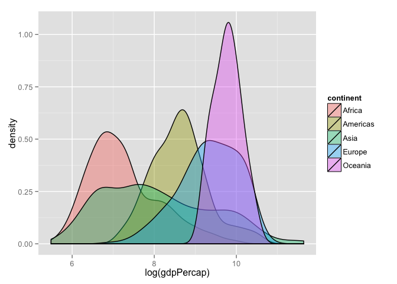

# Homework 03: Manipulating and exploring data with dplyr and ggplot2
csiu  
October 4, 2015  


- Link to [Homework 03](http://stat545-ubc.github.io/hw03_dplyr-and-more-ggplot2.html)

> The goal is to manipulate and explore a dataset with the `dplyr` package, complemented by visualizations made with `ggplot2`.

## Input data
**Gapminder data**

```r
suppressMessages(library(plyr))
suppressMessages(library(dplyr))
library(ggplot2)
library(knitr)
library(tidyr)
library(scales)


# setwd('homework')
gapminder_df <- read.delim("../data/gapminder.txt")
```

## Task 01: 
> Get the maximum and minimum of GDP per capita for all continents

To obtain the min and max GDP per capita for all continents, we first grouped the gapminder data by continent and then filtered (in each group i.e. continent) for the min and max GDP per capita. Next, we arranged the data to be sorted by continent name and then by GDP per capita so that one can easily find a continent and look at its min or max GDP per capita value. In addition to the continent and GDP per capita values, we also presented the associated country, year, life expectancy, and population data.


```r
gapminder_df %>% 
  group_by(continent) %>% 
  filter(min_rank(gdpPercap) < 2 | min_rank(desc(gdpPercap)) < 2) %>% 
  arrange(continent, gdpPercap) %>%
  select(continent, gdpPercap, country, year, lifeExp, pop) %>% 
  kable(format="markdown")
```


|continent |   gdpPercap|country                | year| lifeExp|       pop|
|:---------|-----------:|:----------------------|----:|-------:|---------:|
|Africa    |    241.1659|Congo, Dem. Rep.       | 2002|  44.966|  55379852|
|Africa    |  21951.2118|Libya                  | 1977|  57.442|   2721783|
|Americas  |   1201.6372|Haiti                  | 2007|  60.916|   8502814|
|Americas  |  42951.6531|United States          | 2007|  78.242| 301139947|
|Asia      |    331.0000|Myanmar                | 1952|  36.319|  20092996|
|Asia      | 113523.1329|Kuwait                 | 1957|  58.033|    212846|
|Europe    |    973.5332|Bosnia and Herzegovina | 1952|  53.820|   2791000|
|Europe    |  49357.1902|Norway                 | 2007|  80.196|   4627926|
|Oceania   |  10039.5956|Australia              | 1952|  69.120|   8691212|
|Oceania   |  34435.3674|Australia              | 2007|  81.235|  20434176|

From the data, it's interesting to see that the min and max GDP per capita within Oceania both belongs to Australia (of different years). Since 1952, the GDP per capita in Australia has increased as did life expectancy and population size.

In the next bit, we summarized the information differently to show only the continent and its min and max GDP per capita.


```r
df_task1 <- gapminder_df %>% 
  group_by(continent) %>% 
  summarise(min_gdpPercap = min(gdpPercap),
            max_gdpPercap = max(gdpPercap))

df_task1 %>%
  kable(format="markdown")
```


|continent | min_gdpPercap| max_gdpPercap|
|:---------|-------------:|-------------:|
|Africa    |      241.1659|      21951.21|
|Americas  |     1201.6372|      42951.65|
|Asia      |      331.0000|     113523.13|
|Europe    |      973.5332|      49357.19|
|Oceania   |    10039.5956|      34435.37|

```r
df_task1 %>% 
  gather(variable, value, -continent) %>% 
  ggplot(aes(x=variable, y=value, group=continent, color=continent)) +
  geom_line() + 
  geom_point(size=3.5, alpha=0.4) +
  scale_x_discrete(labels = c("min", "max")) +
  xlab("") +
  ylab("gdpPercap")
```

 

Here we can see that Africa is the continent with the min GDP per captia and Asia is the continent with the max GDP per capita. From this figure, we can also see that Asia is the continent with the greatest range of GDP per capita.

## Task 02: 
> Look at the spread of GDP per capita within the continents.

To consider the spread of GDP per capita within the continents, I listed the number of observations, mean, median, standard deviation, min, max, and range of GDP per capita for each continent. 


```r
gapminder_df %>% 
  group_by(continent) %>%
  summarise(n_obs = n(),
            gdpPercap_mean = mean(gdpPercap),
            gdpPercap_median = median(gdpPercap),
            gdpPercap_sd = sd(gdpPercap),
            gdpPercap_min = min(gdpPercap),
            gdpPercap_max = max(gdpPercap),
            gdpPercap_range = max(gdpPercap) - min(gdpPercap)) %>% 
  kable(format="markdown")
```


|continent | n_obs| gdpPercap_mean| gdpPercap_median| gdpPercap_sd| gdpPercap_min| gdpPercap_max| gdpPercap_range|
|:---------|-----:|--------------:|----------------:|------------:|-------------:|-------------:|---------------:|
|Africa    |   624|       2193.755|         1192.138|     2827.930|      241.1659|      21951.21|        21710.05|
|Americas  |   300|       7136.110|         5465.510|     6396.764|     1201.6372|      42951.65|        41750.02|
|Asia      |   396|       7902.150|         2646.787|    14045.373|      331.0000|     113523.13|       113192.13|
|Europe    |   360|      14469.476|        12081.749|     9355.213|      973.5332|      49357.19|        48383.66|
|Oceania   |    24|      18621.609|        17983.304|     6358.983|    10039.5956|      34435.37|        24395.77|

Here we see that Oceania has the fewest number of observations whereas Africa has the most. On the other hand, looking at the mean and median GDP per capita, Africa has the lowest wherease Oceania has the most. Considering the range of GDP per capita of countries with the continents, Africa has the smallest range and Asia has the greatest range.


```r
ggplot(gapminder_df, aes(x=continent, y=gdpPercap, fill=continent)) + 
  geom_boxplot(alpha=0.5) +
  scale_x_discrete(limits = rev(levels(gapminder_df$continent))) +
  coord_flip()
```

 

To highlight these sentiments further, we presented the results in a boxplot, which clearly shows the great range of GDP per capita in Asia. 


```r
ggplot(gapminder_df, aes(x=log(gdpPercap), fill=continent)) + 
  geom_density(alpha=0.4)
```

 

Plotting the same information (log-scaled) in a density plot, we undoubtedly see that Oceania has the greatest GDP per capita and Africa has the least. 

## Task 03:
> Compute a trimmed mean of life expectancy for different years. Or a weighted mean, weighting by population. Just try something other than the plain vanilla mean.

### Vanilla mean

```r
df_task3 <- gapminder_df %>% 
  group_by(year) %>% 
  summarise(mean_lifeExp = mean(lifeExp),
            mean_pop = mean(pop),
            mean_gdpPercap = mean(gdpPercap))

df_task3 %>%
  kable(format="markdown")
```


| year| mean_lifeExp| mean_pop| mean_gdpPercap|
|----:|------------:|--------:|--------------:|
| 1952|     49.05762| 16950402|       3725.276|
| 1957|     51.50740| 18763413|       4299.408|
| 1962|     53.60925| 20421007|       4725.812|
| 1967|     55.67829| 22658298|       5483.653|
| 1972|     57.64739| 25189980|       6770.083|
| 1977|     59.57016| 27676379|       7313.166|
| 1982|     61.53320| 30207302|       7518.902|
| 1987|     63.21261| 33038573|       7900.920|
| 1992|     64.16034| 35990917|       8158.609|
| 1997|     65.01468| 38839468|       9090.175|
| 2002|     65.69492| 41457589|       9917.848|
| 2007|     67.00742| 44021220|      11680.072|

Here we calculated the mean life expectancy, mean population, and mean GDP per capita for the different years. In the following figure, we can see that the average life expectancy, population size, and GDP per capita increases with time. 

(This figure was generated from code based on [hadley's "Align two plots on a page"](https://github.com/hadley/ggplot2/wiki/Align-two-plots-on-a-page)).


```r
df_task3 %>% 
  gather(variable, value, -year) %>% 
  # filter(variable %in% c("mean_pop", "mean_lifeExp")) %>% 
  ggplot(aes(x=year, y=value)) +
  facet_grid(variable~., scale="free") +
  geom_point() +
  geom_line() +
  # geom_point(subset = .(variable == "mean_lifeExp")) + 
  # geom_line(subset = .(variable == "mean_lifeExp")) + 
  # geom_point(subset = .(variable == "mean_pop")) +
  # geom_line(subset = .(variable == "mean_pop")) +
  scale_y_continuous(labels = comma) +
  scale_x_continuous(breaks = seq(min(gapminder_df$year), max(gapminder_df$year), 5)) +
  ylab("")
```

 

### Non-vanilla mean
In addition to plain vanilla mean of life expectancy, we can add additional columns such as weighing this value (i.e. the mean life expectancy) with the average population size or with the average GDP per capita.


```r
df_task3 <- df_task3 %>% 
  mutate(lifeExp_pop = mean_lifeExp * mean_pop,
         lifeExp_gdpPercap = mean_lifeExp * mean_gdpPercap)

df_task3 %>% 
  kable(format="markdown")
```


| year| mean_lifeExp| mean_pop| mean_gdpPercap| lifeExp_pop| lifeExp_gdpPercap|
|----:|------------:|--------:|--------------:|-----------:|-----------------:|
| 1952|     49.05762| 16950402|       3725.276|   831546399|          182753.2|
| 1957|     51.50740| 18763413|       4299.408|   966454616|          221451.4|
| 1962|     53.60925| 20421007|       4725.812|  1094754842|          253347.3|
| 1967|     55.67829| 22658298|       5483.653|  1261575304|          305320.4|
| 1972|     57.64739| 25189980|       6770.083|  1452136512|          390277.6|
| 1977|     59.57016| 27676379|       7313.166|  1648686250|          435646.5|
| 1982|     61.53320| 30207302|       7518.902|  1858751851|          462662.1|
| 1987|     63.21261| 33038573|       7900.920|  2088454542|          499437.8|
| 1992|     64.16034| 35990917|       8158.609|  2309189421|          523459.1|
| 1997|     65.01468| 38839468|       9090.175|  2525135438|          590994.8|
| 2002|     65.69492| 41457589|       9917.848|  2723553071|          651552.3|
| 2007|     67.00742| 44021220|      11680.072|  2949748460|          782651.5|

The weighted plot will then look something like this: 


```r
df_task3 %>% 
  gather(variable, value, -year) %>% 
  filter(variable %in% c("lifeExp_pop", "lifeExp_gdpPercap")) %>% 
  ggplot(aes(x=year, y=value)) +
  facet_grid(variable~., scale="free") +
  geom_point() +
  geom_line() +
  scale_y_continuous(labels = comma) +
  scale_x_continuous(breaks = seq(min(gapminder_df$year), max(gapminder_df$year), 5)) +
  ylab("")
```

 

Unsurprisingly, values are still increasing!

## Task 04: 
> How is life expectancy changing over time on different continents?


```r
gapminder_df %>% 
  ggplot(aes(x=lifeExp, fill=continent)) + 
  geom_density(alpha=0.4) +
  facet_grid(year~.)
```

 

In general, life expectancy is increasing over time on all the different continents. It is interesting to see that Oceania is missing from the density plot despite it being in the gapminder `data.frame`. This is possibly due to the small sample size (n=2) when the data is split by year.


```r
gapminder_df %>% 
  filter(continent == "Oceania") %>% 
  kable(format="markdown")
```


|country     | year|      pop|continent | lifeExp| gdpPercap|
|:-----------|----:|--------:|:---------|-------:|---------:|
|Australia   | 1952|  8691212|Oceania   |  69.120|  10039.60|
|Australia   | 1957|  9712569|Oceania   |  70.330|  10949.65|
|Australia   | 1962| 10794968|Oceania   |  70.930|  12217.23|
|Australia   | 1967| 11872264|Oceania   |  71.100|  14526.12|
|Australia   | 1972| 13177000|Oceania   |  71.930|  16788.63|
|Australia   | 1977| 14074100|Oceania   |  73.490|  18334.20|
|Australia   | 1982| 15184200|Oceania   |  74.740|  19477.01|
|Australia   | 1987| 16257249|Oceania   |  76.320|  21888.89|
|Australia   | 1992| 17481977|Oceania   |  77.560|  23424.77|
|Australia   | 1997| 18565243|Oceania   |  78.830|  26997.94|
|Australia   | 2002| 19546792|Oceania   |  80.370|  30687.75|
|Australia   | 2007| 20434176|Oceania   |  81.235|  34435.37|
|New Zealand | 1952|  1994794|Oceania   |  69.390|  10556.58|
|New Zealand | 1957|  2229407|Oceania   |  70.260|  12247.40|
|New Zealand | 1962|  2488550|Oceania   |  71.240|  13175.68|
|New Zealand | 1967|  2728150|Oceania   |  71.520|  14463.92|
|New Zealand | 1972|  2929100|Oceania   |  71.890|  16046.04|
|New Zealand | 1977|  3164900|Oceania   |  72.220|  16233.72|
|New Zealand | 1982|  3210650|Oceania   |  73.840|  17632.41|
|New Zealand | 1987|  3317166|Oceania   |  74.320|  19007.19|
|New Zealand | 1992|  3437674|Oceania   |  76.330|  18363.32|
|New Zealand | 1997|  3676187|Oceania   |  77.550|  21050.41|
|New Zealand | 2002|  3908037|Oceania   |  79.110|  23189.80|
|New Zealand | 2007|  4115771|Oceania   |  80.204|  25185.01|

Another way to visualize this data is by boxplots.


```r
gapminder_df %>% 
  ggplot(aes(y=lifeExp, x=continent, color=continent)) + 
  geom_boxplot(outlier.size = 1) +  
  geom_point(alpha=0.5) +
  #geom_jitter() +
  facet_grid(~year) + 
  theme(axis.text.x = element_blank(),
        axis.ticks.x = element_blank())
```

 

In the boxplots, Oceania is present. Also present are outlier data points. Here we see that in 1992, there is 1 country in Africa with unexpectedly low life expectancy.


```r
gapminder_df %>% 
  filter(year=="1992", continent=="Africa") %>% 
  filter(lifeExp == min(lifeExp)) %>% 
  kable(format="markdown")
```


|country | year|     pop|continent | lifeExp| gdpPercap|
|:-------|----:|-------:|:---------|-------:|---------:|
|Rwanda  | 1992| 7290203|Africa    |  23.599|  737.0686|

This country is Rwanda. Googling "Rwanda 1992", we get [Rwandan Civil War](https://en.wikipedia.org/wiki/Rwandan_Civil_War) from 1990-1993 -- which explains the low life expectancy.

## Task 05:
> Find countries with interesting stories. Open-ended and, therefore, hard. Promising but unsuccessful attempts are encouraged. This will generate interesting questions to follow up on in class.

Continuing on from the previous task (i.e. task 04), Rwanda is an interesting country.


```r
df_task5 <- gapminder_df %>% 
  filter(country == "Rwanda")

df_task5 %>% 
  select(year, pop, lifeExp, gdpPercap) %>% 
  gather(variable, value, -year) %>% 
  ggplot(aes(x=year, y=value)) +
  facet_grid(variable~., scale="free") +
  geom_point() +
  geom_line() +
  scale_x_continuous(breaks = seq(min(gapminder_df$year), max(gapminder_df$year), 5)) +
  scale_y_continuous(labels = comma) +
  ylab("") + 
  ggtitle("Rwanda")
```

 

Here we plotted Rwanda's population size, life expectancy, and GDP per capita across time. From the previous task, we know that the Rwandan Civil War occurred between 1990-1993, which explained the dip in life expectancy from above 40 to below 25 years in 1992. What is surprising here is that the population size did not (despite the presence of war) decrease during this time; on the other hand, it looks like there is a slight increase.

To interpret the GDP per capita of Rwanda, we will consider this in relation to the GDP per capita of other countries in Africa.


```r
gapminder_df %>% 
  filter(continent == "Africa") %>%
  select(country, year, gdpPercap) %>% 
  ggplot(aes(x=year, y=log(gdpPercap), group=country)) + 
  geom_line(alpha=0.66) + 
  geom_line(subset = .(country == "Rwanda"), color="red", size=1.5) + 
  scale_x_continuous(breaks = seq(min(gapminder_df$year), max(gapminder_df$year), 5)) + 
  ggtitle("GDP per capita of countries in Africa")
```

 

From this plot, we see that the GDP per capita of Rwanda (red) is not the lowest at any given year, but it is still at the bottom of the barrel.


## Task 06:
> Report the absolute and/or relative abundance of countries with low life expectancy over time by continent: Compute some measure of worldwide life expectancy – you decide – a mean or median or some other quantile or perhaps your current age. The determine how many countries on each continent have a life expectancy less than this benchmark, for each year.

Taking a look at global life expectancy through time, we see that in addition to Rwanda (red) 1 country in Aisa (i.e. Cambodia in green) also has an unexpected dip in life Expectancy in 1977. 


```r
gapminder_df %>% 
  select(continent, country, year, lifeExp) %>% 
  ggplot(aes(x=year, y=lifeExp, group=country, color=continent)) + 
  geom_line(alpha=0.66) + 
  geom_line(subset = .(country == "Rwanda"), color="red", size=1) + 
  geom_line(subset = .(country == "Cambodia"), color="#00CC66", size=1) + 
  scale_x_continuous(breaks = seq(min(gapminder_df$year), max(gapminder_df$year), 5))
```

 


```r
gapminder_df %>% 
  filter(year=="1977", continent=="Asia") %>% 
  filter(lifeExp==min(lifeExp)) %>% 
  kable(format="markdown")
```


|country  | year|     pop|continent | lifeExp| gdpPercap|
|:--------|----:|-------:|:---------|-------:|---------:|
|Cambodia | 1977| 6978607|Asia      |   31.22|  524.9722|

Googling "Cambodia 1977", we get another mass killing: [Cambodian genocide](https://en.wikipedia.org/wiki/Cambodian_genocide) which occurred between 1975 and 1979.

## Task 07:
> Make up your own! Between the `dplyr` coverage in class and the list above, I think you get the idea.

Comparing GDP per capita across countries, we noticed that the GDP per capita for 1 country in Asia is unusally high in the earlier years.


```r
gapminder_df %>% 
  select(continent, country, year, gdpPercap) %>% 
  ggplot(aes(x=year, y=gdpPercap, group=country, color=continent)) + 
  geom_line(alpha=0.66) + 
  geom_line(subset = .(country == "Kuwait"), color="#00CC66", size=1) + 
  scale_x_continuous(breaks = seq(min(gapminder_df$year), max(gapminder_df$year), 5))
```

 

This country is Kuwait.


```r
gapminder_df %>%
  filter(gdpPercap == max(gdpPercap)) %>% 
  kable(format="markdown")
```


|country | year|    pop|continent | lifeExp| gdpPercap|
|:-------|----:|------:|:---------|-------:|---------:|
|Kuwait  | 1957| 212846|Asia      |  58.033|  113523.1|

In [wikipedia, "Kuwait"](https://en.wikipedia.org/wiki/Kuwait) is ...

> _... a constitutional emirate with a high income economy backed by the world's sixth largest oil reserves. The Kuwaiti dinar is the highest valued currency in the world. The country ranks highly in regional comparisons of protection of civil liberties, press freedom and constitutionalism. In recent years, political instability has hindered the country's economic diversification._

## Final thoughts
In high school, I never liked history; too many names and too many dates. But looking at history through the lens of data, is fascinating!!

Overall, this assigment was simple (since I'm familiar with R and ggplot2) yet endless (since there is a great number of ways the data can be manipulated and explored). All in all, this was a cool assignment!
