# hw04: split-apply-combine with functions
csiu  
October 12, 2015  

- Link to [Homework 04](http://stat545-ubc.github.io/hw04_write-function-split-apply-combine.html)

## Goal

- to write one (or more) custom functions
- to use `dplyr::do()` to apply to all such pieces. 
- to use `dplyr()` and or `ggplot2` to explore what you got back


```r
suppressPackageStartupMessages(library(dplyr))
library(ggplot2)
library(knitr)
library(broom)

library(gapminder)
```

----

> Write a function to compute something interesting on a piece of the Gapminder data

----

## The task
I think it would be interesting to identify countries whose life expectancy is not changing at a constant rate (i.e. countries whose life expectancy would not be properly fitted by a linear model). This would then in theory reveal intersting stories about a country's past.

To do this in accordance with the goals set up by this assignment -- i.e. write functions -- I will first need some working code. To develop this code, I will test on 1 country i.e. "Canada".


```r
(dat <- gapminder %>% 
  filter(country == "Canada") %>% 
  arrange(year))
```

```
##    country continent year lifeExp      pop gdpPercap
## 1   Canada  Americas 1952  68.750 14785584  11367.16
## 2   Canada  Americas 1957  69.960 17010154  12489.95
## 3   Canada  Americas 1962  71.300 18985849  13462.49
## 4   Canada  Americas 1967  72.130 20819767  16076.59
## 5   Canada  Americas 1972  72.880 22284500  18970.57
## 6   Canada  Americas 1977  74.210 23796400  22090.88
## 7   Canada  Americas 1982  75.760 25201900  22898.79
## 8   Canada  Americas 1987  76.860 26549700  26626.52
## 9   Canada  Americas 1992  77.950 28523502  26342.88
## 10  Canada  Americas 1997  78.610 30305843  28954.93
## 11  Canada  Americas 2002  79.770 31902268  33328.97
## 12  Canada  Americas 2007  80.653 33390141  36319.24
```

To fit a linear model of $y = mx + b$ of year vs life expectancy, we use the `lm()` function.


```r
(fit <- lm(lifeExp ~ year, dat))

b <- coef(fit)[1] #intersect
m <- coef(fit)[2] #slope
```

```
## 
## Call:
## lm(formula = lifeExp ~ year, data = dat)
## 
## Coefficients:
## (Intercept)         year  
##   -358.3489       0.2189
```


```r
tidy(fit) %>% kable()
```


|term        |     estimate| std.error| statistic| p.value|
|:-----------|------------:|---------:|---------:|-------:|
|(Intercept) | -358.3488923| 8.2521323| -43.42501|       0|
|year        |    0.2188692| 0.0041686|  52.50378|       0|

Here we see that the intercept ($b$ -- representing the life expectancy at year 0) is equal to -358.3488923 and the slope ($m$ -- representing the rate of change of life expectancy to year) is equal to 0.2188692. A negative slope represents a trend of decreasing life expectancy while a positive slope indicates a trend of growing life expectancy over time.

Using the linear model, the predicted life expectancy of given year from 1952 to 2007 is given in the following:


```r
(y_hat <- data.frame(year = dat$year,
                     predicted_lifeExp = m * dat$year + b))
```

```
##    year predicted_lifeExp
## 1  1952          68.88385
## 2  1957          69.97819
## 3  1962          71.07254
## 4  1967          72.16688
## 5  1972          73.26123
## 6  1977          74.35558
## 7  1982          75.44992
## 8  1987          76.54427
## 9  1992          77.63862
## 10 1997          78.73296
## 11 2002          79.82731
## 12 2007          80.92165
```

Plotting the actual life expectancy (black) and the predicted life expectancy (red) looks like:


```r
dat %>% 
  ggplot(aes(x=year, y=lifeExp)) +
    geom_abline(intercept = coef(fit)[1],
                slope = coef(fit)[2],
                color = "red") +
    geom_point(data=y_hat, aes(y=predicted_lifeExp), color="red", size=3, shape=1) +
    geom_point(size=3) +
    geom_line(alpha=0.6) + 
    scale_x_continuous(breaks = dat$year) +
    theme_minimal() +
    theme(
      panel.grid.minor = element_blank(),
      panel.grid.major.y = element_line(linetype = "dotted"),
      axis.title = element_text(size=14, face="bold")
    )    
```

 

Here we see that the actual life expectancy over time fits the predicted life expectancy over time pretty well. To quantify this fit -- i.e. the error between the actual (black) and predicted (red) life expectancy -- we take a look at the residual which is calculated by taking the difference between the actual and predicted result ($y - \hat{y}$ -- this can also be calculated by the `residuals()` function in R).


```r
## calculating 'y - y_hat' is the same as the 'residuals' R function
data.frame(year = dat$year,
           actual_lifeExp = dat$lifeExp,
           predicted_lifeExp = y_hat$predicted_lifeExp,
           calculated_by_hand = dat$lifeExp - y_hat$predicted_lifeExp,
           calculatd_by_Rfunction = residuals(fit),
           diff_between_calculations = (dat$lifeExp - y_hat$predicted_lifeExp) - residuals(fit)) %>% 
    kable()
```


| year| actual_lifeExp| predicted_lifeExp| calculated_by_hand| calculatd_by_Rfunction| diff_between_calculations|
|----:|--------------:|-----------------:|------------------:|----------------------:|-------------------------:|
| 1952|         68.750|          68.88385|         -0.1338462|             -0.1338462|                         0|
| 1957|         69.960|          69.97819|         -0.0181923|             -0.0181923|                         0|
| 1962|         71.300|          71.07254|          0.2274615|              0.2274615|                         0|
| 1967|         72.130|          72.16688|         -0.0368846|             -0.0368846|                         0|
| 1972|         72.880|          73.26123|         -0.3812308|             -0.3812308|                         0|
| 1977|         74.210|          74.35558|         -0.1455769|             -0.1455769|                         0|
| 1982|         75.760|          75.44992|          0.3100769|              0.3100769|                         0|
| 1987|         76.860|          76.54427|          0.3157308|              0.3157308|                         0|
| 1992|         77.950|          77.63862|          0.3113846|              0.3113846|                         0|
| 1997|         78.610|          78.73296|         -0.1229615|             -0.1229615|                         0|
| 2002|         79.770|          79.82731|         -0.0573077|             -0.0573077|                         0|
| 2007|         80.653|          80.92165|         -0.2686538|             -0.2686538|                         0|

To calculate the total error between the actual and predicted values, we will add up the residuals... but first we will square the values so that we are not adding negatives.


```r
fit_err <- sum(residuals(fit)^2)
```

The fit error of life expectancy of Canada is 0.6212471. This value is relatively low which means the life expectancy of Canada through the years is fitted pretty well by a linear model. On the other hand, for countries where life expectancy is changing drastically (i.e. not fitted by a linear model), we expect the fit error to be higher. 

This type of analysis is called [**Linear least squares**](https://en.wikipedia.org/wiki/Linear_least_squares_(mathematics)).

## Generalizing with functions

Now that we have the code we want to use predetermined, we shall create functions.

### Function #1: finding the slope, intercept, and fit error
The function:

```r
## Function to determine the slope, intercept, and fit error
lm_intercept_slope <- function(dat, f="lifeExp ~ year"){
  fit <- lm(as.formula(f), dat)
  setNames(data.frame(t(coef(fit)),
                      sum(residuals(fit)^2)
                      ), 
           c("intercept", "slope", "fit_error"))
}
```

Make sure function works with Canada:

```r
## Example: only Canada
lm_intercept_slope(filter(gapminder, country == "Canada"))
```

```
##   intercept     slope fit_error
## 1 -358.3489 0.2188692 0.6212471
```
Because the value of this function given the input matches the value predetermined, we know that this function properly works.

---- 

### Function #2: creating the plot

```r
## Function to plot
plotfig <- function(dat, x="year", y="lifeExp") {
  fit <- lm(dat[[y]] ~ dat[[x]])
  b <- coef(fit)[1]
  m <- coef(fit)[2]
  
  fit_err <- sum(residuals(fit)^2)
  
  y_hat <- data.frame(x = dat[[x]],
                      predicted_y = m * dat[[x]] + b)
    
  ggplot(dat) +
    aes_string(x=x, y=y) +
    geom_abline(intercept = b, slope = m,
                color = "red") +
    geom_point(data=y_hat, aes(x=x, y=predicted_y), 
               color="red", size=3, shape=1) +
    geom_point(size=3) +
    geom_line(alpha=0.6) +
    scale_x_continuous(breaks = dat[[x]]) +
    theme_minimal() +
    theme(
      panel.grid.minor = element_blank(),
      panel.grid.major.y = element_line(linetype = "dotted"),
      axis.title = element_text(size=14, face="bold")
    ) +
    annotate("text", 
             label=sprintf('country: %s\nRSS: %s', 
                           dat[["country"]][1], round(fit_err, 4)), #assume country is defined
             x=min(dat[[x]]), 
             y=max(dat[[y]]), 
             hjust=0,
             vjust=1,
             alpha=0.4,
             fontface="bold",
             family="Courier",
             size=5
             )
}
```

Make sure function works with Canada:

```r
plotfig(filter(gapminder, country == "Canada"))
```

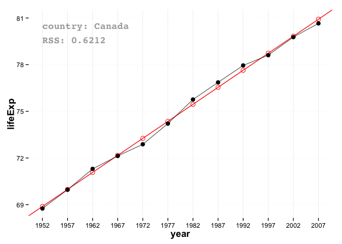 

Here I added `RSS: #` to refer to the fit error a.k.a residual sum of squares.

Furthermore, because I generalized the plotting function, I can arbitrarily plot `pop` by `year` of `Kuwait`:

```r
plotfig(filter(gapminder, country == "Kuwait"), 
        x = "year", y="pop")
```

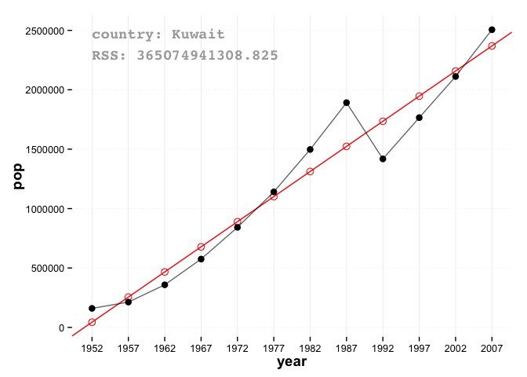 

The RSS values between the two plots are on different scales because the y-axes are different.

## Exploration 
### Category: life expectancy vs year
I can now call my `lm_intercept_slope()` function for all countries using `group_by() ... do() ...`

```r
dat2 <- gapminder %>% 
  group_by(country) %>% 
  do(lm_intercept_slope(., "lifeExp ~ year")) %>% 
  ungroup() %>% 
  arrange(desc(fit_error))

dat2 %>% head() %>% kable()
```


|country   |  intercept|      slope| fit_error|
|:---------|----------:|----------:|---------:|
|Zimbabwe  |  236.79819| -0.0930210|  519.1823|
|Swaziland | -139.19820|  0.0950748|  441.4395|
|Rwanda    |  132.20498| -0.0458315|  430.1090|
|Botswana  |  -65.49586|  0.0606685|  373.5871|
|Lesotho   | -139.16529|  0.0955657|  352.1157|
|Cambodia  | -735.78684|  0.3959028|  316.9851|

Here we see that Zimbabwe is the country with the worst linear fit (followed by Swaziland, Rwanda, Botswana, and Lesotho). Plotting this, we can see that indeed this is true!


```r
gapminder %>% 
  filter(country %in% as.character(head(dat2, 5)[["country"]])) %>% 
  group_by(country) %>% 
  do(figs = plotfig(., x="year", y="lifeExp")) %>% 
  .[match(dat2[["country"]], .$country),] %>% 
  .$figs
```

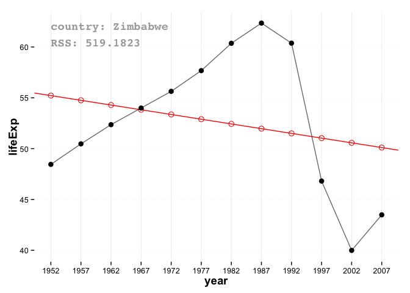 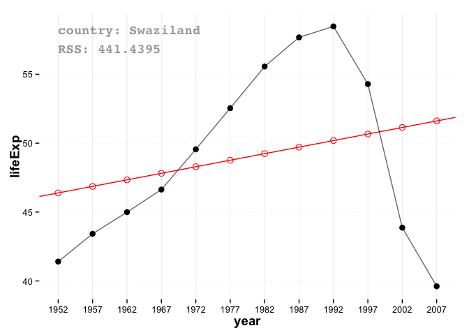 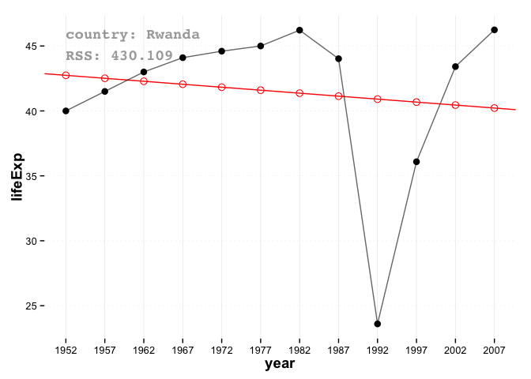 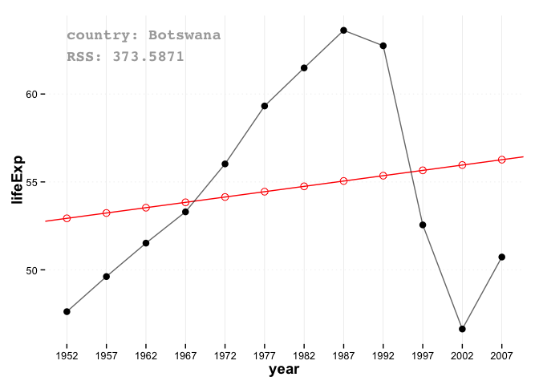 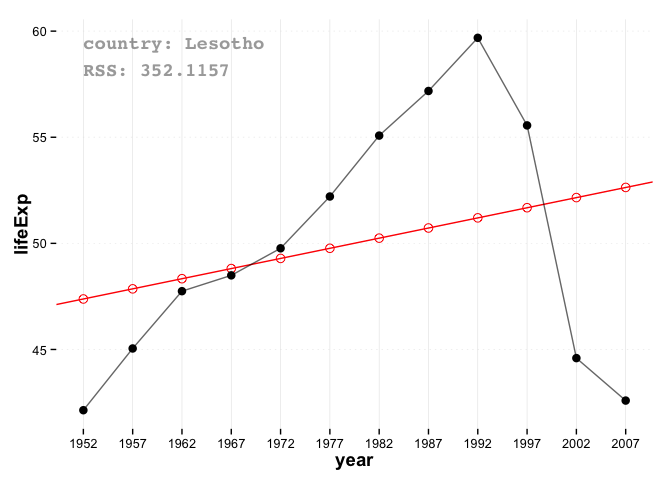 

### Category: gdpPercap vs year
Another analysis I think would be cool is to identify the countries with the worst economies. I approximate this by using a linear model and finding countries with the greatest negative slopes.


```r
dat3 <- gapminder %>% 
  group_by(country) %>% 
  do(lm_intercept_slope(., "gdpPercap ~ year")) %>% 
  ungroup() %>% 
  arrange(slope)

dat3 %>% head() %>% kable()
```


|country    |  intercept|       slope|    fit_error|
|:----------|----------:|-----------:|------------:|
|Kuwait     | 3200775.44| -1583.95682| 3658607004.9|
|Iraq       |  104085.55|   -48.63538|  181015507.6|
|Nicaragua  |   61686.65|   -29.43268|    8906169.8|
|Angola     |   49633.36|   -23.25146|   13019804.1|
|Djibouti   |   42576.87|   -20.14601|    1741848.1|
|Madagascar |   29324.00|   -14.13913|     280574.9|

Below shows the top 5 (as approximated by our statistic) worst economies:

```r
gapminder %>% 
  filter(country %in% as.character(head(dat3, 5)[["country"]])) %>% 
  group_by(country) %>% 
  do(figs = plotfig(., x="year", y="gdpPercap") +
       theme(#axis.text.x = element_text(angle=90, hjust=1, vjust=0.5),
             panel.background = element_rect(fill = "#B7E2F0"),
             panel.grid.major = element_line(color = "white")
             )
     ) %>% 
  .[match(dat3[["country"]], .$country),] %>% 
  .$figs
```

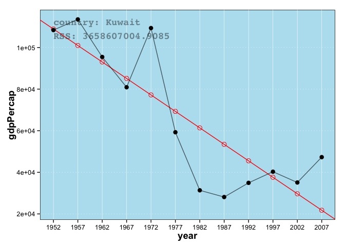 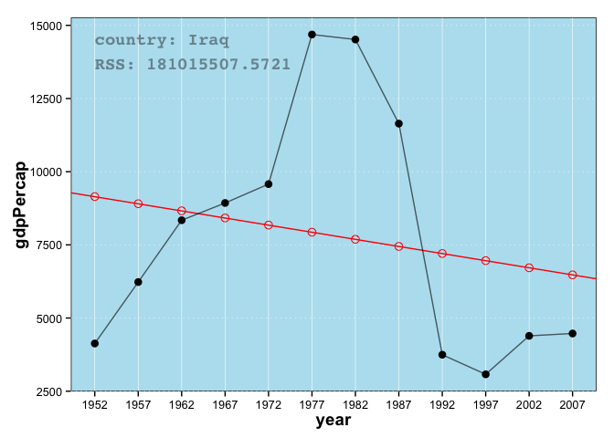 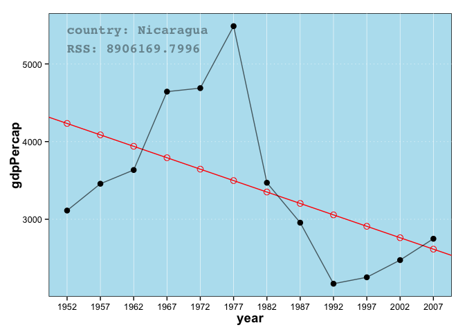 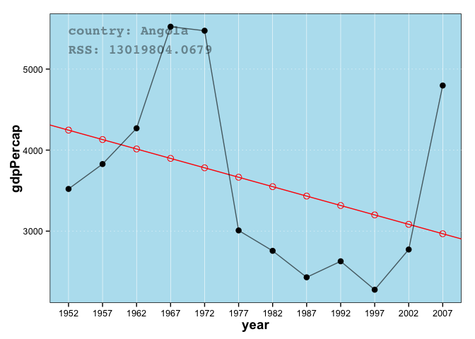 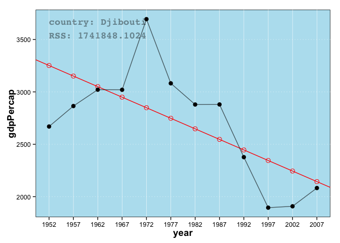 

On the other hand, here are the top economies:

```r
dat4 <- gapminder %>% 
  group_by(country) %>% 
  do(lm_intercept_slope(., "gdpPercap ~ year")) %>% 
  ungroup() %>% 
  arrange(desc(slope))

dat4 %>% head() %>% kable()
```


|country          | intercept|    slope| fit_error|
|:----------------|---------:|--------:|---------:|
|Singapore        |  -1552823| 793.2548| 201108467|
|Norway           |  -1430487| 736.1628|  44215422|
|Hong Kong, China |  -1284608| 657.1543|  95337658|
|Ireland          |  -1141026| 584.3825| 252484071|
|Japan            |  -1086260| 557.7221|  17127517|
|Austria          |  -1037774| 534.5723|   3850051|


```r
gapminder %>% 
  filter(country %in% as.character(head(dat4, 5)[["country"]])) %>% 
  group_by(country) %>% 
  do(figs = plotfig(., x="year", y="gdpPercap") +
       theme(#axis.text.x = element_text(angle=90, hjust=1, vjust=0.5),
             panel.background = element_rect(fill = "#d9ead4"),
             panel.grid.major = element_line(color = "white")
             )
     ) %>% 
  .[match(dat4[["country"]], .$country),] %>% 
  .$figs
```

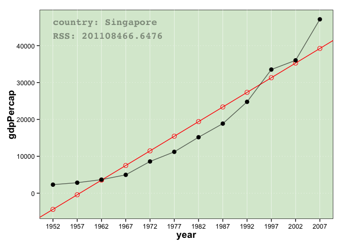 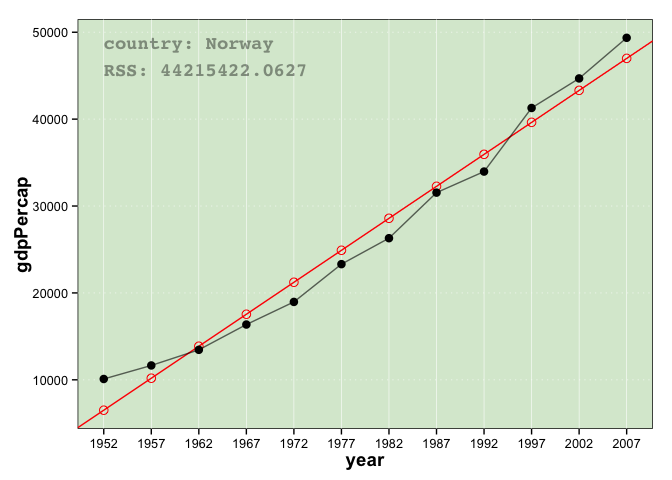 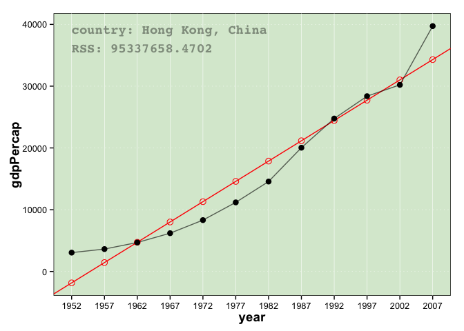 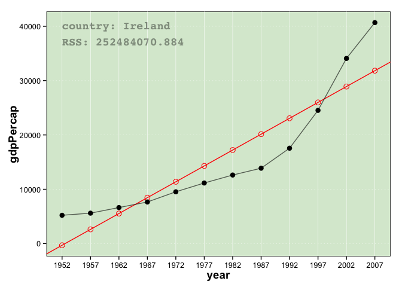 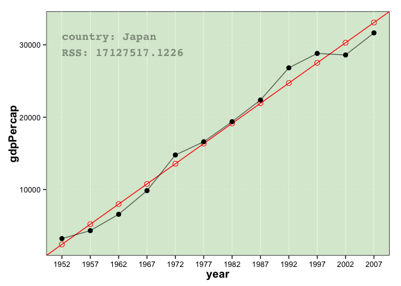 

## Reflection
This assignment was trickier -- in particular the `group_by() ... do() ...` portion where what you are "do"-ing is trying to plot a figure in some particular order e.g.


```r
## NOTE: dat4 = countries ordered by some statistic

## PART1) Normal stuff:
gapminder %>% 
  filter(country %in% as.character(head(dat4, 5)[["country"]])) %>% # <-- Keep only the top5 countries
  group_by(country) %>% 
  
  ## PART2) for each group, plot:
  do(figs = plotfig(., x="year", y="gdpPercap") + # <-- using the "plotfig()" function
       ## add some additional ggplot goodness to change theme:
       theme(panel.background = element_rect(fill = "#d9ead4"), 
             panel.grid.major = element_line(color = "white")
             )
     ) %>% 
  
  ## PART3) order countries in accordance to country order of dat4:
  .[match(dat4[["country"]], .$country),] %>% 
  
  ## PART4) access the plots in the dataframe:
  .$figs
```

The non `dplyr`-ness of the above is PART3... is there a way to `arrange` (or order) the rows of the data.frame by another vector?
