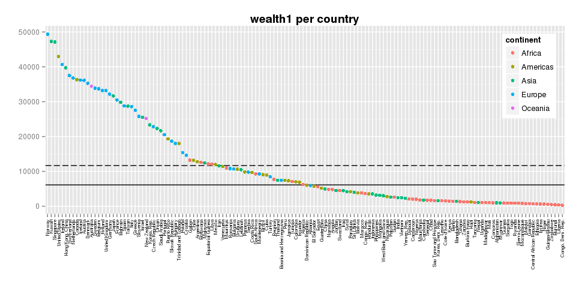
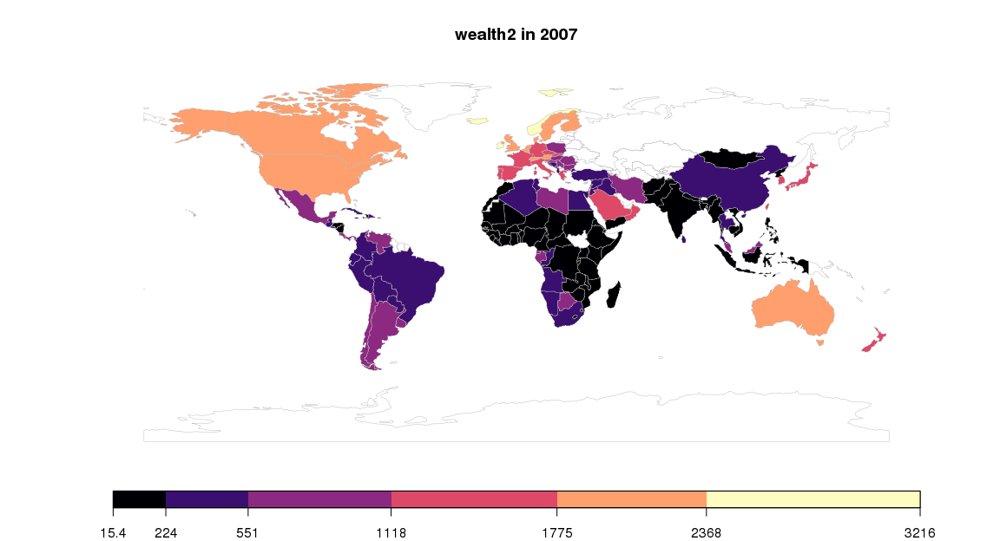
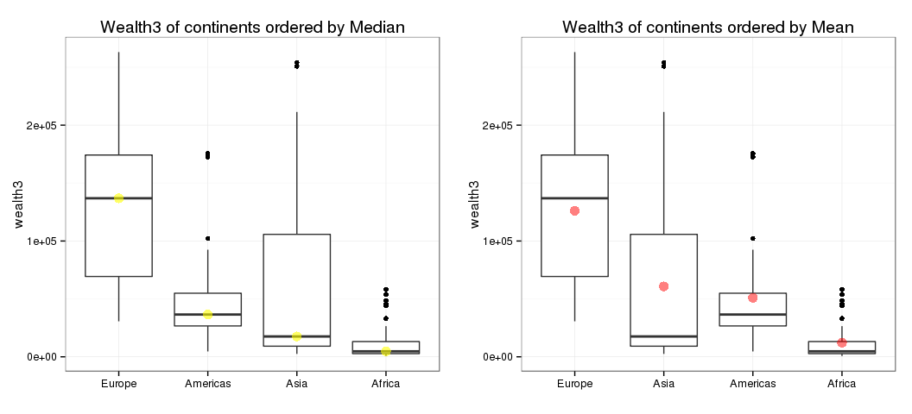

# hw05: factor & figure management; repo hygine
csiu  
October 26, 2015  


- [link to homework](http://stat545-ubc.github.io/hw05_factor-figure-boss-repo-hygiene.html)


```r
library(gapminder)
#library(cowplot)
library(ggplot2)
suppressPackageStartupMessages(library(plyr))
suppressPackageStartupMessages(library(dplyr))
suppressPackageStartupMessages(library(rworldmap))
library(classInt)
library(viridis)
library(knitr)
```

# Measure of wealth

First and foremost, let `wealth1` be a measure of `gdpPercap` i.e. let countries with higher `gdpPercap` be considered wealthy.

_Note: We will be working with the latest data i.e. from 2007_

To visualize the distribution of wealth, let us plot each country's `gdpPercap`.


```r
gdat <- gapminder %>% 
  filter(year == 2007) %>% 
  arrange(desc(gdpPercap)) 

gdat %>%
  ggplot(aes(x = country, 
             y = gdpPercap,
             color = continent)) +
  #geom_hline(yintercept=median(gdat$gdpPercap), color="black") + 
  #geom_hline(yintercept=mean(gdat$gdpPercap), color="black", linetype=5) +
  geom_point() +
  xlab("") +
  ylab("") +
  ggtitle("wealth1 (aka gdpPercap) per country") + 
  theme(axis.text.x = element_text(angle=90, hjust=1, vjust=0.5, size=6, color="grey20"),
        legend.justification = c(1, 1), 
        legend.position = c(1, 1),
        plot.title = element_text(face="bold")
        )
```

 

This figure is messy. In this case, it is easy to tell the wealthiest country, but it gets much harder when we try to identify the poorest (or second poorest) country. From the code, it is also interesting to note that `arrange()` does nothing for arranging the country order on the figure.

> Factor management

We will reorder the countries using `reorder()`:


```r
gdat <- gapminder %>% 
  filter(year == 2007) 

gdat %>%  
  ggplot(aes(x = reorder(country, gdpPercap, FUN=function(x){-x}), 
             y = gdpPercap,
             color = continent)) +
  geom_hline(yintercept=median(gdat$gdpPercap), color="black") + 
  geom_hline(yintercept=mean(gdat$gdpPercap), color="black", linetype=5) +
  geom_point() +
  xlab("") +
  ylab("") +
  ggtitle("wealth1 (aka gdpPercap) per country") + 
  theme(axis.text.x = element_text(angle=90, hjust=1, vjust=0.5, size=6, color="grey20"),
        legend.justification = c(1, 1), 
        legend.position = c(1, 1),
        plot.title = element_text(face="bold")
        )
```

 

In the graph above, the dashed line represents the **mean** and the solid line represents the **median** gdpPercap for the countries. Depending on which statistic you look at, the country in the middle is Iran (for mean) or Dominican Republic (for median). In addition, after `reorder`-ing the countries, we see that Norway is the wealthiest country followed clearly by Kuwait, Singapore, and so on until we get to the poorest country being Liberia, then The Democratic Republic of the Congo.

The measure of wealth using only `gdpPercap` is simple, let us now consider `wealth2` i.e. the wealth relative to population size (`pop`). In this new model, let us suppose a person's wealth is equal to a country's `gdpPercap` split up amongst the population. This means that individuals of a country with a large population gets less wealth as compared to individuals of a country with a small population with the same amount of wealth to share. 


```r
## LET'S DEFINE A NEW FUNCTION
headtail <- function(dat, n=5){
  dotdotdot <- head(dat, 1)
  dotdotdot[,] <- "."
  
  rbind(head(dat, n),
        dotdotdot,
        tail(dat, n)
        )
}

## DO SOMETHING...
gdat2 <- gapminder %>% 
  filter(year == 2007
         #,continent != "Oceania"
         ) %>% 
  mutate(wealth2 = gdpPercap / log(pop)) %>%
  arrange(desc(wealth2)) 

gdat2 %>% 
  headtail(5) %>% 
  kable()
```


|    |country          |continent |year |lifeExp |pop      |gdpPercap   |wealth2          |
|:---|:----------------|:---------|:----|:-------|:--------|:-----------|:----------------|
|1   |Norway           |Europe    |2007 |80.196  |4627926  |49357.19017 |3215.95088826817 |
|2   |Kuwait           |Asia      |2007 |77.588  |2505559  |47306.98978 |3210.73149119251 |
|3   |Singapore        |Asia      |2007 |79.972  |4553009  |47143.17964 |3074.96318316326 |
|4   |Iceland          |Europe    |2007 |81.757  |301931   |36180.78919 |2867.40542740266 |
|5   |Ireland          |Europe    |2007 |78.885  |4109086  |40675.99635 |2671.00714409745 |
|6   |.                |.         |.    |.       |.        |.           |.                |
|138 |Niger            |Africa    |2007 |56.867  |12894865 |619.6768924 |37.8490125841713 |
|139 |Zimbabwe         |Africa    |2007 |43.487  |12311143 |469.7092981 |28.7706025119209 |
|140 |Liberia          |Africa    |2007 |45.678  |3193942  |414.5073415 |27.6766912887459 |
|141 |Burundi          |Africa    |2007 |49.58   |8390505  |430.0706916 |26.9761762604832 |
|142 |Congo, Dem. Rep. |Africa    |2007 |46.462  |64606759 |277.5518587 |15.433412404393  |

The table shows the top and bottom 5 countries in accordance to our new measure of wealth.


```r
## REFERENCE: https://journal.r-project.org/archive/2011-1/RJournal_2011-1_South.pdf
numCats <- 6
category <- "wealth2"

sPDF <- joinCountryData2Map(gdat2,
                            joinCode="NAME",
                            nameJoinColumn="country",
                            mapResolution="li",
                            verbose=TRUE)

#getting class intervals
classInt <- classIntervals(sPDF[[category]],
                           n=numCats, style = "jenks")
catMethod <- classInt[["brks"]]

#getting colours
colourPalette <- magma(numCats)

#plot map
#mapDevice() #create world map shaped window
mapParams <- mapCountryData(sPDF,
                            nameColumnToPlot=category,
                            numCats=numCats,
                            catMethod=catMethod,
                            colourPalette=colourPalette,
                            addLegend=FALSE,
                            mapTitle=sprintf('%s in 2007', category)
                            )

#adding legend
do.call(addMapLegend,
        c(mapParams,
          legendLabels="all",
          legendWidth=1,
          legendIntervals="data",
          legendMar = 2))
```

 

> Visualization design

According to Tamara Munzner, for noncontiguous small regions, we can see only 6-12 colors (including background color, lines, highlights). In this figure, I categorized wealth into 6 bins. 

> I always wanted to do some mapping with R... and here is the perfect chance to do so!!

In this figure, we can see that countries in central Africa and around China are the poorest by our new definition of wealth (`wealth2`). On the other hand, Iceland moves up in wealthiness.

----

New measure of wealth, this time including life expectancy (`lifeExp`). GDP per capita is given as a yearly average. In new model, we will consider the wealth accumulated in a life time. We will also be optimistic and assume the GDP per capita increases by 2% each year. This wealth (`wealth3`) is calculated by `gdpPercap / log(pop) * 1.02 * lifeExp`.


```r
gdat3 <- gapminder %>% 
  filter(year == 2007) %>% 
  mutate(wealth2 = gdpPercap / log(pop),
         wealth3 = wealth2 * 1.02 * lifeExp) %>% 
  arrange(desc(wealth3))

gdat3 %>% 
  headtail() %>% 
  kable()
```


|    |country          |continent |year |lifeExp |pop      |gdpPercap   |wealth2          |wealth3          |
|:---|:----------------|:---------|:----|:-------|:--------|:-----------|:----------------|:----------------|
|1   |Norway           |Europe    |2007 |80.196  |4627926  |49357.19017 |3215.95088826817 |263064.525384265 |
|2   |Kuwait           |Asia      |2007 |77.588  |2505559  |47306.98978 |3210.73149119251 |254096.519637417 |
|3   |Singapore        |Asia      |2007 |79.972  |4553009  |47143.17964 |3074.96318316326 |250829.17479761  |
|4   |Iceland          |Europe    |2007 |81.757  |301931   |36180.78919 |2867.40542740266 |239119.074838722 |
|5   |Ireland          |Europe    |2007 |78.885  |4109086  |40675.99635 |2671.00714409745 |214916.44653337  |
|6   |.                |.         |.    |.       |.        |.           |.                |.                |
|138 |Guinea-Bissau    |Africa    |2007 |46.388  |1472041  |579.231743  |40.7847626991878 |1929.76204353172 |
|139 |Burundi          |Africa    |2007 |49.58   |8390505  |430.0706916 |26.9761762604832 |1364.22839537465 |
|140 |Liberia          |Africa    |2007 |45.678  |3193942  |414.5073415 |27.6766912887459 |1289.50022278108 |
|141 |Zimbabwe         |Africa    |2007 |43.487  |12311143 |469.7092981 |28.7706025119209 |1276.17013526462 |
|142 |Congo, Dem. Rep. |Africa    |2007 |46.462  |64606759 |277.5518587 |15.433412404393  |731.408551275568 |

We will now see which continent is the wealthiest.


```r
gdat3 %>% 
  ggplot(aes(x = continent,
             #x = reorder(continent, wealth3, FUN=function(x){-median(x)}),
             y = wealth3)) +
  geom_jitter(position = position_jitter(w=0.12, h=0)) +
  #geom_point(alpha = 0.5) + 
  stat_summary(fun.y=median, geom="point", 
               color="red", size=4, alpha=0.6) +
  stat_summary(fun.y=mean, geom="point", 
               color="yellow", size=4, alpha=0.6) +
  xlab("") +
  theme_bw()
```

 

According to the mean (yellow) and median (red) of `wealth3`, Oceania looks to be the continent with the wealthiest countries. But when looking at the countries individuall, there are wealthier countries in other continents. Let us drop Oceania.


```r
gg_median <- gdat3 %>% 
  filter(continent != "Oceania") %>% 
  ggplot(aes(x = reorder(continent, wealth3, FUN=function(x){-median(x)}),
             y = wealth3)) +
  geom_jitter(position = position_jitter(w=0.12, h=0)) +
  stat_summary(fun.y=median, geom="point", 
               color="red", size=4, alpha=0.6) +
  xlab("") +
  ggtitle("Wealth3 of continents ordered by Median") + 
  theme_bw()

gg_mean <- gdat3 %>% 
  filter(continent != "Oceania") %>% 
  ggplot(aes(x = reorder(continent, wealth3, FUN=function(x){-mean(x)}),
             y = wealth3)) +
  geom_jitter(position = position_jitter(w=0.12, h=0)) +
  stat_summary(fun.y=mean, geom="point", 
               color="yellow", size=4, alpha=0.6) +
  xlab("") +
  ggtitle("Wealth3 of continents ordered by Mean") + 
  theme_bw()

cowplot::plot_grid(gg_median, gg_mean)
```

 

**TODO: label richest/poorest country**


> But I want to do more!/Writing figures to file


## Clean up your repo
This is convienently DONE! 

In the first week of lecture (which seems like just yesterday but not and thus is frightening how time flies), Jenny showed us a nice and organized repo where links to homework and classnotes where listed -- in a table of contents -- in the top level README file. I thought this was useful and so I have been adhering to this standard since ... i.e. after every classnote/homework file, I've been listing the new file in my [README](https://github.com/STAT545-UBC/celia_siu/blob/master/README.md) file so that my repo remains clean.

In addition, to ignore `*html` and other irrelevant files, I've been ignoring them in git using the [.gitignore](https://github.com/STAT545-UBC/celia_siu/blob/master/.gitignore) file.

## Report your progress
Here is a list of what I learned in STAT545 that I did not know/realized previously:

- RStudio/Rproject/Git setup is cool, useful, and powerful
- RPubs is a way to share RScripts with the public (but I remain skeptical in using it)
- `dplyr` -- where have you been all my life? -- is a necessity in manipulating data (especially the `%>%` pipe operator)
- `tidyr` is really, really convienent in reshaping data
- `ggplot(...) + stat_summary(...) ...` to add something such as min/max on the fly
- Must try the palettes `viridis` package, it is mouth watering
- `cowplot` (despite the strange name) is for plotting multiple plots on a page
