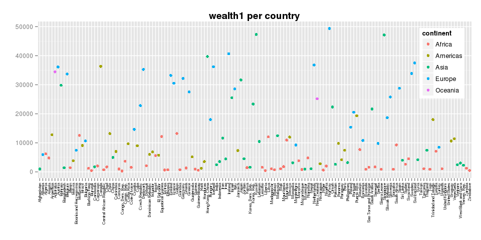
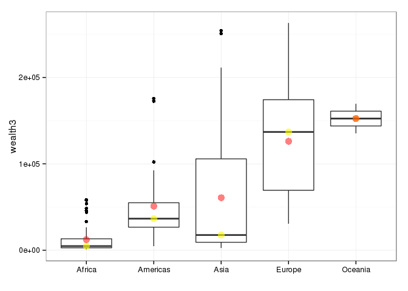

# hw05: factor & figure management; repo hygine
csiu  
October 26, 2015  


- [link to homework](http://stat545-ubc.github.io/hw05_factor-figure-boss-repo-hygiene.html)


```r
library(gapminder)
#library(cowplot)
library(ggplot2)
suppressPackageStartupMessages(library(plyr))
suppressPackageStartupMessages(library(dplyr))
suppressPackageStartupMessages(library(rworldmap))
library(classInt)
library(viridis)
library(knitr)
```

# Measure of wealth

First and foremost, let `wealth1` be a measure of `gdpPercap` i.e. let countries with higher `gdpPercap` be considered wealthy.

_Note: We will be working with the latest data i.e. from 2007._

To visualize the distribution of wealth, let us make a dot plot of each country's `wealth1` (aka `gdpPercap`).


```r
gdat <- gapminder %>% 
  filter(year == 2007) %>% 
  arrange(desc(gdpPercap)) 

gdat %>%
  ggplot(aes(x = country, 
             y = gdpPercap,
             color = continent)) +
  #geom_hline(yintercept=median(gdat$gdpPercap), color="black") + 
  #geom_hline(yintercept=mean(gdat$gdpPercap), color="black", linetype=5) +
  geom_point() +
  xlab("") +
  ylab("") +
  ggtitle("wealth1 per country") + 
  theme(axis.text.x = element_text(angle=90, hjust=1, vjust=0.5, size=6, color="grey20"),
        legend.justification = c(1, 1), 
        legend.position = c(1, 1),
        plot.title = element_text(face="bold")
        )
```

 

This figure is messy. In this case, it is easy to tell the wealthiest country, but it gets much harder when we try to identify the poorest (or second poorest) country. From the code, it is also interesting to note that `arrange()` does nothing for arranging the country order in the figure.

> Factor management

We will reorder the countries using `reorder()`:


```r
gdat <- gapminder %>% 
  filter(year == 2007) 

gdat %>%  
  ggplot(aes(x = reorder(country, gdpPercap, FUN=function(x){-x}), 
             y = gdpPercap,
             color = continent)) +
  geom_hline(yintercept=median(gdat$gdpPercap), color="black") + 
  geom_hline(yintercept=mean(gdat$gdpPercap), color="black", linetype=5) +
  geom_point() +
  xlab("") +
  ylab("") +
  ggtitle("wealth1 per country") + 
  theme(axis.text.x = element_text(angle=90, hjust=1, vjust=0.5, size=6, color="grey20"),
        legend.justification = c(1, 1), 
        legend.position = c(1, 1),
        plot.title = element_text(face="bold")
        )
```

 

In the graph above, the dashed line represents the **mean** and the solid line represents the **median** wealth for the countries. Depending on which statistic you look at, the country in the middle is Iran (for mean) or Dominican Republic (for median). In addition, after `reorder`-ing the countries, we see that Norway is the wealthiest country followed clearly by Kuwait, Singapore, and so on until we get to the poorest country being Burundi, Liberia, and finally The Democratic Republic of the Congo.

## Wealth in different population sizes

The measure of wealth using only `gdpPercap` is simple. Let us now take into account population size (`pop`) for a new measurement of wealth: `wealth2`. In this new model, let us suppose a person's wealth is equal to a country's `gdpPercap` split up amongst the population. This means that individuals of a country with a large population gets less wealth as compared to individuals of a country with a small population with the same amount of wealth to share.


```r
## DEFINE NEW FUNCTION TO GLIMPSE AT DATA
headtail <- function(dat, n=5){
  dotdotdot <- head(dat, 1)
  dotdotdot[,] <- "."
  
  rbind(head(dat, n),
        dotdotdot,
        tail(dat, n)
        )
}

## SHOW ME THE HITS
gdat2 <- gapminder %>% 
  filter(year == 2007
         #,continent != "Oceania"
         ) %>% 
  mutate(wealth2 = gdpPercap / log(pop)) %>%
  arrange(desc(wealth2)) 

gdat2 %>% 
  headtail(5) %>% 
  kable()
```


|    |country          |continent |year |lifeExp |pop      |gdpPercap   |wealth2          |
|:---|:----------------|:---------|:----|:-------|:--------|:-----------|:----------------|
|1   |Norway           |Europe    |2007 |80.196  |4627926  |49357.19017 |3215.95088826817 |
|2   |Kuwait           |Asia      |2007 |77.588  |2505559  |47306.98978 |3210.73149119251 |
|3   |Singapore        |Asia      |2007 |79.972  |4553009  |47143.17964 |3074.96318316326 |
|4   |Iceland          |Europe    |2007 |81.757  |301931   |36180.78919 |2867.40542740266 |
|5   |Ireland          |Europe    |2007 |78.885  |4109086  |40675.99635 |2671.00714409745 |
|6   |.                |.         |.    |.       |.        |.           |.                |
|138 |Niger            |Africa    |2007 |56.867  |12894865 |619.6768924 |37.8490125841713 |
|139 |Zimbabwe         |Africa    |2007 |43.487  |12311143 |469.7092981 |28.7706025119209 |
|140 |Liberia          |Africa    |2007 |45.678  |3193942  |414.5073415 |27.6766912887459 |
|141 |Burundi          |Africa    |2007 |49.58   |8390505  |430.0706916 |26.9761762604832 |
|142 |Congo, Dem. Rep. |Africa    |2007 |46.462  |64606759 |277.5518587 |15.433412404393  |

The table shows the top and bottom 5 countries in accordance to our new measure of wealth. Norway, Kuwait, and Singapore remains the top 3. Iceland (replacing United States) is the new 4th place. Ireland stays at 5th. The bottom 4 country remains the same, but the 5th poorest is now Niger (in place of Guinea-Bissau).

> I always wanted to do some mapping with R... and here is the perfect chance to do so!!

To get spatial perspective, we plot `wealth2` on a map.


```r
## REFERENCE: https://journal.r-project.org/archive/2011-1/RJournal_2011-1_South.pdf
numCats <- 6
category <- "wealth2"

sPDF <- joinCountryData2Map(gdat2,
                            joinCode="NAME",
                            nameJoinColumn="country",
                            mapResolution="li",
                            verbose=TRUE)

#getting class intervals
classInt <- classIntervals(sPDF[[category]],
                           n=numCats, style = "jenks")
catMethod <- classInt[["brks"]]

#getting colours
colourPalette <- magma(numCats)

#plot map
#mapDevice() #create world map shaped window
mapParams <- mapCountryData(sPDF,
                            nameColumnToPlot=category,
                            numCats=numCats,
                            catMethod=catMethod,
                            colourPalette=colourPalette,
                            addLegend=FALSE,
                            mapTitle=sprintf('%s in 2007', category)
                            )

#adding legend
do.call(addMapLegend,
        c(mapParams,
          legendLabels="all",
          legendWidth=1,
          legendIntervals="data",
          legendMar = 2))
```

 

According to Tamara Munzner, for noncontiguous small regions, we can see only 6-12 colors (including the background color, lines, and highlights). In this figure, I categorized wealth into 6 bins. 

> Visualization design

In this figure, we can see that countries in central Africa and around China are the poorest by our new definition of wealth. On the other hand, the wealthiest countries are located in northern Europe.

## Wealth in a life time

In a new measure of wealth, let us this time consider life expectancy (`lifeExp`). `gdpPercap` represents a yearly average. In this new model (i.e. `wealth3`), we will consider the wealth accumulated in a life time. We will also be optimistic and assume the GDP per capita increases 2% each year. This wealth (i.e. `wealth3`) is calculated by `gdpPercap / log(pop) * 1.02 * lifeExp`.


```r
gdat3 <- gapminder %>% 
  filter(year == 2007) %>% 
  mutate(wealth2 = gdpPercap / log(pop),
         wealth3 = wealth2 * 1.02 * lifeExp) %>% 
  arrange(desc(wealth3))

gdat3 %>% 
  headtail() %>% 
  kable()
```


|    |country          |continent |year |lifeExp |pop      |gdpPercap   |wealth2          |wealth3          |
|:---|:----------------|:---------|:----|:-------|:--------|:-----------|:----------------|:----------------|
|1   |Norway           |Europe    |2007 |80.196  |4627926  |49357.19017 |3215.95088826817 |263064.525384265 |
|2   |Kuwait           |Asia      |2007 |77.588  |2505559  |47306.98978 |3210.73149119251 |254096.519637417 |
|3   |Singapore        |Asia      |2007 |79.972  |4553009  |47143.17964 |3074.96318316326 |250829.17479761  |
|4   |Iceland          |Europe    |2007 |81.757  |301931   |36180.78919 |2867.40542740266 |239119.074838722 |
|5   |Ireland          |Europe    |2007 |78.885  |4109086  |40675.99635 |2671.00714409745 |214916.44653337  |
|6   |.                |.         |.    |.       |.        |.           |.                |.                |
|138 |Guinea-Bissau    |Africa    |2007 |46.388  |1472041  |579.231743  |40.7847626991878 |1929.76204353172 |
|139 |Burundi          |Africa    |2007 |49.58   |8390505  |430.0706916 |26.9761762604832 |1364.22839537465 |
|140 |Liberia          |Africa    |2007 |45.678  |3193942  |414.5073415 |27.6766912887459 |1289.50022278108 |
|141 |Zimbabwe         |Africa    |2007 |43.487  |12311143 |469.7092981 |28.7706025119209 |1276.17013526462 |
|142 |Congo, Dem. Rep. |Africa    |2007 |46.462  |64606759 |277.5518587 |15.433412404393  |731.408551275568 |

This table (similar to the previous table) shows the top and bottom 5 countries in accordance to `wealth3`. Comparing to table of `wealth2`, we see that the order of the top 5 wealthiest countries does not change. The order of the 5 poorest countries (from `wealth2`'s Democratic Republic of the Congo, Burundi, Liberia, Zimbabwe, and Niger to `wealth3`'s Democratic Republic of the Congo, Zimbabwe, Liberia, Burundi, and Guinea-Bissau) does change.

To identify the wealthiest continent, we will create another dot plot and this time grouping by continents.


```r
gdat3 %>% 
  ggplot(aes(x = continent,
             y = wealth3)) +
  geom_boxplot() + 
  #geom_point(alpha = 0.7) + 
  #geom_jitter(position = position_jitter(w=0.12, h=0)) +
  stat_summary(fun.y=median, geom="point", color="yellow", size=4, alpha=0.6) +
  stat_summary(fun.y=mean, geom="point", color="red", size=4, alpha=0.5) +
  xlab("") +
  theme_bw()
```

 

In this figure, we used `geom_boxplot()` to show the density of countries with a particular `wealth3`. Yellow represents the median country and red the mean country. According to the mean (red) and median (yellow) of `wealth3`, Oceania looks to be the continent with the wealthiest countries; however, looking at the countries individually, there are wealthier countries in other continents. Let us drop Oceania.

> Factor management: Drop Oceania


```r
gg_median <- gdat3 %>% 
  filter(continent != "Oceania") %>% 
  ggplot(aes(x = reorder(continent, wealth3, FUN=function(x){-median(x)}),
             y = wealth3)) +
  geom_boxplot() + 
  #geom_point(alpha = 0.5, size=3) + 
  #geom_jitter(position = position_jitter(w=0.12, h=0)) +
  stat_summary(fun.y=median, geom="point", color="yellow", size=4, alpha=0.6) +
  ggtitle("Wealth3 of continents ordered by Median") + 
  xlab("") +
  theme_bw()

gg_mean <- gdat3 %>% 
  filter(continent != "Oceania") %>% 
  ggplot(aes(x = reorder(continent, wealth3, FUN=function(x){-mean(x)}),
             y = wealth3)) +
  geom_boxplot() +
  #geom_point(alpha = 0.5, size=3) + 
  #geom_jitter(position = position_jitter(w=0.12, h=0)) +
  stat_summary(fun.y=mean, geom="point", color="red", size=4, alpha=0.5) +
  ggtitle("Wealth3 of continents ordered by Mean") +
  xlab("") +
  theme_bw()

cowplot::plot_grid(gg_median, gg_mean)
```

 

From these figures -- after removing Oceania and reordering by median (left) and mean (right) -- we see that the order of wealth changes between continents when we look at mean vs median: the Americas are wealthier than Asia when we look at median and the reverse is true when we look at the mean.

From a data visualization standpoint, initially I wanted to use `geom_point()`, but then I lose out the density information when the points stack on top of each other. Adding a `alpha = 0.5` does not make the plot look prettier, so I then turned to `geom_jitter()`. `geom_jitter()` is a whole different can of worms. The jitters are random. For the visualization, I wanted the jitters to be replicated across the 3 plots. Using `set.seed()` seems to replicate the next instance of `geom_jitter()`, but after I removed Oceania, reordered the continent factor levels, and use `cowplot::plot_grid()` to plot the figures side-by-side, the jitters across the 3 plots are different. This was too complicated, so I went simplistic and turned to `geom_boxplot()`. `geom_boxplot()` works out well. 

## Predictor of `wealth3`

In the last analysis, I want to identify the factor (i.e. `gdpPercap`, `pop`, or `lifeExp`) which has the greatest affect on `wealth3`. To do this, we measure the correlation of `wealth3` against each factor (using the `summarise_each()` function) and find the one with the greatest magnitude.


```r
gdat3a <- gapminder %>% 
  mutate(wealth3 = gdpPercap/log(pop)*1.02*lifeExp)

gdat3a %>%
  group_by(year) %>%
  summarise_each(funs(corr_w3 = cor(., wealth3)),
                 gdpPercap, lifeExp, pop) %>%
  arrange(desc(year)) %>%
  kable()
```


| year| gdpPercap|   lifeExp|        pop|
|----:|---------:|---------:|----------:|
| 2007| 0.9917331| 0.6781904| -0.0780549|
| 2002| 0.9915931| 0.6834073| -0.0711951|
| 1997| 0.9917893| 0.6976013| -0.0687073|
| 1992| 0.9909715| 0.7009699| -0.0664145|
| 1987| 0.9898910| 0.7450658| -0.0721045|
| 1982| 0.9879539| 0.7323858| -0.0775274|
| 1977| 0.9884797| 0.6326518| -0.0695720|
| 1972| 0.9939191| 0.4549154| -0.0517041|
| 1967| 0.9928170| 0.4835118| -0.0472823|
| 1962| 0.9963999| 0.3879964| -0.0395568|
| 1957| 0.9978666| 0.3049172| -0.0335520|
| 1952| 0.9981962| 0.2816096| -0.0299991|

From this table, we see that `gdpPercap` is the most correlated, then it is `lifeExp`, and finally `pop`.

## Clean up your repo
This is convienently DONE! 

In the first week of lecture (which seems like just yesterday but not and thus is frightening how time flies), Jenny showed us a nice and organized repo where links to homework and classnotes where listed -- in a table of contents -- in the top level README file. I thought this was useful and so I have been adhering to this standard since ... i.e. after every classnote/homework file, I've been listing the new file in my [README](https://github.com/STAT545-UBC/celia_siu/blob/master/README.md) file so that my repo remains clean.

In addition, to ignore `*html` and other irrelevant files, I've been ignoring them in git using the [.gitignore](https://github.com/STAT545-UBC/celia_siu/blob/master/.gitignore) file.

## But I want to do more!

In the following bit, we map `log(wealth3)` across the years. 

> Writing figures to file

Using "Knit HTML" from RStudio takes forever when I allow the following chunk of code to regenerate. This is why I (1) set the chunk to be `eval=FALSE`, (2) manually do a `ggsave()` to save the figure to file, and (3) later add it back to the markdown using ``. 


```r
## REFERENCES
## mapping in ggplot: http://stackoverflow.com/questions/29907053/plot-colour-coded-world-map-using-ggplot2
## categorical to bin: http://stackoverflow.com/questions/14763514/bin-continuous-values-in-ggplot2-based-on-criteria-to-obtain-more-distinct-col
## joins: https://stat545-ubc.github.io/bit001_dplyr-cheatsheet.html#left_joinsuperheroes-publishers

map.world <- map_data(map="world")

## ===================================================================== ##
## FIX MAPPING OF COUNTRIES BETWEEN map.world AND gapminder 
## List countries
cg <- gapminder$country %>% unique() %>% sort()
cm <- map.world$region %>% unique() %>% sort()

## Fix mapping
map.world$region <- revalue(map.world$region, 
                            replace=c("USA" = "United States", 
                                      "UK" = "United Kingdom",
                                      "North Korea" = "Korea, Dem. Rep.",
                                      "South Korea" = "Korea, Rep.",
                                      "Yemen" = "Yemen, Rep.",
                                      "West Bank" = "West Bank and Gaza",
                                      "Gaza Strip" = "West Bank and Gaza",
                                      #"Congo" = "Congo, Dem. Rep.",
                                      #"Congo" = "Congo, Rep.",
                                      "Trinidad" = "Trinidad and Tobago",
                                      "Tobago" = "Trinidad and Tobago"
                                      ))
## MAPPINGS TO FIX
## Have life expectancy, but can't map to world
setdiff(cg, map.world$region %>% unique() %>% sort())
## Missing life expectancy data
setdiff(map.world$region %>% unique() %>% sort(), cg)

#grep("bank", cm, value = T, ignore.case = T)
## ===================================================================== ##

map.world2 <- inner_join(map.world, 
                         gapminder %>% 
                           mutate(wealth3 = gdpPercap/log(pop)*1.02*lifeExp),
                         by = c("region" = "country"))

gg <- ggplot() +
  #geom_map(data=map.world2, map=map.world2, aes(x=long, y=lat, map_id=region), fill="grey90") + 
  #geom_polygon(data=map.world2, aes(x=long, y=lat, group=group), fill="grey90") + 
  geom_map(data=transform(map.world2, category=cut(log(wealth3), 6)) %>% filter(year != "NA"), 
           map=map.world2,
           aes(map_id=region, x=long, y=lat, fill=category)) +
  scale_fill_viridis(discrete=TRUE, option="A", name="Range of\nlog(wealth3)") +
  coord_equal() +
  facet_wrap(~year, ncol=2, drop=TRUE) + 
  theme(panel.grid.major = element_line(size=0.3),
        panel.grid.minor = element_line(size=0.2)
        )

ggsave(filename="homework/figure/hw05-wealth3-world-years.png", plot=gg, width=7.2, height=7)
```


This figure shows the `log(wealth3)` across the years. Looking down a column is 10 years. 

In the figure, we also see that between US and Canada, US becomes wealthier first followed by Canada. In general, countries tends to be wealthier across time. It is also interesting to see that Libya (in Africa) becomes wealthy until 1982 and then moves back in wealthiness in 1987; googling this, we get the [Chadian-Libyan conflict](https://en.wikipedia.org/wiki/Chadian%E2%80%93Libyan_conflict) of 1978-1987.

> Revalue a factor

In the chunk of code for creating the figure, I needed to `revalue()` some factors so that there is mapping between countries from the `map.world` and `gapminder` datasets. There is also some countries without mapping -- e.g. "Russia" is missing in the `gapminder` dataset -- which results to no rendering of the country in the figure. 


## Report your progress
In this assignment ... 

- I used the `viridis` palette for the first time
- I finally get to map something
- Combining `rworldmap` with `ggplot` is tricky business, but I got it done
- Reording factors with `reorder()` is brilliant
- Creating a new function -- i.e. `headtail()` -- is convienent 
- `stat_summary()` is awesome
- `cowplot::plot_grid()` is easy to use
- Used `summarise_each()` for the first time
- Manually doing a `revalue()` is painful, but needs to be done

Here is a list of what I learned in STAT545 that I did not know/realized previously:

- RStudio/Rproject/Git setup is cool, useful, and powerful
- RPubs is a way to share RScripts with the public (but I remain skeptical in using it)
- `dplyr` -- where have you been all my life? -- is a necessity in manipulating data (especially the `%>%` pipe operator)
- `tidyr` is really, really convienent in reshaping data
- `ggplot(...) + stat_summary(...) ...` to add something such as min/max on the fly
- The `viridis` palettes are mouth watering
- `cowplot` (despite the strange name) is for plotting multiple plots on a page
