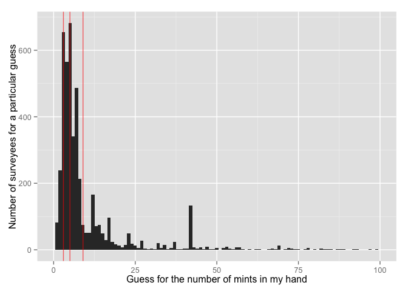
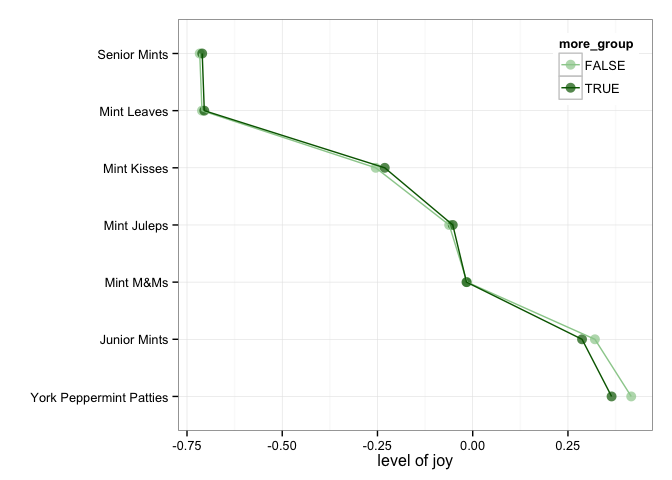
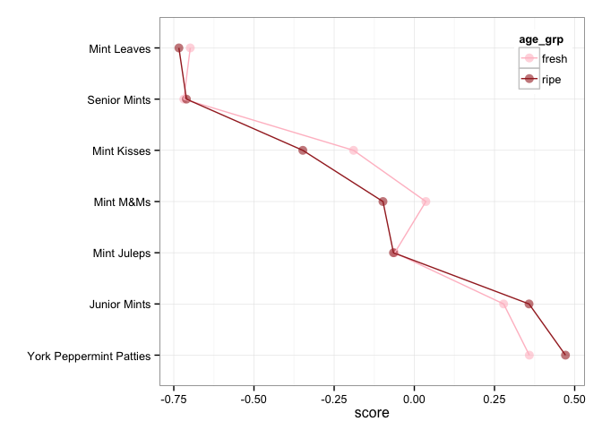

# hw07: Bring the Candy Survey data
csiu  
November 8, 2015  

```r
knitr::opts_chunk$set(fig.path='figure/hw07-')
options(knitr.table.format = 'markdown')
```

I have cleaned up candy data here: 

- add [user id column](https://github.com/csiu/candyplay/blob/master/data-raw/02_add-user-column.md)
- cleanup for [general factors](https://github.com/csiu/candyplay/blob/master/data-raw/03_tidy1.md) | resulting [csv file](https://github.com/csiu/candyplay/blob/master/data-raw/03_tidy1.csv)
- cleanup for [guess number of mints](https://github.com/csiu/candyplay/blob/master/data-raw/04_tidy2-mints.md) | resulting [csv file](https://github.com/csiu/candyplay/blob/master/data-raw/04_tidy2-mints.csv)
- cleanup for [age](https://github.com/csiu/candyplay/blob/master/data-raw/05_tidy3-age.md) | resulting [csv file](https://github.com/csiu/candyplay/blob/master/data-raw/05_tidy3-age.csv)
- cleanup for [the candy itself](https://github.com/csiu/candyplay/blob/master/data-raw/06_tidy4-candy.md) | resulting [csv file](https://github.com/csiu/candyplay/blob/master/data-raw/06_tidy4-candy.csv)

# Use of candy data

I want to explore mints. 

----

## The questions:
1. If you guess there is more mints in my hand, do you feel more joy towards mint candy?
2. If you're taking the survey late at night, do you guess there is more mints in my hand?
3. Do people 40 or older feel more joy towards mint candy?
4. Given the people who said they were old, are we able to predict their age given their preference towards mint candy & the number of mints they have guess?

## Data cleaning:
Load packages:


```r
library(readr)
suppressPackageStartupMessages(library(tidyr))
suppressPackageStartupMessages(library(dplyr))
library(ggplot2)
library(ggdendro)
library(viridis)
```

Load raw data:


```r
raw <- read_csv("../data/candy-survey-2015.csv")
```

Here are the column names in the raw data -- I will not be using all of them in my analysis.

```r
colnames(raw)
```

```
##   [1] "Timestamp"                                                                                                        
##   [2] "How old are you?"                                                                                                 
##   [3] "Are you going actually going trick or treating yourself?"                                                         
##   [4] "[Butterfinger]"                                                                                                   
##   [5] "[100 Grand Bar]"                                                                                                  
##   [6] "[Anonymous brown globs that come in black and orange wrappers]"                                                   
##   [7] "[Any full-sized candy bar]"                                                                                       
##   [8] "[Black Jacks]"                                                                                                    
##   [9] "[Bonkers]"                                                                                                        
##  [10] "[Bottle Caps]"                                                                                                    
##  [11] "[Box’o’ Raisins]"                                                                                                 
##  [12] "[Brach products (not including candy corn)]"                                                                      
##  [13] "[Bubble Gum]"                                                                                                     
##  [14] "[Cadbury Creme Eggs]"                                                                                             
##  [15] "[Candy Corn]"                                                                                                     
##  [16] "[Vials of pure high fructose corn syrup, for main-lining into your vein]"                                         
##  [17] "[Candy that is clearly just the stuff given out for free at restaurants]"                                         
##  [18] "[Cash, or other forms of legal tender]"                                                                           
##  [19] "[Chiclets]"                                                                                                       
##  [20] "[Caramellos]"                                                                                                     
##  [21] "[Snickers]"                                                                                                       
##  [22] "[Dark Chocolate Hershey]"                                                                                         
##  [23] "[Dental paraphenalia]"                                                                                            
##  [24] "[Dots]"                                                                                                           
##  [25] "[Fuzzy Peaches]"                                                                                                  
##  [26] "[Generic Brand Acetaminophen]"                                                                                    
##  [27] "[Glow sticks]"                                                                                                    
##  [28] "[Broken glow stick]"                                                                                              
##  [29] "[Goo Goo Clusters]"                                                                                               
##  [30] "[Good N' Plenty]"                                                                                                 
##  [31] "[Gum from baseball cards]"                                                                                        
##  [32] "[Gummy Bears straight up]"                                                                                        
##  [33] "[Creepy Religious comics/Chick Tracts]"                                                                           
##  [34] "[Healthy Fruit]"                                                                                                  
##  [35] "[Heath Bar]"                                                                                                      
##  [36] "[Hershey’s Kissables]"                                                                                            
##  [37] "[Hershey’s Milk Chocolate]"                                                                                       
##  [38] "[Hugs (actual physical hugs)]"                                                                                    
##  [39] "[Jolly Rancher (bad flavor)]"                                                                                     
##  [40] "[Jolly Ranchers (good flavor)]"                                                                                   
##  [41] "[Kale smoothie]"                                                                                                  
##  [42] "[Kinder Happy Hippo]"                                                                                             
##  [43] "[Kit Kat]"                                                                                                        
##  [44] "[Hard Candy]"                                                                                                     
##  [45] "[Lapel Pins]"                                                                                                     
##  [46] "[LemonHeads]"                                                                                                     
##  [47] "[Licorice]"                                                                                                       
##  [48] "[Licorice (not black)]"                                                                                           
##  [49] "[Lindt Truffle]"                                                                                                  
##  [50] "[Lollipops]"                                                                                                      
##  [51] "[Mars]"                                                                                                           
##  [52] "[Mary Janes]"                                                                                                     
##  [53] "[Maynards]"                                                                                                       
##  [54] "[Milk Duds]"                                                                                                      
##  [55] "[LaffyTaffy]"                                                                                                     
##  [56] "[Minibags of chips]"                                                                                              
##  [57] "[JoyJoy (Mit Iodine)]"                                                                                            
##  [58] "[Reggie Jackson Bar]"                                                                                             
##  [59] "[Pixy Stix]"                                                                                                      
##  [60] "[Nerds]"                                                                                                          
##  [61] "[Nestle Crunch]"                                                                                                  
##  [62] "[Now'n'Laters]"                                                                                                   
##  [63] "[Pencils]"                                                                                                        
##  [64] "[Milky Way]"                                                                                                      
##  [65] "[Reese’s Peanut Butter Cups]"                                                                                     
##  [66] "[Tolberone something or other]"                                                                                   
##  [67] "[Runts]"                                                                                                          
##  [68] "[Junior Mints]"                                                                                                   
##  [69] "[Senior Mints]"                                                                                                   
##  [70] "[Mint Kisses]"                                                                                                    
##  [71] "[Mint Juleps]"                                                                                                    
##  [72] "[Mint Leaves]"                                                                                                    
##  [73] "[Peanut M&M’s]"                                                                                                   
##  [74] "[Regular M&Ms]"                                                                                                   
##  [75] "[Mint M&Ms]"                                                                                                      
##  [76] "[Ribbon candy]"                                                                                                   
##  [77] "[Rolos]"                                                                                                          
##  [78] "[Skittles]"                                                                                                       
##  [79] "[Smarties (American)]"                                                                                            
##  [80] "[Smarties (Commonwealth)]"                                                                                        
##  [81] "[Chick-o-Sticks (we don’t know what that is)]"                                                                    
##  [82] "[Spotted Dick]"                                                                                                   
##  [83] "[Starburst]"                                                                                                      
##  [84] "[Swedish Fish]"                                                                                                   
##  [85] "[Sweetums]"                                                                                                       
##  [86] "[Those odd marshmallow circus peanut things]"                                                                     
##  [87] "[Three Musketeers]"                                                                                               
##  [88] "[Peterson Brand Sidewalk Chalk]"                                                                                  
##  [89] "[Peanut Butter Bars]"                                                                                             
##  [90] "[Peanut Butter Jars]"                                                                                             
##  [91] "[Trail Mix]"                                                                                                      
##  [92] "[Twix]"                                                                                                           
##  [93] "[Vicodin]"                                                                                                        
##  [94] "[White Bread]"                                                                                                    
##  [95] "[Whole Wheat anything]"                                                                                           
##  [96] "[York Peppermint Patties]"                                                                                        
##  [97] "Please leave any remarks or comments regarding your choices."                                                     
##  [98] "Please list any items not included above that give you JOY."                                                      
##  [99] "Please list any items not included above that give you DESPAIR."                                                  
## [100] "Guess the number of mints in my hand."                                                                            
## [101] "Betty or Veronica?"                                                                                               
## [102] "Check all that apply: \"I cried tears of sadness at the end of  ____________\""                                   
## [103] "\"That dress* that went viral early this year - when I first saw it, it was ________\""                           
## [104] "Fill in the blank: \"Taylor Swift is a force for ___________\""                                                   
## [105] "What is your favourite font?"                                                                                     
## [106] "If you squint really hard, the words \"Intelligent Design\" would look like."                                     
## [107] "Fill in the blank: \"Imitation is a form of ____________\""                                                       
## [108] "Please estimate the degree(s) of separation you have from the following celebrities [JK Rowling]"                 
## [109] "Please estimate the degree(s) of separation you have from the following celebrities [JJ Abrams]"                  
## [110] "Please estimate the degree(s) of separation you have from the following celebrities [Beyoncé]"                    
## [111] "Please estimate the degree(s) of separation you have from the following celebrities [Bieber]"                     
## [112] "Please estimate the degree(s) of separation you have from the following celebrities [Kevin Bacon]"                
## [113] "Please estimate the degree(s) of separation you have from the following celebrities [Francis Bacon (1561 - 1626)]"
## [114] "[Sea-salt flavored stuff, probably chocolate, since this is the \"it\" flavor of the year]"                       
## [115] "[Necco Wafers]"                                                                                                   
## [116] "Which day do you prefer, Friday or Sunday?"                                                                       
## [117] "Please estimate the degrees of separation you have from the following folks [Bruce Lee]"                          
## [118] "Please estimate the degrees of separation you have from the following folks [JK Rowling]"                         
## [119] "Please estimate the degrees of separation you have from the following folks [Malala Yousafzai]"                   
## [120] "Please estimate the degrees of separation you have from the following folks [Thom Yorke]"                         
## [121] "Please estimate the degrees of separation you have from the following folks [JJ Abrams]"                          
## [122] "Please estimate the degrees of separation you have from the following folks [Hillary Clinton]"                    
## [123] "Please estimate the degrees of separation you have from the following folks [Donald Trump]"                       
## [124] "Please estimate the degrees of separation you have from the following folks [Beyoncé Knowles]"
```

Here I find the columns of interest for analyzing mint data e.g. time of response, age of surveyee, any candy with the word "mint" in it, and the guess of the number of mints in my hands.

```r
(columns_of_interest <- colnames(raw) %>% 
   grep("Timestamp|How old are you?|mint", ., value = TRUE, ignore.case = TRUE))
```

```
##  [1] "Timestamp"                            
##  [2] "How old are you?"                     
##  [3] "[Junior Mints]"                       
##  [4] "[Senior Mints]"                       
##  [5] "[Mint Kisses]"                        
##  [6] "[Mint Juleps]"                        
##  [7] "[Mint Leaves]"                        
##  [8] "[Mint M&Ms]"                          
##  [9] "[York Peppermint Patties]"            
## [10] "Guess the number of mints in my hand."
```

**Cleanup `timestamp`** by re-reading the file plus creating a new `user` id column:

```r
raw <- read_csv("../data/candy-survey-2015.csv",
                col_types = cols(
                  Timestamp = col_datetime("%m/%d/%Y %H:%M:%S")
                ))
raw <- raw %>% 
  mutate(user = sprintf("ID-%04d", order(Timestamp)))
```

The column names of the columns of interest are messy; here I select and rename the columns of interest for my use e.g. 

- replacing "How old are you?" with "age"
- replacing "Guess the number of mints in my hand." with "n_mints"
- removing `[` and `]` from the joy/despair candy columns


```r
raw <- raw[,c("user", columns_of_interest)]

colnames(raw) <- plyr::revalue(colnames(raw), 
                               replace = c("How old are you?" = "age", 
                                           "Guess the number of mints in my hand." = "n_mints",
                                           "Timestamp" = "timestamp"))
colnames(raw) <- gsub("^\\[|\\]$", "", colnames(raw))
colnames(raw)
```

```
##  [1] "user"                    "timestamp"              
##  [3] "age"                     "Junior Mints"           
##  [5] "Senior Mints"            "Mint Kisses"            
##  [7] "Mint Juleps"             "Mint Leaves"            
##  [9] "Mint M&Ms"               "York Peppermint Patties"
## [11] "n_mints"
```

**Cleanup `age`**, but first we will need to see what there is to do:


```r
## Find all non integer values in age column
raw %>% 
  filter(!grepl("^\\d+$", age), !is.na(age)) %>% 
  mutate(age = tolower(age)) %>% 
  group_by(age) %>% 
  summarise(count = length(age)) %>% 
  knitr::kable(format="markdown")
```


|age                                                                                                                                                        | count|
|:----------------------------------------------------------------------------------------------------------------------------------------------------------|-----:|
|--                                                                                                                                                         |     1|
|>39                                                                                                                                                        |     1|
|0.62                                                                                                                                                       |     1|
|18.17                                                                                                                                                      |     1|
|18.75                                                                                                                                                      |     1|
|27^                                                                                                                                                        |     1|
|30's                                                                                                                                                       |     1|
|30+                                                                                                                                                        |     1|
|30s                                                                                                                                                        |     1|
|37 (i'm taking a child)                                                                                                                                    |     1|
|37,                                                                                                                                                        |     1|
|40. deal with it.                                                                                                                                          |     1|
|40s                                                                                                                                                        |     1|
|40something                                                                                                                                                |     1|
|42 - i'm taking my kid                                                                                                                                     |     1|
|44.4444                                                                                                                                                    |     1|
|45, but the 8-year-old huntress and bediapered unicorn give me political cover and social respectability.  however, i will eat more than they do combined. |     1|
|46:                                                                                                                                                        |     2|
|5 months                                                                                                                                                   |     1|
|50 (despair)                                                                                                                                               |     1|
|50, taking a 13 year old.                                                                                                                                  |     1|
|50+                                                                                                                                                        |     1|
|50ish                                                                                                                                                      |     1|
|50t                                                                                                                                                        |     1|
|65+                                                                                                                                                        |     1|
|７１＋                                                                                                                                                     |     1|
|9e+22                                                                                                                                                      |     1|
|a million                                                                                                                                                  |     1|
|adult                                                                                                                                                      |     1|
|dadt                                                                                                                                                       |     1|
|enough                                                                                                                                                     |     3|
|gofuckyourself                                                                                                                                             |     1|
|good lord!  i'm 43!                                                                                                                                        |     1|
|in dog years?                                                                                                                                              |     1|
|many                                                                                                                                                       |     1|
|middle-aged                                                                                                                                                |     1|
|nevermind                                                                                                                                                  |     1|
|none of your business                                                                                                                                      |     1|
|not tell                                                                                                                                                   |     1|
|old                                                                                                                                                        |    13|
|old but still know joy from despair                                                                                                                        |     1|
|old enough                                                                                                                                                 |     4|
|old enough to know better                                                                                                                                  |     1|
|old enough to party                                                                                                                                        |     1|
|old, very old                                                                                                                                              |     1|
|older than dirt                                                                                                                                            |     2|
|older than you                                                                                                                                             |     1|
|over 40                                                                                                                                                    |     1|
|so old                                                                                                                                                     |     1|
|too                                                                                                                                                        |     1|
|too old                                                                                                                                                    |    12|
|too old for this                                                                                                                                           |     1|
|very                                                                                                                                                       |     5|
|x                                                                                                                                                          |     1|

To do:

- fix "37 (i’m taking a child)" and "42 - i’m taking my kid" by `grep`-ing for **taking** (Note those are the only instances of "taking") and keeping only the first 2 characters in the string
- remove `,` and `:` from "37," and "46:"
- replace "good lord! I’m 43!" with "43"
- replace "40. deal with it.", "45, but the 8-year-old huntress and bediapered unicorn give me political cover and social respectability. however, i will eat more than they do combined.", and "50 (despair)" with only the first 2 characters in string
- convert values to integers (and replace those that fail conversion with NA)
- and keep only ages in valid ranges e.g. between 1 (i.e. don't want babies) - 116 (i.e. surveyee should be younger than the [oldest living person, Susannah Mushatt Jones, age 116](https://en.wikipedia.org/wiki/List_of_the_verified_oldest_people)).


```r
## Save the user-id of those that self report as old -- to be used later
self_reported_as_old <- raw %>% 
  mutate(age = tolower(age)) %>% 
  filter(grepl("old", age),
         !grepl("year[- ]old", age)
         ) %>% 
  select(user, age)
```


```r
## Cleanup age data
raw <- raw %>%
  mutate(age = tolower(age),
         age = plyr::mapvalues(age,
                               from = grep("taking", age, value = TRUE),
                               to = grep("taking", age, value = TRUE) %>%
                                 substr(0, 2),
                               warn_missing = FALSE),
         age = plyr::mapvalues(age,
                               from = grep("^\\d+[,:]$", age, value = TRUE),
                               to = grep("^\\d+[,:]$", age, value = TRUE) %>%
                                 sub("[,:]$", "", .),
                               warn_missing = FALSE),
         age = plyr::mapvalues(age,
                               from = grep("43!", age, value = TRUE),
                               to = 43,
                               warn_missing = FALSE),
         age = plyr::mapvalues(age,
                               from = grep("^40. deal with it.|^45, but the|^50 \\(despair\\)",
                                           age, value = TRUE),
                               to = grep("^40. deal with it.|^45, but the|^50 \\(despair\\)",
                                         age, value = TRUE) %>%
                                 substr(0, 2),
                               warn_missing = FALSE),
         age = suppressWarnings(as.integer(age)),
         age = ifelse(age > 116 | age < 1, NA, age)
  )
```

In the tidy data, here is the distribution of the ages:

```r
raw %>% 
  ggplot(aes(x = age, y = ..count..)) + 
  geom_bar(binwidth=1) + 
  xlab("Age of surveyees") +
  ylab("Number of surveyees")
```

 

Here is a summary of the tidy age data:

```r
summary(raw$age) %>% 
  broom::tidy()
```

```
##   minimum q1 median  mean q3 maximum  NA
## 1       5 29     35 36.89 44     115 290
```

- Comments:
    - 5368 out of 5658 (95%) of surveyess has filled in the "age" field with a valid age
    - the youngest surveyee is 5
    - the oldest surveyee is 115 -- according the [List of the verified oldest people](https://en.wikipedia.org/wiki/List_of_the_verified_oldest_people), this entry could refer to [Emma Morano](https://en.wikipedia.org/wiki/Emma_Morano) of Italy, [Violet Brown](https://en.wikipedia.org/wiki/Violet_Brown) of Jamaica, and [Nabi Tajima](https://en.wikipedia.org/wiki/Nabi_Tajima) of Japan... but I am pessimistic of the reliability of this information
    - most surveyee are in the range of 30 to 35

**Cleanup `n_mints`**, but first we will need to see what there is to do:

```r
## Find all non integer values in n_mints column
## Need to remove underscore so markdown table renders properly
raw %>%
  filter(!grepl("^\\d+$", n_mints), !is.na(n_mints), !grepl("_", n_mints)) %>% 
  mutate(n_mints = tolower(n_mints)) %>% 
  group_by(n_mints) %>% 
  summarise(count = length(n_mints)) %>% 
  arrange(desc(count)) %>% 
  knitr::kable()
```


|n_mints                                                                                                  | count|
|:--------------------------------------------------------------------------------------------------------|-----:|
|none                                                                                                     |    14|
|seven                                                                                                    |     9|
|no                                                                                                       |     5|
|three                                                                                                    |     5|
|3.14                                                                                                     |     4|
|3.5                                                                                                      |     4|
|all of them                                                                                              |     4|
|pi                                                                                                       |     4|
|two                                                                                                      |     4|
|yes                                                                                                      |     4|
|zero                                                                                                     |     4|
|too many                                                                                                 |     3|
|?                                                                                                        |     2|
|2 1/2                                                                                                    |     2|
|all of them.                                                                                             |     2|
|f                                                                                                        |     2|
|i need to know the kind of mint. 12 coctail mints,  14 tic-tacs,  4 wrapped hard mint. zero invest-mints |     2|
|infinite                                                                                                 |     2|
|not enough                                                                                               |     2|
|over 9000                                                                                                |     2|
|twelve                                                                                                   |     2|
|which hand?                                                                                              |     2|
|y                                                                                                        |     2|
|yes.                                                                                                     |     2|
|-2                                                                                                       |     1|
|-4                                                                                                       |     1|
|-9                                                                                                       |     1|
|💯                                                                                                          |     1|
|0 - you ate them                                                                                         |     1|
|0 you are them                                                                                           |     1|
|0, you are holding dried out rabbit pellets                                                              |     1|
|0, you ate them already                                                                                  |     1|
|0! trick question!                                                                                       |     1|
|0.  you're thinking of cake.                                                                             |     1|
|0. i can smell them on your breath.                                                                      |     1|
|0. nice try.                                                                                             |     1|
|0. you ate them.                                                                                         |     1|
|1 billion                                                                                                |     1|
|1 give or take                                                                                           |     1|
|1 melted blob                                                                                            |     1|
|1 since any number would've melted together                                                              |     1|
|1, 674,432,001                                                                                           |     1|
|1,000,000                                                                                                |     1|
|1,247                                                                                                    |     1|
|1.00e+06                                                                                                 |     1|
|100%                                                                                                     |     1|
|11. it's ridiculous. it's not even funny.                                                                |     1|
|12 or 14                                                                                                 |     1|
|13.2                                                                                                     |     1|
|13.487                                                                                                   |     1|
|15.5                                                                                                     |     1|
|17. seriously, leave some for the rest of us.                                                            |     1|
|2 - one for you and one for me.  screw everyone else.                                                    |     1|
|2 plus a slightly crushed one.                                                                           |     1|
|2.5                                                                                                      |     1|
|222.5 \pm 0.1                                                                                            |     1|
|24.5                                                                                                     |     1|
|3 altoides                                                                                               |     1|
|3-ish                                                                                                    |     1|
|3?                                                                                                       |     1|
|3.7                                                                                                      |     1|
|4 + 1 melted                                                                                             |     1|
|4 and smashe one                                                                                         |     1|
|4,862,988,012,889,96.50                                                                                  |     1|
|4?                                                                                                       |     1|
|4. it's always 4.                                                                                        |     1|
|4. no, 3. two. stop eating them! now you have none.                                                      |     1|
|4.353251262                                                                                              |     1|
|4.5 (one is crumbled)                                                                                    |     1|
|4.9                                                                                                      |     1|
|417.5                                                                                                    |     1|
|42, duh...                                                                                               |     1|
|42.7635                                                                                                  |     1|
|420+69                                                                                                   |     1|
|5 melted ones                                                                                            |     1|
|5, no 3 sir                                                                                              |     1|
|5, realistically                                                                                         |     1|
|5,000                                                                                                    |     1|
|5?                                                                                                       |     1|
|5.  next!                                                                                                |     1|
|5.5                                                                                                      |     1|
|6?                                                                                                       |     1|
|6.5                                                                                                      |     1|
|6.9                                                                                                      |     1|
|6x10^23                                                                                                  |     1|
|7!                                                                                                       |     1|
|7?                                                                                                       |     1|
|7.223                                                                                                    |     1|
|7.3/4                                                                                                    |     1|
|7.5                                                                                                      |     1|
|70,499,234,512                                                                                           |     1|
|8.5                                                                                                      |     1|
|9,723,421.03                                                                                             |     1|
|9.8 million! (they're very small mints)                                                                  |     1|
|a handful.                                                                                               |     1|
|a melted mass                                                                                            |     1|
|african or european                                                                                      |     1|
|african or european?                                                                                     |     1|
|are you a human?                                                                                         |     1|
|are you sure you have any?                                                                               |     1|
|at least 2                                                                                               |     1|
|blue                                                                                                     |     1|
|c                                                                                                        |     1|
|d                                                                                                        |     1|
|deez nuts                                                                                                |     1|
|depends on the ize of the mints and your hand                                                            |     1|
|dick                                                                                                     |     1|
|don't ask me                                                                                             |     1|
|e                                                                                                        |     1|
|elevendy two                                                                                             |     1|
|eleventy                                                                                                 |     1|
|eleventy billion                                                                                         |     1|
|fifteen and a half.                                                                                      |     1|
|fistfull                                                                                                 |     1|
|five                                                                                                     |     1|
|fuck you.                                                                                                |     1|
|gimme a dolla                                                                                            |     1|
|googol                                                                                                   |     1|
|gummy bears                                                                                              |     1|
|ha i thought that read head                                                                              |     1|
|half                                                                                                     |     1|
|hopefully, none. 0                                                                                       |     1|
|i                                                                                                        |     1|
|if your hand is open, 17. if closed, 9.                                                                  |     1|
|junior mints or tic-tacs?                                                                                |     1|
|leaves or candies?                                                                                       |     1|
|marmalade                                                                                                |     1|
|maximum of roughly 20 of an average sized mint and average sized hand...i figure about 10                |     1|
|melted together                                                                                          |     1|
|mintteen                                                                                                 |     1|
|no mints.  just the whole world in your hand.                                                            |     1|
|no, cause mint is also gross.                                                                            |     1|
|no.                                                                                                      |     1|
|none - all in your mouth by now                                                                          |     1|
|none i hate mints                                                                                        |     1|
|none, because your hands are occupied typing this question/statement. pi mints?                          |     1|
|none, i ate them all.                                                                                    |     1|
|none, you ate them                                                                                       |     1|
|none, you liar!                                                                                          |     1|
|none; you ate them                                                                                       |     1|
|none. those are sweetarts.                                                                               |     1|
|none. you ate them                                                                                       |     1|
|none. you ate them all.                                                                                  |     1|
|none... sneaky bastard!                                                                                  |     1|
|nowhere near enough dammit                                                                               |     1|
|one big one, now.                                                                                        |     1|
|p                                                                                                        |     1|
|penis                                                                                                    |     1|
|plaid                                                                                                    |     1|
|probably 12                                                                                              |     1|
|purple                                                                                                   |     1|
|qp                                                                                                       |     1|
|several                                                                                                  |     1|
|shoe                                                                                                     |     1|
|six.                                                                                                     |     1|
|tau                                                                                                      |     1|
|there are no mints.  there is no hand.                                                                   |     1|
|there's only cream in your hand                                                                          |     1|
|thirteenteen                                                                                             |     1|
|those aren't mints...                                                                                    |     1|
|threeve                                                                                                  |     1|
|too many if not 0                                                                                        |     1|
|trick question                                                                                           |     1|
|trick question, depends on the mint. are they dinner mints, peppermints, breath mints?                   |     1|
|twizzlers                                                                                                |     1|
|was 5 now melted down to 1                                                                               |     1|
|we're not friends anymore                                                                                |     1|
|what size are the mints? let's go with 4                                                                 |     1|
|what size mints? 40 tictacs, 13 polo mints, 25 altoids, 1 york peppermint patty, 2 mini candy canes      |     1|
|what? why is this a question?                                                                            |     1|
|while you're on your computer? none.                                                                     |     1|
|why are you eating mints? did you eat something stinky? why don't you ever share your mints, steve?!     |     1|
|why?                                                                                                     |     1|
|why? were all going to die sooner or later - what's the point?                                           |     1|
|x                                                                                                        |     1|
|you 12                                                                                                   |     1|
|you don't have any hands?                                                                                |     1|
|you don't have any hands.                                                                                |     1|
|you're a double arm amputee                                                                              |     1|
|yuck                                                                                                     |     1|
|zagnut                                                                                                   |     1|
|zero, you ate them                                                                                       |     1|
|zero, you ate them before they melted or stolen                                                          |     1|
|zero! who keeps mints in their hand                                                                      |     1|
|zero.                                                                                                    |     1|
|zoidberg?                                                                                                |     1|
|π                                                                                                        |     1|

To do:

- Removing punctuation at the end of strings e.g. "5?", "7!"
- Mapping any string starting with 0 or contains "zero" or "none" to be 0 e.g. "0 - you ate them", "zero! who keeps mints in their hand", "none i hate mints"
- Removing commas in strings that contain only digits/commas e.g. "5,000"
- Manually revalue some factors e.g. "six" is 6 and "7.3/4" is 1.825
- Converting values to integers (and replacing those that fail conversion with NA)
- Replacing negative integers with NA (since this is count data)


```r
## Cleanup n_mints data
raw <- raw %>%
  mutate(
    n_mints = tolower(n_mints),
    n_mints = plyr::mapvalues(n_mints,
                              from = grep("[.!?]$", n_mints, value=TRUE),
                              to   = grep("[.!?]$", n_mints, value=TRUE) %>%
                                gsub("[.!?]$", "", .),
                              warn_missing = FALSE),
    n_mints = plyr::mapvalues(n_mints,
                              from = grep("^0|^zero|none", n_mints, value = TRUE),
                              to   = grep("^0|^zero|none", n_mints, value = TRUE) %>%
                                length() %>%
                                rep(0, .),
                              warn_missing = FALSE),
    n_mints = plyr::mapvalues(n_mints,
                              from = grep("^\\d+,[.,0-9]+$", n_mints, value = TRUE),
                              to   = grep("^\\d+,[.,0-9]+$", n_mints, value = TRUE) %>%
                                gsub(",", "", .)),
    n_mints = plyr::revalue(n_mints, replace = c("one"=1, "two"=2, "three"=3, "four"=4, "five"=5,
                                                 "six"=6, "seven"=7, "eight"=8, "nine"=9, "ten"=10,
                                                 "twelve"=12, "π"=pi,
                                                 "2 1/2"=2.5, "420+69"=489, "7.3/4"=1.825,
                                                 "1 billion"=1000000000),
                            warn_missing = FALSE),
    n_mints = suppressWarnings(as.integer(n_mints)),
    n_mints = ifelse(n_mints < 0, NA, n_mints)
  )
```

Here is a summary of the guesses to the number of mints in my hand:

```r
(n_mints_summary <- summary(raw$n_mints) %>% 
  broom::tidy())
```

```
##   minimum q1 median   mean q3 maximum  NA
## 1       0  3      5 206600  9   1e+09 633
```

Here is the list of the top 10 surveyee with the largest guess for the number of mints in my hand:

```r
raw %>% 
  select(user, n_mints) %>% 
  arrange(desc(n_mints)) %>% 
  head(10) %>% 
  knitr::kable()
```


|user    |    n_mints|
|:-------|----------:|
|ID-3020 | 1000000000|
|ID-2254 |   17343234|
|ID-4166 |    9723421|
|ID-3933 |    4235522|
|ID-3636 |    2365891|
|ID-0133 |    1000000|
|ID-3700 |    1000000|
|ID-5515 |    1000000|
|ID-0924 |     457136|
|ID-0730 |     204333|

Here is the distribution of guesses of number of mints in my hand from 0 to 100:

```r
raw %>% 
  ggplot(aes(x = n_mints, y = ..count..)) + 
  geom_bar(binwidth=1, origin=-.5) +
  geom_vline(xintercept = c(n_mints_summary$q1,
                            n_mints_summary$median,
                            n_mints_summary$q3), 
             color = "red", alpha = 0.6) + 
  xlim(0,100) +
  xlab("Guess for the number of mints in my hand") + 
  ylab("Number of surveyees for a particular guess")
```

 

Here the red line refers to the 1st quartile, 2nd quartile (median), and 3rd quartile.


```r
## Determine what that guess is for the peak for n_mint > 25, count > 100
raw %>% 
  group_by(n_mints) %>% 
  summarise(count = length(n_mints)) %>% 
  ungroup() %>% 
  filter(n_mints > 25, count > 100)
```

```
## Source: local data frame [1 x 2]
## 
##   n_mints count
##     (int) (int)
## 1      42   133
```

- Comments:
    - A lot of people guess of less than 10
    - Most people guess between 3 to 9 mints
    - The largest guess was 1 billion -- I think this surveyee was joking when they made their guess
    - There is also a weird peak where 133 surveyee guess 42 mints in my hand 
    
**Summary:** At this point I have, 

- created user ids
- cleaned the timestamp
- cleaned the ages
- cleaned the guess of mints in my hand
- renamed the headers for the candy data and am keeping the despair and joy values for candy data


```r
processed <- raw
rm(raw)
```

## The answers:
Now that the data is clean, we can answer the questions posed previously.

> 1. If you guess there is more mints in my hand, do you feel more joy towards mint candy?

**Figuring out how many mints is "more mints"**. We will do this by looking at the quartiles in a boxplot. Because the top guess is 1 billion, I will need to "zoom in" to the window where the majority of the data is. I will also allow the warning to show to tell me how many guesses are not shown in the figure.

```r
processed %>% 
  select(n_mints) %>% 
  gather(factor,guess) %>% 
  ggplot(aes(x = factor, y = guess)) +
  geom_boxplot() +
  ylim(0,100) +
  xlab("") + 
  coord_flip()
```

```
## Warning: Removed 707 rows containing non-finite values (stat_boxplot).
```

 

```r
summary(processed$n_mints) %>% 
broom::tidy()
```

```
##   minimum q1 median   mean q3 maximum  NA
## 1       0  3      5 206600  9   1e+09 633
```

Looking at the boxplot and 3rd quartile, we see that most people have a guess of less than 10 mints in my hand. (From the warning we can also see that 707 surveyees predicted more than 100 mints.) We will thus divide the surveyees into 2 groups: those with guesses less than 10, and those with guesses 10 or more. 

**Segregating the groupings.**

```r
processed <- processed %>% 
  mutate(more_group = n_mints >= 10)

processed %>% 
  group_by(more_group) %>% 
  summarise(n = length(more_group),
            fraction = n / nrow(processed)) %>% 
  knitr::kable()
```


|more_group |    n| fraction|
|:----------|----:|--------:|
|FALSE      | 3821| 0.675327|
|TRUE       | 1204| 0.212796|
|NA         |  633| 0.111877|

From this table, we see that 21.3% of surveyees have a guess of 10 or more, 67.5% have a guess of less than 10, and 11.1% did not respond.

**Looking at the preferences of each group.**
Here we summarize the preference of each mint candy for each group based on the scoring where JOY = +1 and DESPAIR = -1 normalized by the number of surveyee.

```r
## Helper function -- because I'm awesome
find_sum <- function(x, is_joy=TRUE, find_diff=FALSE){
  if (find_diff) {
    ## THIS HERE WILL GIVE A SCORE OF (JOY-DESPAIR)/(NUMBER OF PEOPLE WHO VOTED)
    (sum(x == "JOY", na.rm = TRUE) - sum(x == "DESPAIR", na.rm = TRUE)) / 
      sum(x == "JOY" | x == "DESPAIR", na.rm = TRUE)
  } else {
    ## THIS HERE WILL GIVE COUNT OF "JOY" OR "DESPAIR"
    feeling = ifelse(is_joy, "JOY", "DESPAIR")
    ifelse(is_joy, 
           sum(x == feeling, na.rm = TRUE),
           -sum(x == feeling, na.rm = TRUE))
  }
}
 
## Summarize the score for each mint candy 
d1 <- processed %>% 
  group_by(more_group) %>% 
  summarise(
    `Junior Mints` = find_sum(`Junior Mints`, find_diff=T),
    `Senior Mints` = find_sum(`Senior Mints`, find_diff=T),
    `Mint Kisses` = find_sum(`Mint Kisses`, find_diff=T),
    `Mint Juleps` = find_sum(`Mint Juleps`, find_diff=T),
    `Mint Leaves` = find_sum(`Mint Leaves`, find_diff=T),
    `Mint M&Ms` = find_sum(`Mint M&Ms`, find_diff=T),
    `York Peppermint Patties` = find_sum(`York Peppermint Patties`, find_diff=T)
  ) %>% 
  gather(candy, score, -more_group)

## Reorder factor based on score of the more_group
d1_order <- d1 %>% 
  filter(more_group == TRUE) %>% 
  arrange(desc(score)) %>% 
  .$candy %>% 
  as.character()
d1$candy <- factor(d1$candy, levels = d1_order)

## Plot
d1 %>% 
  filter(!is.na(more_group)) %>% 
  ggplot(aes(x = candy, y = score, color = more_group, group = more_group)) + 
  geom_point(size = 3.5, alpha = 0.7) + 
  geom_line() + 
  scale_color_manual(values = c("darkseagreen3", "darkgreen")) +
  xlab("") +
  ylab("level of joy") +
  coord_flip() +
  theme_bw() +
  theme(legend.justification=c(1,1), legend.position=c(1,1))
```

 

From this plot, we can see that: 

- surveyees who has predicted more mints in my hand (BLUE) marginally finds more joy in 4 mint candies (i.e. Senior Mints, Mint Leaves, Mint Kisses, and Mint Juleps)
- surveyees who has predicted less mints in my hand (RED) marginally finds more joy in 3 mint candies (i.e. Mint M&Ms, Junior Mints, and York Peppermint Patties)
- those who has predicted more mints (BLUE) find more joy in "Senior Mints" 
- those who has predicted less mints (RED) find more joy in "Junior Mints"
- the general feeling of mint candy is despair since 5 out 7 mint candy score negatively in the level of joy (where positive = joy and negative = despair)

**Answer #1:** If one were to guess there is more mints in my hand, then in general yes you do feel marginally more joy towards mint candy. 

> 2. If you’re taking the survey late at night, do you guess there is more mints in my hand?

Arbitrarily, I'm going to define "late at night" as being between 11PM - 3AM.


```r
processed <- processed %>% 
  mutate(nearest_hour = format(round(timestamp, units="hours"), format="%H:%M"),
         late_night = nearest_hour %in% c("23:00", "00:00", "01:00", "02:00", "03:00"))
```

Here is the distribution of when surveyees submitted their surveys:

```r
processed %>% 
  ggplot(aes(x = nearest_hour, y = ..count.., fill = late_night)) + 
  geom_bar() +
  scale_fill_manual(values = c("darkgoldenrod1", "navy")) +
  theme_bw() +
  theme(
    axis.text.x = element_text(angle = 45, hjust = 1)
  )
```

 

Here we plot the boxplot of guesses group by survey submitted at late night or not:


```r
processed %>% 
  select(late_night, n_mints) %>% 
  ggplot(aes(x = late_night, y = n_mints, fill = late_night)) +
  geom_boxplot() +
  scale_fill_manual(values = c("darkgoldenrod1", "navy")) +
  coord_cartesian(ylim= c(0,20)) +
  theme_bw()
```

 


```r
## Summarize distribution of guesses between late night vs not
processed %>% 
  group_by(late_night) %>% 
  summarise(
    n = length(n_mints),
    minimum = summary(n_mints) %>% broom::tidy %>% .$minimum,
    q1 = summary(n_mints) %>% broom::tidy() %>% .$q1,
    median = summary(n_mints) %>% broom::tidy() %>% .$median,
    mean = summary(n_mints) %>% broom::tidy() %>% .$mean,
    q3 = summary(n_mints) %>% broom::tidy() %>% .$q3,
    maximum = summary(n_mints) %>% broom::tidy() %>% .$maximum
    ) %>% 
  knitr::kable()
```


|late_night |    n| minimum| q1| median|   mean| q3|   maximum|
|:----------|----:|-------:|--:|------:|------:|--:|---------:|
|FALSE      | 5289|       0|  3|      5| 218500|  9| 1.000e+09|
|TRUE       |  369|       0|  3|      5|  31730|  8| 9.723e+06|

- Comments:
    - There is a lot less people (369 vs 5289) submitting the survey in the late night between 11 PM - 3 AM
    - The 1 billion guess was submitted not in the late night, this likely caused the mean to be pulled up to 218,500 (vs. mean of 31,730 in the late night when the largest guess was 9,723,000)
    - The median were the same between the two groups
    - Looking at the quartiles, we see the majority of guesses was between 3-8 for late night and 3-9 for not late night. This means that ...
    
**Answer #2:** The answer looks to be no, if one was taking the survey late at night, one does not guess there is more mints in my hand. 

Follow-up: What if I group by the nearest hour instead of late night?


```r
d2 <- processed %>% 
  mutate(late_night_color = ifelse(late_night, "navy", "darkgoldenrod1")) %>% 
  group_by(nearest_hour) %>% 
  summarise(late_night_color = unique(late_night_color))

gg_d2hr <- processed %>% 
  ggplot(aes(x = nearest_hour, y = n_mints, fill = nearest_hour)) +
  geom_boxplot(show_guide = FALSE) + 
  scale_fill_manual(values = d2$late_night_color) +
  scale_y_continuous(labels = scales::comma) +
  theme(
    axis.text.x = element_text(angle = 90, vjust = 0.5)
  )

cowplot::plot_grid(gg_d2hr + xlab(""),
                   gg_d2hr + coord_cartesian(ylim= c(0,30)),
                   nrow = 2,
                   align = "v")
```

 

Here we see that the crazy 1 billion guess was made around 7 PM and also the guess in the number of mints in my hand doesn't really change according to when the survey was submitted.

> 3. Do people 40 or older feel more joy towards mint candy?

**Define the groups.** Recall the distribution of ages of our surveyees:

```r
processed %>% 
  ggplot(aes(x=age, y=..count..)) + 
  geom_bar(binwidth=1, origin=-0.5) + 
  geom_vline(xintercept=39.5, color="red", alpha=0.6) + 
  annotate("text", x=10, y=225, label="fresh", size=10, color="grey60") +
  annotate("text", x=59, y=225, label="ripe", size=10, color="grey60") +
  theme_bw()
```

 

Here we added a horizontal line to represent the split in our age groups: "ripe" for those 40 or older and "fresh" for those younger than 40.

**Looking at the preferences of each group.** Here we summarize the preference of each mint candy for each group based on the scoring where JOY = +1 and DESPAIR = -1 normalized by the number of surveyee.

```r
## get data
d3 <- processed %>% 
  mutate(age_grp = ifelse(age < 40, "fresh", "ripe")) %>% 
  filter(!is.na(age_grp)) %>% 
  group_by(age_grp) %>% 
  summarise(
    `Junior Mints` = find_sum(`Junior Mints`, find_diff=T),
    `Senior Mints` = find_sum(`Senior Mints`, find_diff=T),
    `Mint Kisses` = find_sum(`Mint Kisses`, find_diff=T),
    `Mint Juleps` = find_sum(`Mint Juleps`, find_diff=T),
    `Mint Leaves` = find_sum(`Mint Leaves`, find_diff=T),
    `Mint M&Ms` = find_sum(`Mint M&Ms`, find_diff=T),
    `York Peppermint Patties` = find_sum(`York Peppermint Patties`, find_diff=T)
  ) %>% 
  gather(candy, score, -age_grp)

## reorder factor
d3_order <- d3 %>% 
  filter(age_grp == "ripe") %>% 
  arrange(desc(score)) %>% 
  .$candy %>% 
  as.character()
d3$candy <- factor(d3$candy, levels = d3_order)

## plot
d3 %>% 
  ggplot(aes(x = candy, y = score, color = age_grp, group = age_grp)) + 
  geom_point(size=3.5, alpha=0.6) + 
  geom_line() + 
  scale_color_manual(values = c("pink", "brown")) + 
  xlab("") + 
  coord_flip() + 
  theme_bw() + 
  theme(legend.justification=c(1,1), legend.position=c(1,1))
```

 

Out of the 7 mint candies, the ripe group feels more joy for 3 (i.e. Senior Mints, Junior Mints, and York Peppermint Patties) of them and the the fresh group feels more joy for 4 (i.e. Mint Leaves, Mint Kisses, Mint M&Ms, and Mint Juleps) of them. This therefore shows that ...

**Answer #3**: No, people 40 or older does not feel more joy towards mint candy.

> 4. Given the people who said they were old, are we able to predict their age given preference towards mint candy & the number of mints they guess?

The following surveyees self reported as "old". 

```r
(self_reported_as_old_users <- self_reported_as_old$user)
```

```
##  [1] "ID-0215" "ID-0256" "ID-0289" "ID-0777" "ID-0816" "ID-0933" "ID-1122"
##  [8] "ID-1426" "ID-1430" "ID-1489" "ID-1490" "ID-1491" "ID-1492" "ID-1493"
## [15] "ID-1783" "ID-1961" "ID-2124" "ID-2516" "ID-2713" "ID-2784" "ID-2819"
## [22] "ID-2947" "ID-3035" "ID-3036" "ID-3113" "ID-3375" "ID-3662" "ID-3974"
## [29] "ID-4108" "ID-4616" "ID-4802" "ID-4924" "ID-5088" "ID-5312" "ID-5320"
## [36] "ID-5344" "ID-5587" "ID-5616"
```
*(Note: You can scroll down to the table below to see the text of their self reporting).*

**The question:** I want to know if I can predict their age given their preference towards the 7 mint candies & the number of mints they guess.

**The method:** To do this, I will split my data into `test_data` and `train_data`. The `test_data` contains the information of the surveyees who has self reported as "old". The `train_data` contains the information from the other surveyees. With these groupings, I can then do supervised machine learning to predict the ages of the `test_data`.

To make my life easier, I will disclude surveyees whose information is not complete (e.g. contain NA for any of the 7 candies or the number of mints they guess).


```r
## Make life easier and drop users if they have NA in any of the 7 candies or NA in n_mints
test_data <- processed %>% 
  filter(user %in% self_reported_as_old_users,
         !is.na(n_mints),
         !is.na(`Junior Mints`),
         !is.na(`Senior Mints`),
         !is.na(`Mint Kisses`),
         !is.na(`Mint Juleps`),
         !is.na(`Mint Leaves`),
         !is.na(`Mint M&Ms`),
         !is.na(`York Peppermint Patties`)
  )

train_data <- processed %>% 
  filter(!user %in% self_reported_as_old_users,
         !is.na(age), ## ages of training data should also not be NA
         !is.na(n_mints),
         !is.na(`Junior Mints`),
         !is.na(`Senior Mints`),
         !is.na(`Mint Kisses`),
         !is.na(`Mint Juleps`),
         !is.na(`Mint Leaves`),
         !is.na(`Mint M&Ms`),
         !is.na(`York Peppermint Patties`)
  )  
```

**Size of train and test set**

My training data has the following number of surveyees:

```r
nrow(train_data)
```

```
## [1] 3815
```

My test data has the following number of surveyees who has self reported as old:

```r
nrow(test_data)
```

```
## [1] 28
```

**Train model**: The model I will employ is linear regression. This is chosen because it is easy to implement and it was seen in class before. 

```r
## Fit linear model
fit <- lm(age ~ n_mints + `Junior Mints` + `Senior Mints` + `Mint Kisses` + 
            `Mint Juleps` + `Mint Leaves` + `Mint M&Ms` + `York Peppermint Patties`, 
          data=train_data)

## Summarize results
summary(fit)
```

```
## 
## Call:
## lm(formula = age ~ n_mints + `Junior Mints` + `Senior Mints` + 
##     `Mint Kisses` + `Mint Juleps` + `Mint Leaves` + `Mint M&Ms` + 
##     `York Peppermint Patties`, data = train_data)
## 
## Residuals:
##     Min      1Q  Median      3Q     Max 
## -32.923  -7.825  -1.382   6.793  69.767 
## 
## Coefficients:
##                                Estimate Std. Error t value Pr(>|t|)    
## (Intercept)                   3.625e+01  3.468e-01 104.530  < 2e-16 ***
## n_mints                      -1.360e-10  1.113e-08  -0.012 0.990248    
## `Junior Mints`JOY             1.131e+00  5.406e-01   2.093 0.036437 *  
## `Senior Mints`JOY             3.985e-01  5.853e-01   0.681 0.496072    
## `Mint Kisses`JOY             -2.618e+00  4.851e-01  -5.396 7.23e-08 ***
## `Mint Juleps`JOY              5.918e-01  3.907e-01   1.515 0.129923    
## `Mint Leaves`JOY             -1.038e+00  5.612e-01  -1.850 0.064428 .  
## `Mint M&Ms`JOY               -1.729e+00  4.459e-01  -3.876 0.000108 ***
## `York Peppermint Patties`JOY  2.579e+00  5.477e-01   4.709 2.58e-06 ***
## ---
## Signif. codes:  0 '***' 0.001 '**' 0.01 '*' 0.05 '.' 0.1 ' ' 1
## 
## Residual standard error: 11.12 on 3806 degrees of freedom
## Multiple R-squared:  0.02741,	Adjusted R-squared:  0.02536 
## F-statistic: 13.41 on 8 and 3806 DF,  p-value: < 2.2e-16
```

To get and idea of error, I will:

- take the difference between the actual & predicted age for each surveyee of the train set
- square the difference for each surveyee
- take the sum of all squared differences
- divide by the number of surveyees to get an average squared error
- and finally do a square root to remove squared term from the average squared error


```r
y_hat <- predict(fit, train_data)
y     <- train_data$age

## Estimate of error
(err <- sqrt(sum((y - y_hat)^2) / length(y)))
```

```
## [1] 11.10982
```

**Prediction**: Now that my model is fitted/trained, I can now use it to predict the ages on the test data.

```r
self_reported_as_old_predictions <- 
  ## make model prediction
  predict(fit, test_data) %>% 
  
  ## combine with test data to get user ID
  cbind(test_data,
        predicted_age = .) %>% 
  select(user, predicted_age) %>% 
  
  ## join with 'self_reported_as_old' to original response to "age" variable (before cleanup)
  left_join(., self_reported_as_old, by="user") %>% 
  select(user, age, predicted_age)
  
self_reported_as_old_predictions %>% 
  knitr::kable()
```


|user    |age                                 | predicted_age|
|:-------|:-----------------------------------|-------------:|
|ID-0215 |old enough                          |      38.33404|
|ID-0256 |old enough                          |      35.16887|
|ID-0777 |old enough                          |      34.52232|
|ID-0816 |old but still know joy from despair |      40.55329|
|ID-1122 |too old for this                    |      38.23294|
|ID-1491 |too old                             |      36.25087|
|ID-1492 |too old                             |      36.25087|
|ID-1493 |too old                             |      36.25087|
|ID-1783 |old enough to party                 |      35.16887|
|ID-1961 |too old                             |      36.60549|
|ID-2124 |old                                 |      37.97403|
|ID-2516 |too old                             |      31.90461|
|ID-2713 |too old                             |      38.23294|
|ID-2784 |too old                             |      40.95176|
|ID-2819 |old                                 |      36.84268|
|ID-2947 |old                                 |      38.23294|
|ID-3036 |old                                 |      38.92332|
|ID-3113 |old                                 |      37.78658|
|ID-3375 |old                                 |      36.25087|
|ID-3662 |old                                 |      40.55329|
|ID-4108 |old                                 |      39.96149|
|ID-4802 |too old                             |      39.96149|
|ID-4924 |old                                 |      35.61522|
|ID-5088 |old enough to know better           |      37.19477|
|ID-5312 |too old                             |      40.35995|
|ID-5320 |old enough                          |      36.60549|
|ID-5344 |old                                 |      36.84268|
|ID-5616 |old, very old                       |      39.42194|

Distribution of surveyees who has self reported as old:

```r
self_reported_as_old_predictions %>% 
  mutate(predicted_age = as.integer(predicted_age)) %>% ## convert to integer
  
  ## get count data
  group_by(predicted_age) %>%  
  summarise(count = length(predicted_age)) %>% 
  
  ## plot
  ggplot(aes(x = predicted_age, y = count)) + 
  geom_bar(stat="identity") +
  scale_x_continuous(breaks = seq(30,40,1)) + 
  xlab('predicted age of those who self report as "old"') + 
  theme_bw()
```

 

```r
## Summary
self_reported_as_old_predictions$predicted_age %>% 
  summary() %>% 
  broom::tidy() %>% 
  knitr::kable()
```


| minimum|    q1| median|  mean|    q3| maximum|
|-------:|-----:|------:|-----:|-----:|-------:|
|    31.9| 36.25|  37.49| 37.53| 39.05|   40.95|

**Answer #4**: Overall, the prediction is possible and most people who has self reported as old are predicted to be between 31 to 40 (+/- 11); majority being 36.

## Reflection 
- Tidying data is tedious
- The analysis step took a fraction of the time the tidying step did
- There is a general feeling of despair associated towards mint candy
- If you guess there is more mint candy in my hand, you are marginally more likely to feel joy towards mint candy than those that have guess less
- If you taking the survey at night, you are not likely to guess there are more mints in my hand
- If you are 40 or older, you are not likely to feel more joy towards mint candy
- Most people who self reported as old are between 35 - 40

----
## [ASIDE]: Candy data art

> **The opinions of 1K towards 7 mint candy**

Because this is **art**, I'm going to the interpretation up to you ;)

```r
## get data
set.seed(492)
xdf <- processed[,grep("^[A-Z]|^user$", colnames(processed), value = TRUE)] %>%
  sample_n(1000)

## save a copy for plotting
xdf2 <- xdf %>%
  gather(candy, feeling, -user) 
xdf2[is.na(xdf2)] <- "NA"
xdf2$feeling <- factor(xdf2$feeling, levels = c("DESPAIR", "NA", "JOY"))

## turn into int matrix
xdf[xdf == "JOY"] <- 1L
xdf[xdf == "DESPAIR"] <- -1L
xdf[is.na(xdf)] <- 0L
xdf <- xdf %>% select(-user) %>% as.matrix() %>% apply(., 2, as.integer)
## cluster
hclust_user <- xdf %>% dist()  %>% hclust()
hclust_candy <- xdf %>% t() %>% dist() %>% hclust()

## reorder factors
xdf2$user <- factor(xdf2$user, levels = xdf2$user[hclust_user$order])
xdf2$candy <- factor(xdf2$candy, levels = levels(xdf2$candy)[hclust_candy$order])

## dendrogram
ddata <- hclust_candy %>% 
  as.dendrogram() %>% 
  dendro_data(., type = "rectangle") 
ggden <- ggplot(segment(ddata)) + 
  geom_segment(aes(x = x, y = y, xend = xend, yend = yend)) + 
  theme_dendro() +
  theme(plot.margin=grid::unit(c(0.5,1,-0.3,1), "cm"))

## heatmap
gg <- xdf2 %>%
  ggplot(aes(x = candy, y = user, fill = feeling)) +
  geom_tile() +
  scale_fill_viridis(discrete = TRUE, guide = guide_legend(reverse=TRUE)) +
  xlab("") +
  ylab("The Opinions of 1000 People") + 
  theme(
    axis.title.y = element_text(color = "grey50", vjust = -0.5, hjust = 0),
    axis.text.y = element_blank(),
    axis.ticks.y = element_blank(),
    axis.text.x = element_text(angle = 45, hjust = 1, colour = "black"),
    plot.margin=grid::unit(c(-0.5,1,0.1,1), "cm"),
    legend.title=element_blank(),
    legend.direction="horizontal",
    legend.justification=c(1,1.9),
    legend.position=c(1,0)
  )

## stitching dendrogram with heatmap
gp1<-ggplotGrob(ggden)
gp2<-ggplotGrob(gg)

maxWidth = grid::unit.pmax(gp1$widths[2:5], gp2$widths[2:5])
gp1$widths[2:5] <- as.list(maxWidth)
gp2$widths[2:5] <- as.list(maxWidth)

gridExtra::grid.arrange(gp1, gp2, ncol=1,heights=c(1.7/10,8.3/10))
```

 

- reference: [Cluster data in heat map in R ggplot](http://stackoverflow.com/questions/25528059/cluster-data-in-heat-map-in-r-ggplot)
- reference: [Using the ggdendro package to plot dendrograms](https://cran.r-project.org/web/packages/ggdendro/vignettes/ggdendro.html)
- reference: [ggplot2 and ggdendro - plotting color bars under the node leaves](http://stackoverflow.com/questions/19926697/ggplot2-and-ggdendro-plotting-color-bars-under-the-node-leaves)
- reference: [removing all the space between two ggplots combined with grid.arrange](http://stackoverflow.com/questions/15556068/removing-all-the-space-between-two-ggplots-combined-with-grid-arrange)
- reference: [Legends in ggplot2](http://cookbook-r.com/Graphs/Legends_(ggplot2)/)
