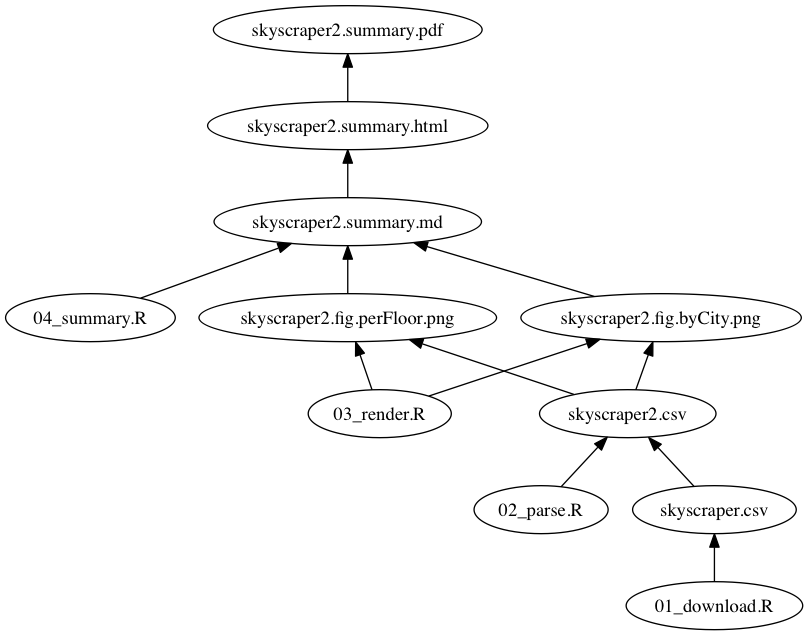

# HW: automation
csiu  
November 26, 2015  
- The homework: http://stat545-ubc.github.io/hw09_automation.html

## Homework Location
- The homework 9 scripts are located in [hw09/](https://github.com/STAT545-UBC/celia_siu/tree/master/homework/hw09)
- The expected outputs are located in: [hw09/output/](https://github.com/STAT545-UBC/celia_siu/tree/master/homework/hw09/output)

## The data
Instead of the gapminder data, I chose to use data that I scraped off the internet. The data comes from [The Skyscraper Center](http://www.skyscrapercenter.com/buildings) and lists information about the **100 Tallest Completed Buildings in the World**. 

There was no obvious way to download this data from the [website](http://www.skyscrapercenter.com/buildings) in a structured format, so I decided to apply what I learned in the previous homework and create an R package [`csiu/skyscraper`](https://github.com/csiu/skyscraper) to house the [csv data](https://raw.githubusercontent.com/csiu/skyscraper/master/inst/skyscraper.csv).

## The pipeline

My pipeline work as follows:

1. `01_download.R` will **download** data called skyscraper.csv
2. `02_parse.R` will then do some simple calculations and **transform** skyscraper.csv => skyscraper2.csv
3. `03_render.R` will take skyscraper2.csv and **render** 2 figures: skyscraper.fig.byCity.png and skyscraper.fig.perFloor.png
4. `04_summary.R` will then take the 2 figures and **consolidate** them to 1 simple skyscraper.summary.md report
5. If you are running the `Makefile` (and not `05_fake-makefile.R`), the report will be converted md -> html -> pdf via `pandoc`

*Note: `downloader` and `readr` should be installed.*

> **[REFERENCE]** Workflow was generated using: https://github.com/vak/makefile2dot

### ... running the R way

To run this pipeline, you should be able to just download [05_fake-makefile.R](https://github.com/STAT545-UBC/celia_siu/blob/master/homework/hw09/05_fake-makefile.R) and `source` that script ... or run the following command in the command line/terminal:

    Rscript 05_fake-makefile.R

This will 

1. download my other Rscripts
2. clean out previous results, and 
3. generate the results

### ... running with `Makefile`

In this mode, you will need to download the [Makefile](https://github.com/STAT545-UBC/celia_siu/blob/master/homework/hw09/Makefile) and run:

    make skyscraper.summary.md
    
If you have pandoc installed, you can run :

    make
    
Here I use pandoc to convert `md -> html -> pdf`. I convert first to html because I use html img tags to tweak the size of the image (or else the figures display too big in the html). I also want a copy in pdf, so I convert `html -> pdf`. The conversion is from html to pdf because the figures are not rendered when I convert from md to pdf due to my use of html tags.

Overall, I think the Makefile method is more preferable to the R way (as already somewhat indicated by my use of the word "fake" when naming the R version makefile).

## Reflection
About a year and a half ago was the first time I encountered Makefiles. This particular script was used written by a PhD student and was used to run a Bioinformatics pipeline. I recall being deeply confused, but had understood the make structure of:

    target: dependency
        rule

I since then haven't touched Makefiles until last week during class. After reading a couple of the recommended blog posts and parts of the make manual, 

- [Minimal Make](http://kbroman.org/minimal_make/) by Karl Broman
- [Using Make for reproducible scientific analyses](http://www.bendmorris.com/2013/09/using-make-for-reproducible-scientific.html) by Ben Morris
- [GNU make](https://www.gnu.org/software/make/manual/html_node/index.html)

the use of make was coming back to me. For instance: 

- [special targets](https://www.gnu.org/software/make/manual/html_node/Special-Targets.html) such as `.PHONY` to represent phony targets
- [automatic variables](https://www.gnu.org/software/make/manual/html_node/Automatic-Variables.html) such as `$@` to represent the target, `$<` to represent the first dependency, and `$^` to represent all the dependencies

I also learned new things such as:

- the [use of `%`](http://stackoverflow.com/questions/7404444/what-does-a-percent-symbol-do-in-a-makefile) as a pattern wildcard symbol
- the use of [functions](https://www.gnu.org/software/make/manual/html_node/Functions.html) such as [`$(foreach ...)`](https://www.gnu.org/software/make/manual/html_node/Foreach-Function.html#Foreach-Function) to do something over a list 

I since then am using `make` in my own scientific research and am glad I encountered Makefiles again.
