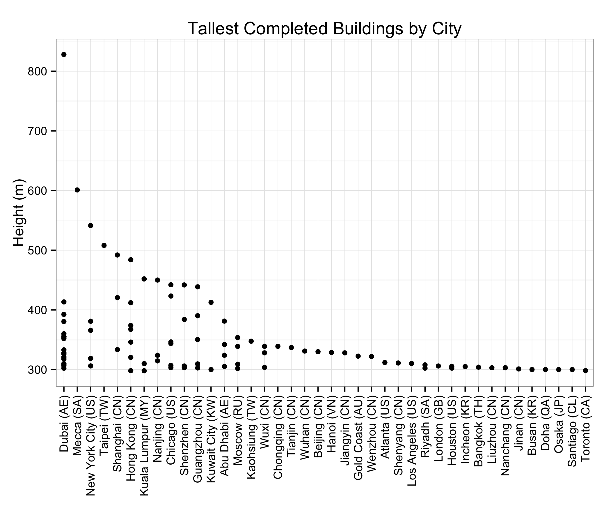
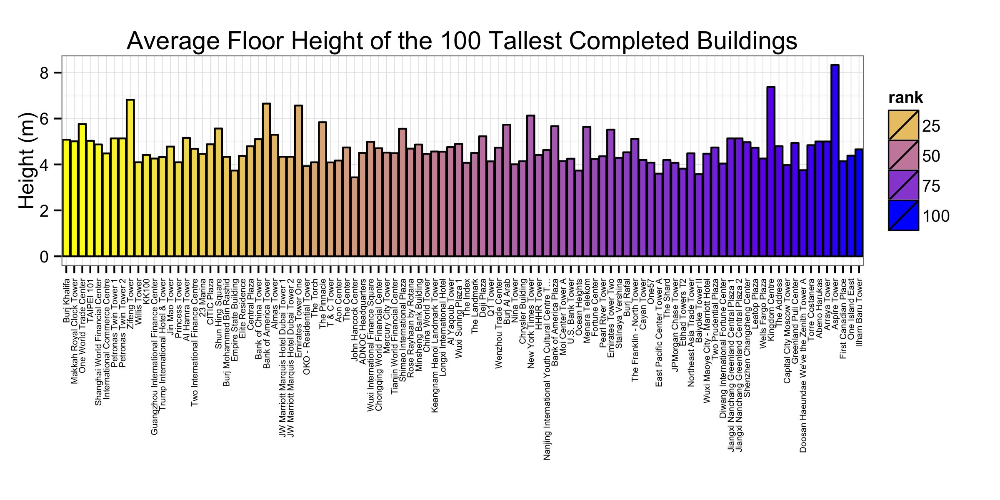

---
output:
    html_document:
        keep_md: yes
---
# Looking at the 100 tallest completed buildings

## Cities with the tallest buildings

In figure 1, we can see that Dubai is the city with the tallest building.

## Average floor height

In figure 2, we can see that the tallest building does not have the tallest floor height.

## Reference
> Skyscrapercenter.com,. (2015). *100 Tallest Completed Buildings in the World - The Skyscraper Center.* Retrieved 25 November 2015, from http://www.skyscrapercenter.com/buildings

