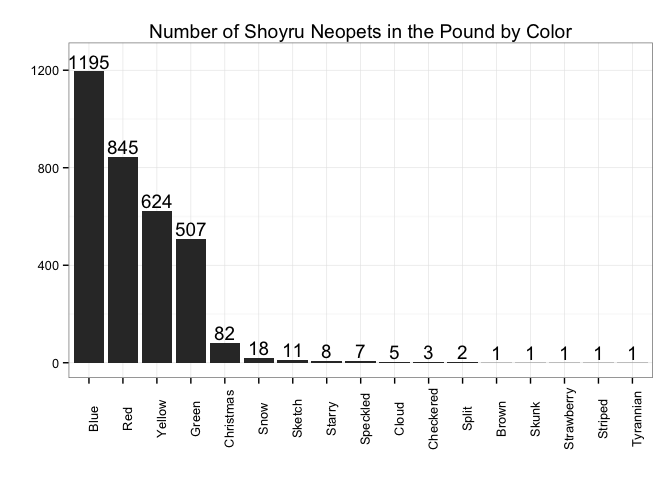
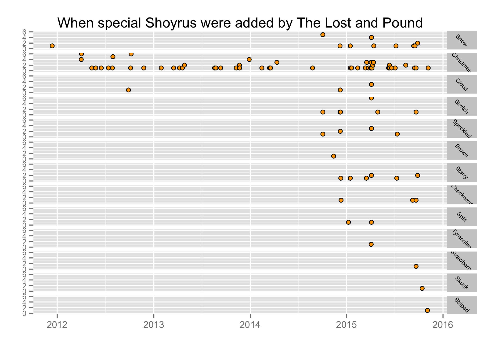
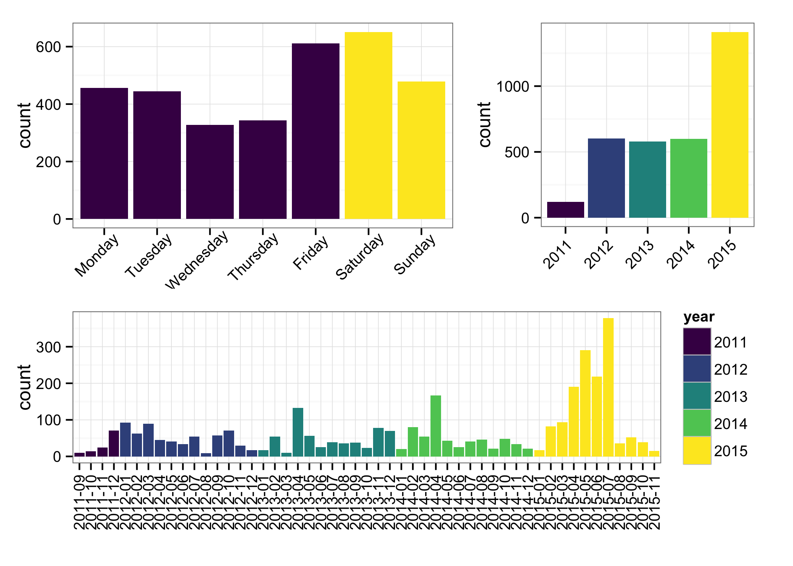
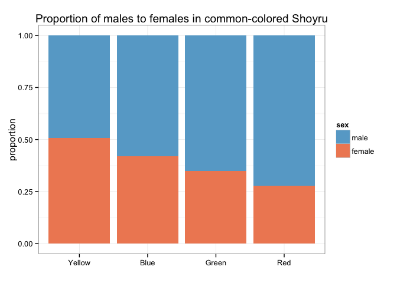

# STAT547 HW10: Data from the web
csiu  
December 4, 2015  


## The Big Picture

For this [homework](http://stat545-ubc.github.io/hw10_data-from-web.html), we are asked to create a new dataset by scraping the web.

I have done so previously in [homework 9](https://github.com/STAT545-UBC/celia_siu/blob/master/homework/hw09-automation.md). The dataset that I created for this homework is taken from [The Skyscraper Center](http://www.skyscrapercenter.com/buildings) and it gives the information for the **100 tallest completed buildings in the world**. In the process of compiling this data for homework 9, I manually copied the [table from the website](http://www.skyscrapercenter.com/buildings) onto a spreadsheet and saved it into a [CSV file](https://raw.githubusercontent.com/csiu/skyscraper/master/inst/skyscraper.csv). I then created an R package and made it available at [`csiu/skyscraper`](https://github.com/csiu/skyscraper). As a simple test drive of the data, we can see (from the [README](https://github.com/csiu/skyscraper/blob/master/README.md)) that the tallest completed building is in Dubai.

In addition to [`csiu/skyscraper`](https://github.com/csiu/skyscraper), I also created [`abandoned-shoyru.tsv`](https://gist.github.com/csiu/ea40d624baa5b172c561) (described below).

## The data
The source of this data comes from **The Lost and Pound**: *helping lost pets since 2005* at http://lost.quiggle.org

In the [FAQ section of their website](http://lost.quiggle.org/faq.html), they also mentioned:

> **17. How do you find stuck pets?**
> The basic answer is by randomly typing in names and checking if they are in the pound. Yes that's right, trial and error!

And if you have not guessed it by now, given that I used the term “shoyru”, “pet” and “quiggle”, this data is about [Neopets](https://en.wikipedia.org/wiki/Neopetsneo), a virtual pet website available at http://neopets.com. In particular this data describes the species, colour, and sex of pets abandoned to the pound available for adoption.

**Backtrack to why this dataset**

As a kid, I played Neopets and every December, I would go get the free daily gifts from the [Advent Calendar](http://www.neopets.com/winter/adventcalendar.phtml). I admit I still am getting those gifts for they are a part of my childhood I'm not ready to let go (besides, it's only a few clicks here and there). Anyways, as I was getting the gift, I start to wonder: does Neopets have an API? After a bit of light searching, Neopets does not appear to have one. Eventually, I somehow landed on [The Lost and Pound](http://lost.quiggle.org) and found the concept hilarious (and honestly wished I stumbled into it sooner)... and so now here I am, scraping this data for [homework 10](http://stat545-ubc.github.io/hw10_data-from-web.html).

**Structure of the website**

In this website, the abandoned pets are listed by species. For the homework, I will focus on [Shoyru](http://www.neopets.com/shoyru/) (since this is the first neopet I created). Going to the [page for Shoyru at The Lost and Pound](http://lost.quiggle.org/neopets/shoyru), we see a pagination with 50 abandoned Shoyrus per page. We also see that in total there are 3312 abandoned Shoyrus. After a bit of calculation -- e.g. `ceiling(3312/50)` -- this make 67 pages of Shoyru listings (on Dec 4, 2015).

**The question**

Like many superficial owners, we want to find the pets which are special. In particular, given the list of abandoned pets, we (or as least I) want to know the names of the pets that are not coloured red, green, blue, or yellow (i.e. those pets which are not commonly coloured a.k.a. not available by default).

## Scraping the data

### The packages
The main package I will use for scraping the HTML is [`rvest`](https://github.com/hadley/rvest) by Hadley Wickham.

```r
## Scraping HTML
library(rvest)

## Reformatting data
library(tidyr)
library(dplyr)
library(readr)

## Visualization
library(ggplot2)
library(viridis)
```

### The setup
The main URL for the listings of Shoyru is available at:

```r
main_url <- "http://lost.quiggle.org/neopets/shoyru"
```

The `<main_url>` is page 1; if we want to go to page 2, we go to `<main_url>/2`; for page 3, we go to `<main_url>/3`; etc.

In total there are 67 pages (since there is a total of 3312 Shoyrus and 50 Shoyrus per page). Programmatically, we can determine this information by parsing the pagination info ...

> Shoyru 1-50 of 3312

... using with the following function which computes i.e. 3312 / (50 - 1 + 1) => ceiling => 67

```r
number_of_pages <- function(main_url){
  ## Parsing for necessary info
  page_info <- read_html(main_url) %>% 
    html_node(".count") %>% 
    html_text() %>%
    strsplit(., "-| ") %>% 
    .[[1]] %>% 
    as.integer() %>% 
    suppressWarnings()
  
  ## Calculate total number of pages
  (page_info[4] / (page_info[2] - page_info[1] + 1)) %>% 
    ceiling()  
}
```

### The parsers
Before the parsers can be defined, we need to understand the structure of the HTML


Here we see that the information we are interested in (e.g. pet id and color) is embedded under `class="species"`, and `class="pet"`. As for the sex, we see that it is embedded in a class tag. Because the sex is not in the html text portion, I partitioned the scraping and parsing of the html into 2 parts: `male = TRUE` and `male = FALSE`.


```r
main_get_pets <- function(the_url){
  the_html <- read_html(the_url)
  rbind(
    helper_pet_parser(the_html, male = TRUE),
    helper_pet_parser(the_html, male = FALSE)
  ) %>% 
    arrange(desc(date_added))
}

## The nitty gritty detail of parsing the HTML into: 
##> id, color, data_added, sex 
helper_pet_parser <- function(the_html, male = TRUE){
  ifelse(male, ".species .pet.m", ".species .pet.f") %>% 
    ## get HTML text
    html_nodes(the_html, .) %>%
    html_text() %>%
    
    ## convert to data frame with appropriate columns
    as.data.frame() %>% 
    separate(".", 
             into = c("id", "color", "date_added"), 
             sep = " the | Shoyru ") %>% 
    
    ## tidy columns using regrex!
    mutate(date_added = gsub("^.*?(\\d+[^,+] .{3} \\d{4}).*$", "\\1", date_added) %>% 
             as.Date("%d %B %Y"),
           sex = ifelse(male, "male", "female")
    )
}
```

### The scraping
Now that our functions are defined, we are prepared to do the scraping!


```r
## How many pages?
pages <- number_of_pages(main_url)

## For each page, scrape and parse the HTML
the_data <- NULL
for (i in 1:pages) {
  the_data <- rbind(
    the_data, 
    main_get_pets(paste(main_url, i, sep="/"))
  )
}

## Save the data
readr::write_tsv(the_data, "abandoned-shoyru.tsv")
```

*Note: I have saved the data to [gist: ea40d624baa5b172c561](https://gist.github.com/csiu/ea40d624baa5b172c561)*

## Analysis
In my analysis, I want to answer 1 main question: 

> **Given the list of abandoned pets, what are the names of the pets that are not commonly colored i.e. the Shoyrus that are not colored red, green, yellow, or blue**.

The first thing to do is to read in the data.


```r
infile <- "https://gist.githubusercontent.com/csiu/ea40d624baa5b172c561/raw/abandoned-shoyru.tsv"
dat    <- read_tsv(infile)

## Make the following to factors!
dat$color <- as.factor(dat$color)
dat$sex   <- as.factor(dat$sex)
```

**Shoyru by color**

Now that the data is in, we can plot the counts of Shoyrus by color:


```r
dat %>% 
  group_by(color) %>% 
  summarise(count = n()) %>% 
  ggplot(aes(x = reorder(color, -count), 
             y = count,
             label = count)) + 
  geom_bar(stat = "identity") +
  geom_text(vjust = -0.25) +
  xlab("") +
  ylab("") +
  ylim(0,1251) +
  ggtitle("Number of Shoyru Neopets in the Pound by Color") +
  theme_bw() +
  theme(
    axis.text.x = element_text(angle = 90)
  )
```

 

Here we see that (as expected) the majority of abandoned Shoyru are commonly colored e.g. in blue, red, yellow, and green. Interestingly, more than 50 of abandoned Shoyru are Christmas colored. This somewhat large number can be explained by my somewhat background knowledge that one year the free Advent Calendar gift was a Christmas Paint Brush ([Dec 6, 2008](http://www.jellyneo.net/?go=advent&id=08)) which can be used to color any neopet into Christmas color... and another year, a Snow paint brush was offered ([Dec 25, 2012](http://www.jellyneo.net/?go=advent&id=12))...

**The list of special abandoned Shoyrus**

Now that our appetites are wet, here is the list of special Shoyrus.

*Note, since there are 82 Christmas colored Shoyru, I have removed them from the list.*


```r
dat %>%
  filter(! color %in% c("Blue", "Red", "Yellow", "Green", "Christmas")) %>% 
  arrange(color) %>% 
  mutate(name = paste0("[`",id,"`](http://www.neopets.com/petlookup.phtml?pet=",id,")")) %>% 
  select(name, color, sex, 
         `Date listed by The Lost and Pound` = date_added) %>% 
  knitr::kable(format = "markdown")
```


|name                                                                                      |color      |sex    |Date listed by The Lost and Pound |
|:-----------------------------------------------------------------------------------------|:----------|:------|:---------------------------------|
|[`__Nearra__`](http://www.neopets.com/petlookup.phtml?pet=__Nearra__)                     |Brown      |female |2014-11-13                        |
|[`kikki7314`](http://www.neopets.com/petlookup.phtml?pet=kikki7314)                       |Checkered  |female |2015-09-21                        |
|[`Syuryu`](http://www.neopets.com/petlookup.phtml?pet=Syuryu)                             |Checkered  |male   |2015-09-08                        |
|[`brisnger01_04_08`](http://www.neopets.com/petlookup.phtml?pet=brisnger01_04_08)         |Checkered  |female |2014-12-11                        |
|[`KiNg_DragON_SuPEr_14`](http://www.neopets.com/petlookup.phtml?pet=KiNg_DragON_SuPEr_14) |Cloud      |male   |2015-04-05                        |
|[`Mi_Alejandra`](http://www.neopets.com/petlookup.phtml?pet=Mi_Alejandra)                 |Cloud      |female |2015-04-05                        |
|[`shya814`](http://www.neopets.com/petlookup.phtml?pet=shya814)                           |Cloud      |female |2015-04-05                        |
|[`dragon13247`](http://www.neopets.com/petlookup.phtml?pet=dragon13247)                   |Cloud      |male   |2014-12-08                        |
|[`a_hjhjhjhjh_a`](http://www.neopets.com/petlookup.phtml?pet=a_hjhjhjhjh_a)               |Cloud      |male   |2012-09-27                        |
|[`__p_e_a_c_h_e_s__`](http://www.neopets.com/petlookup.phtml?pet=__p_e_a_c_h_e_s__)       |Sketch     |female |2015-09-21                        |
|[`_____sarah_____`](http://www.neopets.com/petlookup.phtml?pet=_____sarah_____)           |Sketch     |female |2015-04-29                        |
|[`CyNeo543975`](http://www.neopets.com/petlookup.phtml?pet=CyNeo543975)                   |Sketch     |male   |2015-04-05                        |
|[`Shoyru_Strife`](http://www.neopets.com/petlookup.phtml?pet=Shoyru_Strife)               |Sketch     |male   |2015-04-05                        |
|[`SpectrumWeb`](http://www.neopets.com/petlookup.phtml?pet=SpectrumWeb)                   |Sketch     |male   |2015-04-05                        |
|[`rockmanx448`](http://www.neopets.com/petlookup.phtml?pet=rockmanx448)                   |Sketch     |male   |2015-04-05                        |
|[`MR_T_175`](http://www.neopets.com/petlookup.phtml?pet=MR_T_175)                         |Sketch     |male   |2015-04-05                        |
|[`lluvia_sakura_`](http://www.neopets.com/petlookup.phtml?pet=lluvia_sakura_)             |Sketch     |female |2015-04-05                        |
|[`Roronoa_Zolo_2005`](http://www.neopets.com/petlookup.phtml?pet=Roronoa_Zolo_2005)       |Sketch     |male   |2014-12-09                        |
|[`Jonnytrue`](http://www.neopets.com/petlookup.phtml?pet=Jonnytrue)                       |Sketch     |male   |2014-12-07                        |
|[`LittleAanimeDragon`](http://www.neopets.com/petlookup.phtml?pet=LittleAanimeDragon)     |Sketch     |male   |2014-10-03                        |
|[`Shoyru78232`](http://www.neopets.com/petlookup.phtml?pet=Shoyru78232)                   |Skunk      |female |2015-10-14                        |
|[`drago_1452`](http://www.neopets.com/petlookup.phtml?pet=drago_1452)                     |Snow       |male   |2015-09-27                        |
|[`_SkylinePigeon_`](http://www.neopets.com/petlookup.phtml?pet=_SkylinePigeon_)           |Snow       |female |2015-09-27                        |
|[`cyndy31`](http://www.neopets.com/petlookup.phtml?pet=cyndy31)                           |Snow       |female |2015-09-17                        |
|[`SkyRocket88`](http://www.neopets.com/petlookup.phtml?pet=SkyRocket88)                   |Snow       |female |2015-09-12                        |
|[`sokal`](http://www.neopets.com/petlookup.phtml?pet=sokal)                               |Snow       |female |2015-07-07                        |
|[`Kavaklave`](http://www.neopets.com/petlookup.phtml?pet=Kavaklave)                       |Snow       |male   |2015-04-14                        |
|[`mark27`](http://www.neopets.com/petlookup.phtml?pet=mark27)                             |Snow       |male   |2015-04-05                        |
|[`CLARKEMAN`](http://www.neopets.com/petlookup.phtml?pet=CLARKEMAN)                       |Snow       |male   |2015-04-05                        |
|[`Shoyru_44__19`](http://www.neopets.com/petlookup.phtml?pet=Shoyru_44__19)               |Snow       |male   |2015-04-05                        |
|[`sissa_5003`](http://www.neopets.com/petlookup.phtml?pet=sissa_5003)                     |Snow       |female |2015-04-05                        |
|[`Norbert6`](http://www.neopets.com/petlookup.phtml?pet=Norbert6)                         |Snow       |male   |2015-01-15                        |
|[`Rozan_Shoryuha2`](http://www.neopets.com/petlookup.phtml?pet=Rozan_Shoryuha2)           |Snow       |male   |2014-12-07                        |
|[`shoyru_3663`](http://www.neopets.com/petlookup.phtml?pet=shoyru_3663)                   |Snow       |male   |2014-10-03                        |
|[`ShiroOuji`](http://www.neopets.com/petlookup.phtml?pet=ShiroOuji)                       |Snow       |male   |2014-10-03                        |
|[`Sth_eeph`](http://www.neopets.com/petlookup.phtml?pet=Sth_eeph)                         |Snow       |female |2014-10-03                        |
|[`Sky_15524`](http://www.neopets.com/petlookup.phtml?pet=Sky_15524)                       |Snow       |female |2014-10-03                        |
|[`shoyru_the_grate1`](http://www.neopets.com/petlookup.phtml?pet=shoyru_the_grate1)       |Snow       |female |2014-10-03                        |
|[`_Stuffle_`](http://www.neopets.com/petlookup.phtml?pet=_Stuffle_)                       |Snow       |female |2011-12-13                        |
|[`Shetop`](http://www.neopets.com/petlookup.phtml?pet=Shetop)                             |Speckled   |male   |2015-07-12                        |
|[`Cosmic_D`](http://www.neopets.com/petlookup.phtml?pet=Cosmic_D)                         |Speckled   |male   |2015-04-05                        |
|[`__Slater___`](http://www.neopets.com/petlookup.phtml?pet=__Slater___)                   |Speckled   |female |2015-04-05                        |
|[`ScorchyPuffneo`](http://www.neopets.com/petlookup.phtml?pet=ScorchyPuffneo)             |Speckled   |female |2015-04-05                        |
|[`TonyKiss`](http://www.neopets.com/petlookup.phtml?pet=TonyKiss)                         |Speckled   |male   |2014-12-08                        |
|[`Miley_Shoyru_`](http://www.neopets.com/petlookup.phtml?pet=Miley_Shoyru_)               |Speckled   |female |2014-12-08                        |
|[`Roxas_Takinichi`](http://www.neopets.com/petlookup.phtml?pet=Roxas_Takinichi)           |Speckled   |male   |2014-10-03                        |
|[`Shoyru1221_1`](http://www.neopets.com/petlookup.phtml?pet=Shoyru1221_1)                 |Split      |female |2015-04-05                        |
|[`Little_Debbie`](http://www.neopets.com/petlookup.phtml?pet=Little_Debbie)               |Split      |female |2015-01-08                        |
|[`breens468`](http://www.neopets.com/petlookup.phtml?pet=breens468)                       |Starry     |male   |2015-09-27                        |
|[`divineinfektt`](http://www.neopets.com/petlookup.phtml?pet=divineinfektt)               |Starry     |female |2015-09-27                        |
|[`Spalim`](http://www.neopets.com/petlookup.phtml?pet=Spalim)                             |Starry     |female |2015-07-10                        |
|[`Moltres_2617621762`](http://www.neopets.com/petlookup.phtml?pet=Moltres_2617621762)     |Starry     |female |2015-04-05                        |
|[`Shoyru33_Z`](http://www.neopets.com/petlookup.phtml?pet=Shoyru33_Z)                     |Starry     |female |2015-04-05                        |
|[`starry_sweety900`](http://www.neopets.com/petlookup.phtml?pet=starry_sweety900)         |Starry     |female |2015-03-17                        |
|[`mario_bros36`](http://www.neopets.com/petlookup.phtml?pet=mario_bros36)                 |Starry     |male   |2015-01-15                        |
|[`minisk8er451`](http://www.neopets.com/petlookup.phtml?pet=minisk8er451)                 |Starry     |male   |2014-12-10                        |
|[`BlueStrike_999`](http://www.neopets.com/petlookup.phtml?pet=BlueStrike_999)             |Strawberry |male   |2015-09-21                        |
|[`Green737286381`](http://www.neopets.com/petlookup.phtml?pet=Green737286381)             |Striped    |male   |2015-11-03                        |
|[`Rocky6721337`](http://www.neopets.com/petlookup.phtml?pet=Rocky6721337)                 |Tyrannian  |male   |2015-04-04                        |

> **When were the special Shoyrus added?**


```r
## The data
dat.special <- dat %>%
  filter(! color %in% c("Blue", "Red", "Yellow", "Green")) %>% 
  group_by(date_added, color) %>% 
  summarise(count = n()) %>% 
  ungroup()

## Define color factor order by earliest abandon date
list_of_special_order <- dat.special %>% 
  group_by(color) %>% 
  summarise(first_date = sort(date_added)[1]) %>% 
  arrange(first_date) %>% 
  .$color %>% 
  as.character()

## Order factor
dat.special$color <- factor(dat.special$color, levels = list_of_special_order)

## Plot
dat.special %>% 
  ggplot(aes(x = date_added, y = count)) +
  geom_point(colour="black", fill="orange", pch=21) + 
  ylim(0,6) +
  xlab("") +
  ylab("") +
  ggtitle("When special Shoyrus were added by The Lost and Pound") +
  facet_grid(color~.) +
  theme(
    strip.text.y = element_text(size = 6, angle = 315),
    panel.margin = grid::unit(0.25, "lines"),
    axis.text.y = element_text(size = 7.5)
  )
```

 

Here we see that:

- (besides Christmase colored ones,) most special Shoyrus were added after spring/summer 2014
- 1 Snow and 1 Cloud Shoyru were stuck in the pound since winter 2011 and and spring/summer 2012
- and there is a lot of Christmas colored Shoyrus

**Other (what I consider less important) questions**

Now that our question is answered -- and to be honest, that was the only real thing I was interested in -- here are other plots:

---

> **When do The Lost and Pound add more abandoned Shoyru to their listing?**


```r
year_fig <- dat %>% 
  mutate(year = format(date_added, "%Y")) %>% 
  ggplot(aes(x = year, y = ..count.. , fill = year)) + 
  geom_bar() +
  scale_fill_viridis(discrete = TRUE, option = "D") +
  xlab("") +
  theme_bw() +
  theme(
    legend.position = "none",
     axis.text.x = element_text(angle = 45, hjust = 1)
  )
```

```r
date_fig <- dat %>% 
  mutate(month_year = format(date_added, "%Y-%m"),
         year = format(date_added, "%Y")) %>% 
  group_by(month_year, year) %>% 
  summarise(count = n()) %>% 
  ggplot(aes(x = month_year, y = count, fill = year)) +
  geom_bar(stat = "identity") +
  scale_fill_viridis(discrete = TRUE, option = "D") +
  xlab("") + 
  theme_bw() +
  theme(
    axis.text.x = element_text(angle = 90, hjust = 1, vjust = 0.5)
  )
```

```r
dat.dayofweek <- dat %>% 
  mutate(
    day_of_week = format(date_added, "%A"),
    day_of_week_ = format(date_added, "%u") %>% as.integer(),
    weekend = ifelse(day_of_week_ %in% 1:5, FALSE, TRUE)
  )

dayofweek_fig <- dat.dayofweek %>% 
  ggplot(aes(x = reorder(day_of_week, day_of_week_), 
             y = ..count..,
             fill = weekend)) + 
  geom_bar() +
  scale_fill_viridis(discrete = TRUE) +
  xlab("") +
  theme_bw() +
  theme(
    legend.position = "none",
    axis.text.x = element_text(angle = 45, hjust = 0.8)
  )
```


```r
cowplot::ggdraw() +
  cowplot::draw_plot(dayofweek_fig, 0,  0.4, 0.6, 0.6) +
  cowplot::draw_plot(year_fig,   0.58, 0.46, 0.4, 0.54) +
  cowplot::draw_plot(date_fig,      0,    0,   1, 0.49)
```

 

In this collection of figures, we see that:

- The Lost and Pound tend to add to their list on Fridays and Saturdays (top left; navy = weekday & yellow = weekend)
- Most abandoned Shoyru are added to the list in 2015 (top right)
- In particular, most abandoned Shoyru are added to the list between the Spring and Summer of 2015 (bottom)

*Note: Keep in mind that pets can be adopted and thus might explain why there are more listings in 2015 than 2011.*

---

> **What is the proportion of males to females in the common-coloured, abandoned Shoyru population?**


```r
standard_colors <- c("Red", "Yellow", "Blue", "Green")

## Calculate total counts per color
dat.color1 <- dat %>% 
  filter(color %in% standard_colors) %>% 
  group_by(color) %>% 
  summarise(count = n())
## Now use total counts per color to calculate proportion
dat.tmp <- dat %>%
  filter(color %in% standard_colors) %>% 
  group_by(color, sex) %>% 
  summarise(count = n()) %>% 
  mutate(proportion = count / dat.color1$count[dat.color1$color == color]) %>% 
  suppressWarnings()

## Define color order by proportion of e.g. females
dat.tmp.colorfactorlevel <- dat.tmp %>% 
  filter(sex == "female") %>% 
  plyr::arrange(desc(proportion)) %>% 
  select(color) %>% 
  .$color %>% 
  as.character()
## Need to add back color levels found in male but not in female else NA
dat.tmp.colorfactorlevel <- c(
  dat.tmp.colorfactorlevel, 
  setdiff(dat.tmp$color, dat.tmp.colorfactorlevel)
)

## Update factor order
dat.tmp$color <- factor(dat.tmp$color, levels = dat.tmp.colorfactorlevel)

## Plot
dat.tmp %>% 
  ggplot(aes(x = color,
             y = proportion,
             fill = sex)) +
  geom_bar(stat = "identity") +
  ggtitle("Proportion of males to females in common-colored Shoyru") +
  xlab("") +
  guides(fill = guide_legend(reverse=TRUE)) +
  theme_bw()
```

 

Here we see that only in the yellow abandoned Shoyru population is there more females than males.

---

## Reflection 
I once tried to scrape HTML with python and I remember having quite a difficult time. After having used [`rvest`](https://github.com/hadley/rvest), I can appreciate both the appeal of web scraping and the superb job Hadley did in creating [`rvest`](https://github.com/hadley/rvest).

